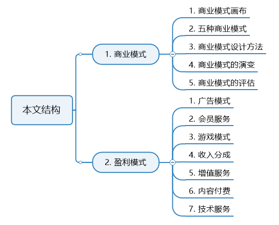
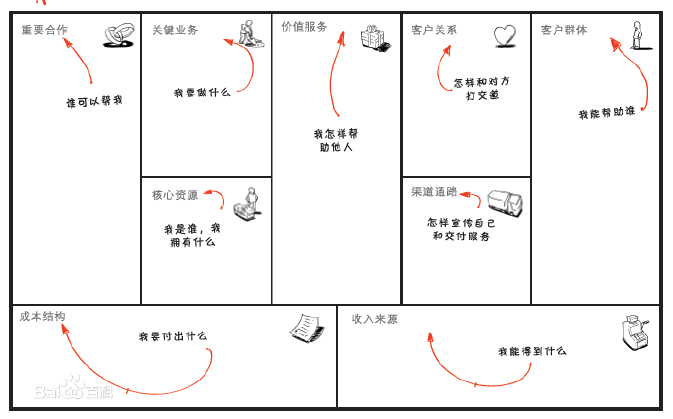
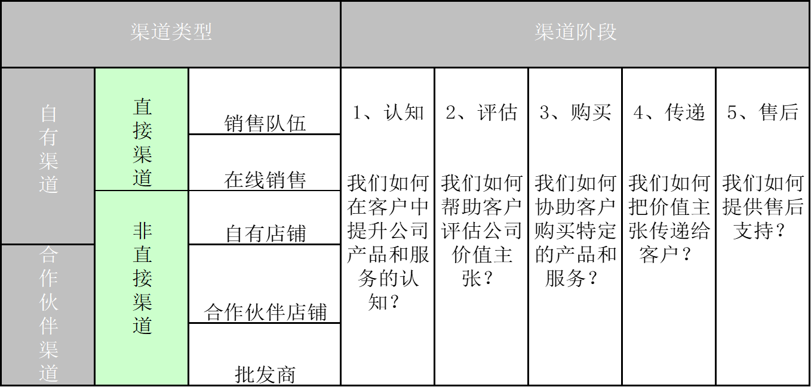

上一篇文章讲了什么是产品与产品经理，今天开始进入这个系列的正题。

在这里先讲一下这个系列的目的，这个系列我主要是想普及产品经理的基础知识，对于已经了解了产品经理的人来说，可以快速阅读一遍；对于不了解的人，可以迅速补齐基础知识；对于我自己而言，更多是先练练手，为之后写更深入的内容做准备。

该系列的大致思路是先向大家详细介绍上一篇文章中所讲的“产品开发流程”中，产品经理需要做的工作，以此让大家深入了解产品经理的工作内容。

之后会分享一些运营和技术知识。该系列主要是产品经理basic的分享，所以最后会对基础的设计工作再次细化，比如原型的设计、常见的功能设计等。

注：因为是些理论性的东西，所以会参考一些现有的资料，有些东西是自己以前看书记录的，但已经不知道是什么书了。特此声明。

好，那现在进入正题，今天主要讲产品的商业模式。

## 一、商业模式

在探讨产品规划之前，必不可少的要谈及商业模式。（这又是商科方面的基础概念了，之后还会遇到更多）

商业模式本质上就是描述了企业如何创造价值，传递价值和获取价值的基本原理。

在前几年的互联网行业，商业模式不断更迭，比如：O2O、共享经济、知识付费、社区电商等，风口起起落落，那时候好像大家都很喜欢谈模式创新。
模式创新，指的就是商业模式。那么，到底什么是商业模式呢？怎么确定企业的商业模式呢？商业模式对企业又有什么用呢？大家为什么这么热衷于模式创新？

### 1、商业模式画布

提到商业模式，有个非常好的方法论——商业模式画布。

商业模式画布是一种用来描述商业模式、可视化商业模式、评估商业模式以及改变商业模式的通用语言。

这个框架可以作为一种共同语言，让你方便地描述和使用商业模式，来构建新的战略性替代方案。

这方面有本书，叫做《商业模式新生代》，对商业模式的讲解非常深入，推荐阅读。

以下内容的基本就是该书的精华提炼。

商业有4个主要方面：“**客户、产品、基础设施、财务生存能力**”。

基于这3个方面，我们来阐述商业模式9个基本模块：

**注**：CS-客户细分/群体；VP-价值主张/服务；CH-渠道通路；CR-客户关系；R$-收入来源；KR-核心资源；KA-关键业务；KP-重要合作；C$-成本结构。

#### 1.1 CS客户细分：企业想要接触和服务的不同人群和组织

简单来说就是以用户为中心，思考我们正在为谁创造价值？市场是什么样子的？谁是我们最重要的客户？

这里普及几个关于市场划分的相关概念：

> **大众市场**：
> 价值主张、渠道通路和客户关系全都聚集于一个大范围的客户群组，客户具有大致相同的需求和问题。
> **利基市场**：
> 价值主张、渠道通路和客户关系都针对某一利基市场的特定需求定制。这种商业模式常可在供应商-采购商的关系中找到。
> **区隔化市场**：
> 客户需求略有不同,细分群体之间的市场区隔有所不同,所提供的价值主张也略有不同。
> **多元化市场**：
> 经营业务多样化,以完全不同的价值主张迎合完全不同需求的客户细分群体。
> **多边平台或多边市场**：
> 服务于两个或更多的相互依存的客户细分群体。

#### 1.2 VP价值主张：为特定客户细分创造价值的系列产品和服务

即：

> 我们该向用户传递什么样的价值？
> 我们正在帮助我们的客户解决哪一类问题？
> 我们正在满足哪些客户需求？
> 我们正在提供给客户细分群体哪些系列的产品和服务？

这些价值主张包括但不限于：

> **新颖**：产品或服务满足客户从未感受和体验过的全新需求
> **性能**：改善产品和服务性能是传统意义上创造价值的普遍方法
> **定制化**，：以满足个别客户或客户细分群体的特定需求来创造价值
> **把事情做好**：可通过帮客户把某些事情做好而简单地创造价值
> 设计：产品因优秀的设计脱颖而出
> **品牌/身份地位**：客户可以通过使用和显示某一特定品牌而发现价值
> **价格**：以更低的价格提供同质化的价值满足价格敏感客户细分群体
> **成本削减**：帮助客户削减成本是创造价值的重要方法
> **风险抑制**：帮助客户抑制风险也可以创造客户价值
> **可达性**：把产品和服务提供给以前接触不到的客户
> **便利性/可用性**：使事情更方便或易于使用可以创造可观的价值

#### 1.3 CH渠道通路：如何沟通，接触其客户细分而传递其价值主张

简单来说就是你如何接触你的用户，包括但不限于：

> - 通过哪些渠道可以接触我们的用户细分群体？
> - 我们如何接触他们？我们的渠道如何整合？
> - 哪些渠道最有效？哪些渠道成本效益最好？
> - 如何把我们的渠道与用户的例行程序进行整合？

企业组织可以选择通过自有渠道、合作伙伴渠道或两者混合来接触客户。下面是一个企业选择渠道的示例：

提升公司产品和服务在客户中的认知，帮助客户评估公司价值主张，协助客户购买特定产品和服务，向客户传递价值主张，提供售后客户支持。

#### 1.4 CR客户关系：公司与特定客户细分群体建立的关系类型

简单来说就是你如何建立客户关系，包括但不限于：

> - 我们每个用户细分群体希望我们与之建立和保持何种关系？
> - 哪些关系我们已经建立了？这些关系成本如何？
> - 如何把他们与商业模式的其余部分进行整合？

客户关系的类型包括但不限于：

> **个人助理**：
> 基于人与人之间的互动，可以通过呼叫中心、电子邮件或其他销售方式等个人肋理手段进行。
>
> **专用个人助理**：
> 为单一客户安排专门的客户代表，通常是向高净值个人客户提供服务。
>
> **自助服务**：
> 为客户提供自助服务所需要的所有条件。
>
> **自动化服务**：
> 整合了更加精细的自动化过程，可以识别不同客户及其特点，并提供与客户订单或交易相关的。
>
> **社区**：
> 利用用户社区与客户或潜在客户建立更为深入的联系，如建立在线社区。
>
> **共同创作**：
> 与客户共同创造价值，鼓励客户参与到全新和创新产品的设计和创作

#### 1.5RS收入来源：从每个客户群体获取的现金收入（需要从创收中扣除成本）

简单来说就是如何用商业模式赚钱，包括但不限于：

> - 什么样的价值能让用户愿意付费？他们现在付费买什么？
> - 他们是如何支持费用的？他们更愿意如何支付费用？
> - 每个收入来源占总收入的比例是多少？

获取收入的来源包括但不限于：

> **资产销售**：销售产品的所有权
> **使用收费**：通过特定的服务收费
> **订阅收费**：销售重复使用的服务
> **租赁收费**：暂时性排他使用权的授权
> **授权收费**：知识产权授权使用
> **经纪收费**：提供中介服务收取佣金
> **广告收费**：提供广告宣传服务收费
>
> 注：不同的收入来源，有固定定价和动态定价2种方式。

#### 1.6 KR核心资源：让商业模式运转所必须的最重要因素

即：

> 我们的价值主张需要什么样的核心资源？
> 我们的渠道通路需要什么样的核心资源？
> 我们的客户关系呢？收入来源呢？

这些资源包括但不限于：

> **实体资产**：包括生产设施、不动产、系统、销售网点和分销网络等
> **知识资产**：包括品牌、专有知识、专利和版权、合作关系和客户数据库
> **人力资源**：在知识密集产业和创意产业中，人力资源至关重要
> **金融资产**：金融资源或财务担保，如现金、信贷额度或股票期权池

#### 1.7 KA关键业务：为了确保商业模式可行，企业必须做的作重要的事情

即：

> 我们价值主张需要哪些关键业务？
> 我们的渠道通路需要哪些关键业务？
> 我们的客户关系呢？收入来源呢？

#### 1.8 KP重要合作：让商业模式运转所需的供应商和合作伙伴的网络

即：

> 谁是我们的重要伙伴？谁是我们的重要供应商？
> 我们正在从伙伴哪里获取这些核心资源？
> 合作伙伴都执行哪些关键业务？

企业为什么要与我们合作呢，这些合作的动机与类型与哪些？

> **合作的动机**：商业模式的优化和规模经济的运用，风险和不确定性的降低，特定资源和业务的获取。
> **合作的类型**：非竞争者之间的战略联盟关系，竞合（在竞争者之间的合作关系），为开发新业务而构建的合作关系，为确保可靠供应的购买方--供应商关系。

#### 1.9 CS成本结构：运营一个商业模式所引发的所有成本

即：

> 什么是我们商业模式中最重要的固有成本？
> 哪些核心资源花费最多？
> 哪些关键业务花费最多？

我们要确定我们的商业模式到底是成本驱动和价值驱动，这关系到之后的资源投入等各项产品决策。

成本结构：固定成本，可变成本，规模经济，范围经济。

#### 1.10 小结

> “一个企业如果要创新商业模式，那你可以在模型的所有或几个或一个格子里创新”，任何新的商业模式，都可以由这9个模块按不同逻辑重新排列组合得出。
> 

### 2、五种商业模式

每个人的视角、关注和基础不一样，向各个模块中填加的内容当然也就不一样，于是就有了不同的商业模式。

《商业模式新生代》书中由商业模式画布模型推出了五种式样：**非绑定式商业模式，长尾式商业模式，多边平台式商业模式，免费式商业模式，开放式商业模式**。

#### 2.1 非绑定式商业模式

有三种基本的业务类型：商业关系型业务，产品创新型业务，基础设施型业务，都含有有经济，竞争和文化驱动因素。分别对应三种价值信条：卓越运营，产品领先，亲近客户。

**实例**：私人银行业种“绑定”（咨询，金融产品，柜台）所引发的冲突和不利的权衡妥协；移动电信行业的业务拆分（网络运营外包，专注于用户和内容）。

#### 2.2 长尾式商业模式

他们专注于为利基市场提供大量产品，每种产品可以卖的很少。三个经济触发因素：生产工具大众化，分销渠道的大众化，链接供需双方的搜索成本不断下降。

**实例**：图书出版行业的变革(lulu.com），乐高。

### 2.3多边平台式商业模式

将两个或者更多有明显区别但又相互依赖的客户群体集合到一起。建立一个平台，为不同的客户群体提供不同的价值主张并获得收入。

**实例**：Google的商业模式（第三方网站的广告）；Wii对决PSP/Xbox,相同模式，不同关注；苹果的平台运营商的演变。

#### 2.4 免费式商业模式

至少一个庞大的客户群体可以享持续的免费服务。三种模式：基于多边平台的免费产品或服务（内容网站）；免费增收服务（人人网），诱钓模式（亚马逊KIindle，合约手机）。

**实例**：广告，新闻报纸；基础免费，增值收费，开源(Red Hat利用linux的免费软件)，SKYPE，颠倒的免费增收模式保险；剃刀与刀片，金吉列。

#### 2.5开放式商业模式

通过与外部伙伴系统性合作，来创造和捕捉价值，可以是“由外到内”，也可以是“由内到外”。

**实例**：宝洁（连接和发展），葛兰素史克的专利池，连接器Innocentive。“

### 3、商业模式设计方法

**客户洞察**：

基于对客户的充分理解，知道该听取哪些客户和忽略哪些客户意见，关注新的和未满足的客户细分群体。

**情景推测**：

通过细化设计环境，帮助我们熟悉商业模型设计流程，包括描述不同客户背景的客户情景推测及描述新商业模式参与竞争的未来场景推测。

**创意构思**：

通过使用画布来分析商业模式的创新的核心问题和使用“假如”的提问方式来生成针对创新商业模式的创意。

**原型制作**：

选出最具多样性的3个创意设想；通过在商业模式画布上绘制每个人创意设想的各个元素来开发3个概念商业原型；标注每个原型的优点和缺点。

**故事讲述**：

通过讲故事把新的商业模式和理念呈现出来，既能推销给投资者，又能调动员工积极性。

### 4、商业模式的演变

在现实生活中，外部的商业环境，包括竞争者、替代者、资本市场、政策法规、技术发展等会一直在变，导致企业在市场上的竞争态势也会变化，再加上企业内部的组织结构也可能会变，所以我们的商业模式也要跟随环境适时地做出调整。

### 5、商业模式的评估

我们说商业模式要跟随环境适时地调整，那什么才算是“适时”呢，我们如何确定商业模式该改变了呢？这就涉及到对商业模式评估的问题，我们可以利用各种工具来进行评估。这个我们之后再讲。

## 二、盈利模式

从商业模式画布来看，盈利模式只是商业模式的一部分。这里我细讲一下互联网产品的盈利模式。

### 1、广告模式

这是要本节重点要讲的。

广告模式一般是以出售广告位来赚钱的模式。 不同的广告位对应不同的流量和曝光度， 所以价格上也会体现出较大的差异性。 

最常见的广告模式有搜索广告（竞价排名广告）、展示类广告（品牌广告）、分类广告、引导广告、 精准广告（电子邮件广告）和植入广告等。

#### 1.1 搜索广告

搜索广告是有搜索技术支撑的广告类型，可以细分为根据搜索关键字在搜索结果页中展示的广告，和根据上下文在内容页中展示的广告两种。

搜索引擎投放在自己搜索结果页中的广告是搜索广告，具有搜索技术的广告代理提供给第三方网站的广告也是搜索广告，譬如著名的 Google AdSense和臭名昭著的度sir。

由于搜索广告可以自助投放而自动获取分成，很多小网站最初都靠投放这类广告获得现金流。

以臭名昭著的百度桑为例，百度搜索引擎的关键词广告就是常说的竞价排名广告。 同样的关键词， 搜索排名越靠前， 一般花费的钱越多。

说到这里，还记得我之前产品经理的能力模型中讲到的“人文修养”吗，对应到魏则西等事件上，大家应该就明白人文修养对产品经理的重要性了。

#### 1.2 展示类广告

展示类广告就是投放广告主提供的展示素材，根据展示素材的不同，又可以细分为横幅广告、富媒体广告、视频广告和赞助广告。

由于这些广告素材的制作成本比较高，所以一般都是在影响力比较大的媒体渠道投放（小媒体所提供的投放效果可能连广告制作成本都无法收回）。

门户网站的广告、 腾讯爱奇艺等视频网站的片头片尾广告、 电视台广告、 地铁公交广告、 楼宇广告等都属于品牌广告。 

品牌广告讲究的是曝光率和覆盖度， 一般难以追踪到广告效果。

#### 1.3 分类广告

分类广告是指投放在分类目录中的广告，比如 craigslist、 kijiji（百姓网）等，如果你的网站不提供分类目录服务，那就不用考虑从分类广告的份额中分收人了。

#### 1.4 引导广告

把用户引导到购物网站，让他们去消费， 然后拿提成。豆瓣获得现金流的一个重要手段，就是引导广告。

#### 1.5 精准广告

Facebook社交网站基于用户行为推荐的广告、 当当网站购买过此书的人还购买过哪些书、 广告联盟等都属于精准广告， 一般是先根据用户行为建立用户模型， 再对内容建模， 最后通过推荐引擎将不同的内容推荐给相关的用户。

#### 1.6 植入广告

现在很多游戏的背景、 电影电视的道具都或多或少会植入一些软性广告， 这种广告就叫植入广告。

广告植入物一般包括商品、 标识、 VI、 CI、 包装、 品牌名称以及企业吉祥物等； 广告植入的对象一般包括台词、 道具、 场景、 奖品、 网络文章（ 小说、 图书） 中的案例等。

#### 1.7 常见的广告计费方式

**按点击付费CPC（Cost Per Click）**

根据广告被点击的次数收费，关键词广告计费最普遍形式，百度联盟中的百度竞价广告将其发挥到了极致。

**按展示付费CPM（Cost Per Thousand Impression）**

不管通过何种方式，只要展示了广告主想要展示的广告内容就要付费，最为常见的弹窗广告等以此计费。

**按数量付费CPA（Cost Per Action）**

根据广告实际投放达成的效果计费，以有效回应的问卷、注册数量或下载安装数量等计费。

**按销售收入付费CPS（Cost Per Sales）**

以实际销售产品的收入计费，事先规定好销售分成，这种形式在游戏产品代销联运过程中尤为常见。

**按时长付费CPT（Cost Per Time）**

以使用广告位的时间来计费，比如“一个月多少钱”这种承包方式，很粗糙，但是省心。

**按播放付费CPV（Cost Per Visit）**

在富媒体广告中应用广泛，以节目或内容被打开播放的次数计费。

### 2、会员服务

在会员服务模式中， 用户缴纳的会员费用不同， 享受的权益和服务也会不同， 缴纳的费用越高， 享有的特权也会越多。 

比如阿里巴巴的“中国供应商”和“诚信通”会员服务； 腾讯视频、 迅雷下载以及臭名昭著的百度网盘等VIP会员服务； 世纪佳缘等网站的会员服务等。

### 3、游戏模式

社交游戏、 大型网络、 小游戏、 网页游戏等Web游戏产品主要靠出售装备、 道具赚钱。

游戏玩家通常在线上交易， 可用人民币或游戏币购买装备。 可以直接在游戏商城购买所需道具， 也可以在游戏交易平台购买。 

装备一般包括装饰性装备， 比如武器、 头盔、 铠甲、 腰带、 靴子和饰物等； 也包括武器装备， 比如手持武器、 法宝、 暗器等； 还包括消费品装备， 比如食物、 药品、 打造原料、 合成原料等。 

一般而言， 装备效用越大， 需要花费的钱也越多。 初级装备品可以在商店中购买， 高级装备品一般需要通过打造得到。

### 4、收入分成

收入分成一般指的是在收入中按照一定的百分比抽取相应的佣金。 

比如， 电商网站出售商品的收入分成、 开放平台的收入分成、 威客模式的收入分成、 团购网站与商家O2O（ Online to Offline， 线上到线下） 模式的收入分成、 豆瓣网站给当当网带来的订单收入分成。 

### 5、增值服务

增值服务就是用户必须额外付一笔费用才能享受的互联网业务。

主要服务包括视频网站的付费电影、 文学网站的付费小说、 QQ的会员特权、 网络虚拟形象、 道具、 个人空间装饰等。 

增值服务一般跟会员服务会有一定的交集， 常结合起来使用。

### 6、内容付费

主要是指前两年开始流行起来的知识付费服务，典型的有得到、喜马拉雅FM、小鹅通等通过贩卖知识、内容而盈利的产品。

知识付费这方面，我是非常感兴趣的，之后可以多聊些，在此不赘述。

### 7、技术服务

主要是指各种技术服务提供，比如提供技术解决方案、云计算服务等。典型的有阿里云、友盟统计、知道创宇云安全等。

### 大家可以思考的：

> - 什么是好的商业模式？
> - 得到APP、抖音APP的商业模式是什么？它们商业模式的核心竞争力是什么？它们的商业模式怎么演进的？有什么异同？未来可能会如何演进？

