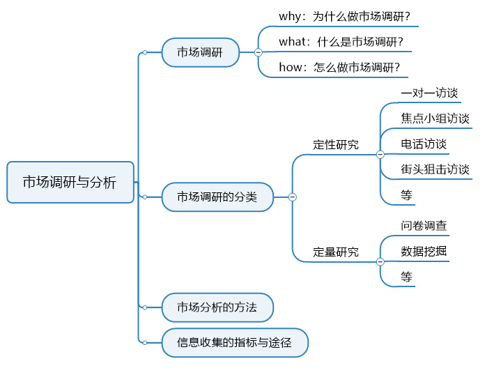
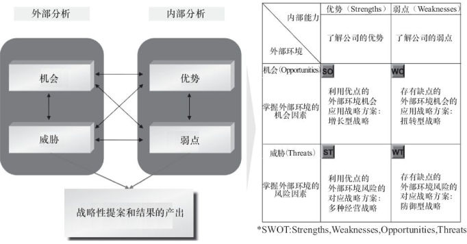
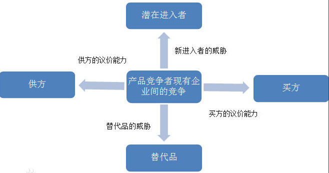
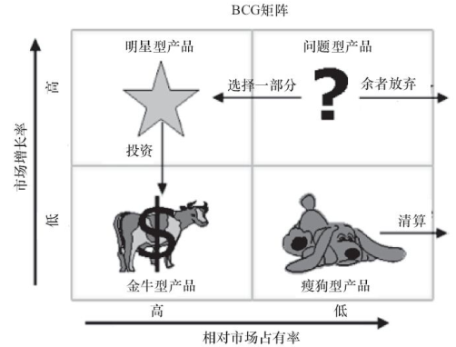

# 市场调研与分析

最近比较忙哈，一直没更新。今天我们来讲讲在《PM basic系列第1篇：产品经理及其修炼》中产品经理工作内容中的第1项——市场调研与分析。

市场调研是传统商业发展起来的方法论，因此本篇文章所讨论的市场调研不单独针对互联网行业。

本文结构如下：

## 一、为什么要做市场调研

我们为什么要做市场调研呢？——了解市场以辅助企业决策。

对，就是这么简单，就是这么浅显。

但这个道理虽浅显，却不易懂。可能你会说这有什么不好懂的嘞，不就是了解市场然后辅助企业决策嘛。哎，别急，咱们先来看看能否回答下面的问题：

> 如何了解市场？
> 怎样才算是了解了市场？
> 企业决策是依据是什么？
> 如何有效辅助企业决策？

市场调研是市场营销学中最重要的一部分，这里以市场营销举例，把市场调研的目的进行细化：

- 明确市场营销的机会和与应当解决的问题所在，并对其下定义；

- 创造、定义、评价市场营销活动；

- 监测市场营销成果。

这里明确一个认知：**市场调研一个过程**。

这么理解这句话呢？我们都知道营销活动只是企业进行商业运作的一个手段而已，企业以效益为准绳。在这个准绳的“约束”下，企业不会因为一个营销活动效果不好就不再做营销活动，反而会去优化这个营销活动，或者更换营销活动。不管是优化还是更换，在更高层级上都可以定义为——市场营销的优化。

优化是什么？优化便是一个过程性的概念。因此，我们要将市场营销作为一个过程来看待。

切换到市场调研上来，我们为什么说市场调研是一个过程。因为市场是一个动态变化的市场，我们要时刻关注市场状况，做好调研工作，才能准确把握企业未来发展的方向。

说到这里，我相信很多人都会想到一点：照你这样说，这世界上很多都是东西都是一个过程啊。哎，对喽，这世界本质就是一个过程，没有什么一成不变的东西，所谓诸行无常就是这个道理。

在这个快速变化的世界里，对我们个人而言，就是要做到不追求确定性、不因循守旧，这样才能内心平静。对于商业而言，就是要做到因时而变、因势而变、因需而变。

到这里，我们就明白了，我们真正要有的认知其实是：**诸行无常**。

> 之后的文章里，大家会经常看到我在文章中插入一些“诸行无常”这样的基础认知。还是那句话，为什么要讲基础认知——因此这些认知太过基础，以致于我们从未认真对待过它。
>
> 还有一点是，我的文章尽量都会保证用词准确、没有歧义，对于大家平时工作中没有理清的概念，我也会尽量尝试理清它。
>
> 这里要说明什么叫做“准确”，以“了解市场以辅助企业决策”为例，“了解”这个词本身是很模糊的，但在这个句子里是准确的，市场是变化的，了解的意义也会随之变化，要具体问题具体对待。因此，我说这个定义是准确的。
>
> 如果大家发现有用词不准确或有歧义的地方，可以私信告知我。
>

## 二、什么是市场调研

明确了为什么要做市场调研，市场调研的定义便已经呼之欲出了。

市场调研就是以各种手段**了解市场**，并以此**辅助企业决策**的**过程**。

可以看到市场调研的定义就是上文所讲的“了解市场”、”企业决策“和”过程“，但是如果各位细心的话，会发现我给的定义中还标粗了”**辅助**“二字。

这个其实很好理解，我们不能盲目相信是市场调研的结果，企业决策时会综合考虑竞品、自身、市场、政策等各种因素。

很久之前，市场调研就广泛应用在快消、金融、咨询、广告等行业当中，互联网发展起来之后，市场调研也广泛应用在互联网行业中。市场调研对于各行业企业的决策都是至关重要的一个手段。

对于产品经理来说，除了市场调研之外，还有一个用户调研。用户调研可以说是市场调研的细化，这个我们之后会讲到。

## 三、市场调研该怎么做

### 1、预调研确定问题或机会所在

开展正式的市场调研之前，会有一个预调研，预调研的主要目的是确定当前产品/市场的问题或机会在哪里。确定了这些，市场调研才算是进入项目立项。

我们之后会讲到很多东西的流程，这些流程都是一个个的闭环。市场调研也是，我们在上文讲到市场调研是一个过程，那岂不是说市场调研只有开始没有终点吗？对也不对，我们说市场调研是一个过程其实是在说它以终为始、循环往复。

### 2、明确调研目标

做市场调研之前，我们一定一定要先明确我们的目标是什么？哎，这时又有人说了：刚才你不讲过了吗，了解市场以辅助企业决策啊。

其实，目标和目的不是一个概念，简单理解的话，就是——目标是目的的细化，**目标是要根据目的进行设置的**。

下面列出一些调研目标的参考：

- 了解行业发展态势：行业市场规模和增长率、行业发展主要影响因素、行业竞争格局、产业链结构

- 了解典型企业：公司概况（发展历史、经营理念、企业文化）、企业盈利模式和经营业绩、企业用人文化和HRM制度、企业的业内口碑

### 3、确定调研方案

这个阶段，我们要做到是设计出一个可行的调研方案，调研方案的内容至少包括一下内容：

- 确定调研对象：我们要调查研究哪些对象（用户、企业、各类组织等）

- 确定调查方法：根据调查对象的特性、企业资源、时间等因素，来确定要采取的调查方法（访谈、调查问卷等）

- 确定信息来源：我们可以从哪些渠道（媒体、专业机构等），来获取除调查手段之外的信息

### 4、执行研究方案

这个阶段，其实就是对调研方案的具体实施，包括但不限于数据的收集、数据的管理、数据的分析等。

### 5、交付研究成果

根据方案执行的结果，对数据进行分析挖掘，最终得出结论（如产品/市场存在的问题或机会等），并撰写报告进行交付。企业参考这些研究成果调整产品方案、活动方案等。

这个阶段的输出物为市场研究报告，形式不限。

### 6、以终为始

交付研究成果之后，调研进入下一轮的迭代与调整。

## 四、市场调研的方法

市场调研分为定性研究和定量研究。定性研究有一对一访谈、焦点小组访谈、电话访谈、接头狙击访谈等，定量研究有问卷调查、数据分析与挖掘等。

### 1、定性研究

#### 1.1 一对一访谈

一对一访谈可能是我最喜欢的一个方法了。

它的好处在于能和访谈用户在较好的空间与时间环境里进行较为深度的沟通，用户能较好的将自己的想法表述出来而不受第三方影响。

一对一访谈效率相对较低，耗时相对较长，所以注意根据实际情况配合其它访谈使用。

进行一对一访谈的时候，需要注意的一些事项：

##### 1.1.1 甄选访谈对象

- 越接近“人物角色定义”的目标用户，越能获得获得较为准确的访谈效果。

- 确定访谈对象愿意接受访谈，对访谈不抵触
- 访谈对象应该包含产品早期的**种子用户**，这样才能摸清产品早期种子用户的实际需求，使产品上线后能有一个较好的用户基础。

##### 1.1.2 一对一访谈过程中的流程设置
- 开始阶段注意调动访谈对象的情绪，使访谈对象能较为专注和产生兴趣，俗称“前戏”，比如适度的赞美、找到共同特点等都可拉近与访谈对象的距离。这对产品经理是一个考验。

- 访谈过程中，注意问题顺序的搭配一定要合理，尽量保持问题的趣味度，参与度，难易度。如果我们把问题的趣味度，参与度，难易度做成一张曲线图的话，这张曲线图应该是上下起伏平滑的，让目标用户能在不知不觉中相对轻松的完成这些问题，切记出现集中难度较大的问题，集中较为枯燥的问题，这样会影响用户的情绪，甚至出现挫败感，情绪波动等。

- 切记要给予用户积极的反馈，不要因为用户的回答出乎你对产品设计的评估而沮丧，对于用户的回答应积极给予“了解”“非常好”“太棒”等鼓励，激励性回应。
- 注意少使用是非题，即对还是错，多使用开放性的问题，这样能让目标用户说出他们更多的感受。我们的目的不是要知道答案，而是要知道目标对象产生这个答案的依据是什么（福特的调查，跑的快的马，背后的逻辑则是需要更快的交通工具，省时省力）。

- 如果随着访谈的深入，涉及到一些事先没有准备到的内容范畴而又对产品有价值的信息，应随机应变，和用户保持来回的交流，把问题了解透彻，这是千载难逢的机会。

- 如果跑题了，没关系，你可以附和着用户继续沟通，然后慢慢的把话题拉回原本的路径。
- 不要坐在访谈对象的正面，面对面坐属于谈判或者审问，有天生的距离感，选择在侧面或者圆桌较好

##### 1.1.3 记录用户的访谈成果

可以由专人进行访谈记录，可以使用的工具包括：

录音笔（一般用户后面的回访，整理）、Mindmanager、Word、幕布、手写等。

#### 1.2 焦点小组访谈

焦点小组源于精神病医生所用的群体疗法（o(╥﹏╥)o），是目前用的较多的用研方法。
焦点小组访谈一般是邀请6-10人参加，针对一些主题听取访谈对象的看法，一般有主持人和介绍，鼓励大家发言。

由于国人的特性，访问中有可能部分人群受其他人群的影响，表述与实际想法有偏差。

#### 1.3 电话访谈

电话访谈适用于目标分散，临时性，需要快速得到结果的情况。注意配合其它访谈使用。

#### 1.4 街头狙击访谈

对，就是街访，在街头拦下用户进行访谈。

注意选择场景与策划产品中的场景要匹配（不排除调研非策划范围内的场景）

但是街访这种还是有点唐突，比较吓人，要注意方式方法，适当时可利用一些人性的弱点。

#### 1.5 定性访谈要注意的问题

定性访谈，总归是和人的交流与沟通，所以他们存在一些共性问题，这里给大家总结一下：

**所有的说法都要有定义**

通常保险的方法就是对有点抽象或者很重要的词语继续追问，而眼熟的就不用定义。比如说，这个人看上去特别cool，cool这个词就可以问（是冷漠？时尚？帅气？聪明？能干？）

**判断都要有例子**

例如说：“这个功能特别不好用，想做一下调研”请问“不好用”是什么意思，怎么个不好用，速度慢，还是容易崩溃等，要表述清楚问题。

**保持自信轻松，这样会感染到受访者**

不要过于卑贱和自谦，要保持不卑不亢，例如：“这方面您是专家，还请您多指正”太看低自己了。“其实我们特别想倾听您的意见，很重要”就可以了。

**通过表扬，肯定，鼓励的方式让受访者提供更多信息**

比如：“嗯，理解，启发很大”。“原来如此，您的看法很有趣，我们会仔细考虑您的想法”。

**认真倾听**

让受访者有安全感和被倾听感，受访者会越发的宣泄自己心中的不满，而有不满的地方，就有商机。

**不要频频开启新话题**

未在受访者前面的回答中追问相关问题的节点，导致未能形成递进采访的格局，不断新起话头，频频出现短促的对话，导致访问只是“点到为止”。

**不要忽略过程**

对于一个时间、行为、故事的具体过程细节、关键行为、考虑、互动情节缺乏细致的追问、探询，从而显得过于简单化与主观判断化。

**不要过多是非题**

前面已经讲过。

**不要明知故问**

不要带着答案问问题。

**不要存在明显的引导性**

这是访谈大忌，在设置问题时，一定要问问自己“我有没有诱导用户回答特定的答案？”

**不要像审查犯人一样**

这个其实就是要营造一个轻松的氛围，问问题时不要太僵硬。

那么如何确定我们的访谈是成功的呢？

#### 1.6 定性访谈的5大成功标志

- 让对方觉得不配合你都不好意思、都像是欠了你什么似的
- 让对方觉得这次还没聊够
- 让对方觉得你才是真懂他的人
- 让你自己发现，在访谈大纲之外，还获得了很多意外的收获
- 让你自己发现，交了这个朋友

### 2、定量研究

#### 2.1 问卷调查

问卷严格上讲可分为

问卷调查的**一般流程**是：明确调研需求→设计调研问卷→问卷上传到问卷平台→数据采集/回收→数据清洗→数据分析→产出调研结果。

##### 2.1.1 问卷设计的基本原则

问卷的设计要以目的为导向，先内容后形式。

- 指向性：将所需信息翻译成被调查者可以回答的一系列具体的问题。
- 可分析：同时这些信息可以并便于进行统计处理和量化分析
- 吸引力：问卷必须促进、激发、鼓励被调查者参与、合作并完成调查。应努力是调查对象的疲劳、厌烦减至最小。
- 误差小：问卷可能是形成回答误差的主要根源。问卷应使回答误差减至最小。

##### 2.1.2 常见的问题类型

问卷的常见问题类型有：单选、多选、排序、量表、描述等。这个根据问题属性和内容来设置。

##### 2.1.3 问卷设计的谬误

- 选项不完全
- 误导、引导
- 选项不接地气
- 选项含义重叠
- 错误代码
- 选项没有覆盖所有情况
- 没有落款
- 背景说明不清

##### 2.1.4 抽样

如果是针对当前用户进行在线问卷调查的话，就涉及到一个抽样调查的问题。

抽样调查其实就是一种由部分认识总体的途径和手段，大家高中时肯定都学过，这里只简单提一下。

抽样的样本量大小不取决与总体的多少，样本的容量通常取决于所许下的数据精度、研究的性质、总体中要素的同质性程度、样本设计、回答率、研究所需的经费以及调查时间的限制。还是那句话具体问题具体对待，牢记诸行无常这条定律。

抽样时可能会有以下这些错误，请牢记：

- 选错样本
- 偏颇的代表性
- 明显有违常识的执行策略
- 太多主观性

#### 2.2 数据挖掘

数据挖掘是对用户行为数据进行多角度的分析挖掘，从数据找出问题或机会。这里的数据可能是自己用户的数据、爬虫爬取的数据、公开数据等。

这个更多是技术性的工作，产品经理要学会提数据需求，能分析数据就好。

## 五、市场分析的方法

市场调研的过程中涉及到对市场的分析，市场分析有很多常用的模型。这些模型都是商科学习中，经常会碰到的，这里不会对其进行具体的解释，大家自行去了解。

要提醒的一点是**模型只是工具，切不可生搬硬套！切不可生搬硬套！切不可生搬硬套！**

### 1、SWOT分析模型

SWOT分析有四种不同类型的组合：

- 优势—机会（ SO，增长型战略）组合

- 弱点—机会（ WO，扭转型战略）组合

- 优势—威胁（ ST，多种经营战略）组合

- 弱点—威胁（ WT，防御型战略）组合

[SWOT分析模型-MBA智库](https://wiki.mbalib.com/wiki/SWOT)

### 2、波特五力模型

[波特五力模型-MBA智库](https://wiki.mbalib.com/wiki/%E6%B3%A2%E7%89%B9%E4%BA%94%E5%8A%9B%E5%88%86%E6%9E%90%E6%A8%A1%E5%9E%8B)

### 3、波士顿矩阵模型

波士顿BCG矩阵用来评估与分析现有产品线和产品组合以及利用麦肯锡三层面法进行产品线规划。 

由图可知， 产品可分为四类：

- 瘦狗型产品： 市场份额低、 市场增长率低的产品；

- 金牛型产品： 市场份额高、 市场增长率低的产品；

- 明星型产品： 市场份额高、 市场增长率高的产品；

- 问题型产品： 市场份额低、 市场增长率高的产品。

一般而言， BCG矩阵的策略大致可分为四种： 

- 逐渐放弃或是卖出瘦狗型产品（ 低成长、 低市占） ； 

- 抓住金牛型产品（ 低成长、 高市占） ， 并尽量挤出现金； 

- 投入现金（ 相对少量） ， 并保持明星型产品（ 高成长、 高市占） 的竞争优势， 确保高市占率； 

- 投入大量现金， 提升问题型产品（ 高成长、 低市占） 的竞争优势， 使其成为明星型产品。 

简单地讲， 就是**放弃瘦狗、 捉住金牛、 维持明星、 投资问题**。

[波士顿BCG矩阵-MBA智库](https://wiki.mbalib.com/wiki/%E6%B3%A2%E5%A3%AB%E9%A1%BF%E7%9F%A9%E9%98%B5)

### 4、PEST分析模型

PEST分析模型倾向于更宏观的分析，具体包含4个元素：

- 政治法律环境(Political Factors)
- 经济环境(Economic Factors)
- 社会文化环境(Sociocultural Factors)
- 技术环境(Technological Factors)

[PEST分析模型](https://wiki.mbalib.com/wiki/PEST)

## 六、信息收集

市场调研中有一项重要的工作——信息收集。

### 1、信息收集能力的指标

确定好研究目标之后，我们就要用最有效的方法找到所需要的信息。每个人都会收集信息，关键在于如何高效地收集信息。那怎样才算是高效的信息收集呢？这里提供3个指标：查准率、查全率、检索速度。

- **查准率**：即要确保对于所有收集的目标信息要足够准确，不掺杂干扰信息

- **查全率**：即要确保已经收集了足够的目标信息

- **收集速度**：即在最少时间内保证查准率和查全率

### 2、有哪些信息收集的途径

搜索引擎：Google、必应、搜狗等（尽量不要用百度）

专业数据库：中国知网等

社交媒体：微信、知乎、简书等

专业媒体：36氪、互联网早读课等

咨询机构：麦卡锡、易观智库等

本地电脑：自己建立的知识库，之后会分享如何建立自己的知识库

网盘资源：百度网盘、网盘搜索工具等

信息收集这个东西也是门学问，这里限于篇幅，不细讲了。

## 七、小结

### 1、市场调研对产品经理的要求

从上文我们可以汇总一下市场调研对产品经理的要求，如下：

- 基本营销、管理、广告、经济学领域相关知识

- 敏锐的商业感觉与行业洞察力

- 广泛而实时更新的市场资讯获取能力和储备（信息检索、挖掘有效信息）

- 基本的市场调研手段知识和实践能力

- Office软件、SPSS软件的熟练应用能力

- 较强的沟通能力、结构化表达能力

- 项目管理能力：我们说要将市场营销作为一个过程来看待

市场调研与用户研究是一个庞大的学科，它有着非常完善的科学方法。对于大企业来讲，这部分工作可能是由专门的市场调研人员和用户研究人员单独负责，而不是产品经理全权负责的。

这篇文章所讲述的其实也只是市场调研的九牛一毛，更多的内容需要大家在实战中自己去总结。

还有就是随着这个系列的展开，我们会发现产品经理工作内容中每一个都可以单独提出来作为一个职业，所以我们才说产品经理是一个对综合实力要求极高的职业。

但这并不是说产品经理要对每一个环节都要做到精通，一方面，几乎没有人能够做到这样；另一方面，随着市场的完善，产品经理也会进行相应的细分。

我们要做的是找到自己专长的那部分，深入研究，然后逐步拓展到其他部分。

### 2、市场调研与用户调研

可能有同学会说，你怎么不讲用户调研呀，这才是产品经理的真正会做的！

那我接下来及谈谈市场调研与用户调研。

其实，在我看来，用户调研只是市场调研的一部分。但这里为了好讲述，我把它们区分开。

市场调研更多的是对整个市场的调研，实际工作中很多公司在前期产品立项时会用到，之后的工作中只是简单地做市场调研了。

用户调研更多的是对市场中用户的调研，这包括已有用户和潜在用户，实际工作中是在产品立项后才会全面展开的工作。

因为市场调研也会涉及到对单个用户的调查，所以市场调研中的很多方法是适用于用户调研的。对于用户调研的一些独有方法，我们会放到之后的需求分析中讲。

### 3、小结

回顾文章开头我提出的问题：

> 如何了解市场？
> 怎样才算是了解了市场？
> 企业决策是依据是什么？
> 如何有效辅助企业决策？

对于这4个问题，我只直接回答了第一个，剩下的3个，我没有正面回答，但答案已经在文章中了。

如果你真的理解了本文精华的话，答案已在你心中。

**预告**：下一篇将会讲《产品战略与规划》。
