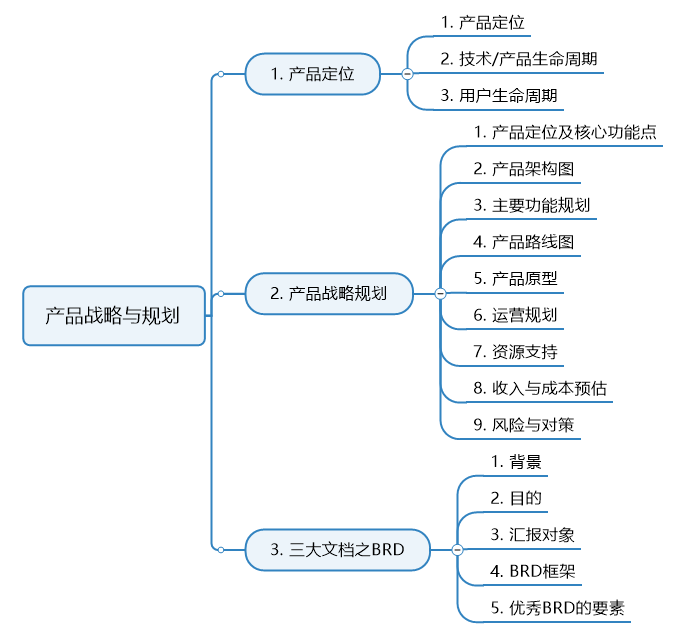
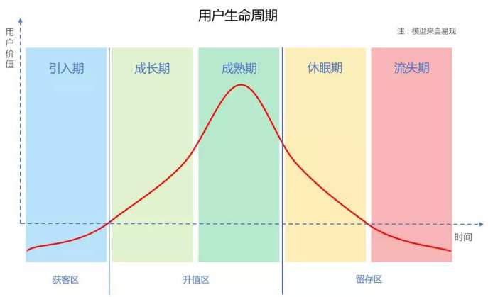
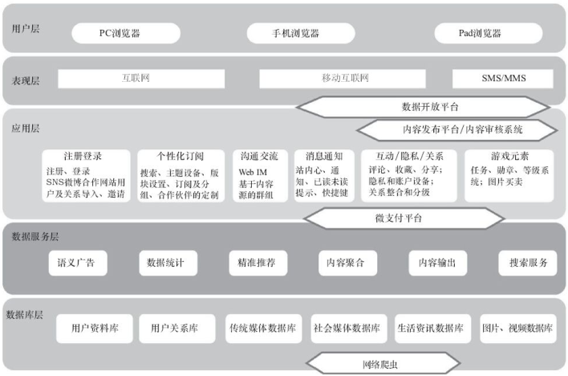
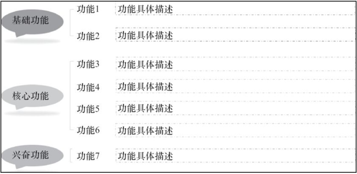
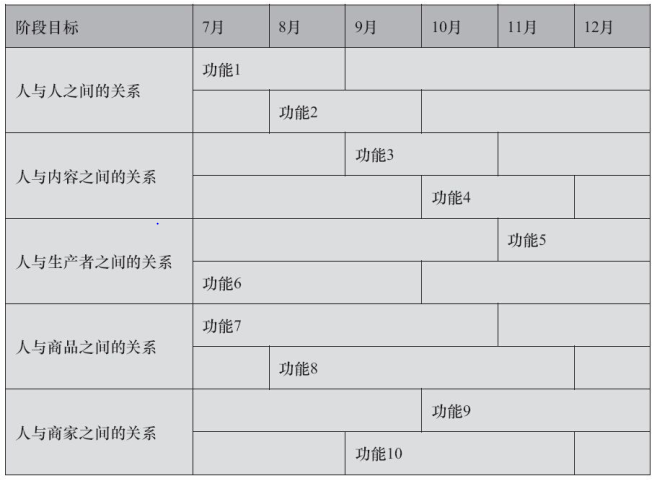
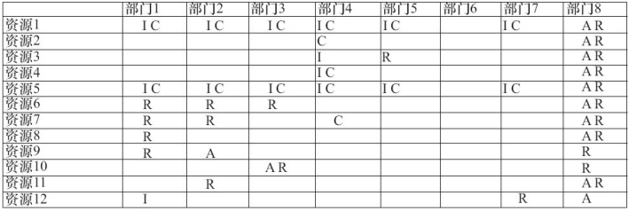
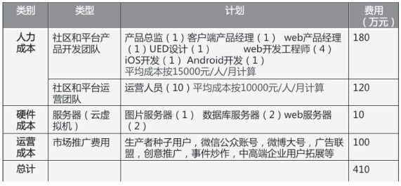
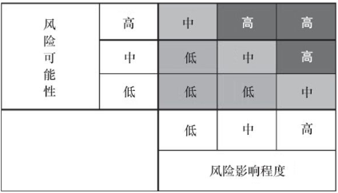

# 聊一聊产品战略与规划

产品规划主要解决怎么去做的问题， 主要包括核心功能点、 产品的架构、 主要功能规划、 产品路线图和产品原型。

注意这里的产品规划仅指单个产品的规划，不包括产品线的规划，因为我自己还没到这个层次。

在前期，我们需要根据初步的市场调研，对产品做一个战略规划，这个阶段决定了产品的未来走向。

在这个阶段，我们需要确定我们产品的定位、用户群、发展路线图、产品基本架构、盈利模式、风险、运营策略等。

说到这里，我想大家应该会想到我们在第2篇文章《聊一聊商业模式》里讲到的商业模式画布。没错，**战略规划的目的就是确定产品的商业模式**。

下面我们一一进行讲解。

本文结构如下：

## 一、产品定位

产品定位是产品规划的前置工作。

产品定位关键在于**一句话能够表达清楚自己的产品**。关于定位对于企业的重要性以及定位的方法论，可参考《定位》这本书。

这里简单说明产品的定位需要明确的一些问题，如下：

- 你要做的是什么行业什么类型的产品，产品的用途是什么、产品的战略定位是什么
- 你的目标用户群是谁，用户的生命周期是怎样的
- 你的产品解决了用户的什么问题
- 你的产品能给用户带来什么价值
- 你的产品跟竞争对手的差异在哪

这些问题都很简单明了，但这里涉及到一个名词——生命周期。生命周期是市场营销里的重要概念，这里我想把它拆成产品生命周期、用户生命周期。

### 1、技术/产品生命周期

只要我们面对的新产品需要我们改变自己一贯的行为模式，或者需要对我们目前依赖的产品或服务进行改进时，我们对于技术采用的态度就会变得越来越重要，所以技术采用生命周期模型也就成为了整个高科技行业所采用的营销方式的中心所在。
#### 1.1 创新者
创新者会非常积极地追随于各种新技术产品之后。有时，他们甚至会在正式的产品尚未发布之前就已经开始使用。这是因为科技是他们生活中的最大乐趣，而并不在意这些技术能够在他们的生活中提供什么样的功能。

在任何一个市场中，创新者都不多见，但是企业必须争取在营销活动初期得到他们的青睐，因为当新产品投放市场时，他们的认同能够为其他消费者带来购买信心。

#### 1.2 早期采用者
早期采用者虽然与创新者相同，都会在新产品生命周期的早期接受产品，但他们并不是技术专家。他们只是一个善于想象、了解并欣赏新技术所具备的优势，并且能够将这些潜在的优势与自己关心的其他方面相联系的群体。只要发现了某种新技术产品能够有效地满足他们的需要，早期采用者就会考虑是否做出购买决策。

正是因为早期采用者在做出购买决策时并不会禁锢于公认的看法，而是更愿意尊重自己的直觉和想象，因此他们对于任何高科技市场的拓展发挥着至关重要的作用。

#### 1.3 早期大众
早期大众的购买决策最终是由一种强烈的实用性想法而推动的。他们知道这些最新奇的发明中有很多最终都将不再流行，并且会成为过眼云烟，所以他们宁愿继续等待，并在自己购买之前，细心观察周围的人对新产品作何评价。

由于这一群体中的消费者数量是非常多的-几乎占据整个技术采用生命周期的1/3，所以说，赢得他们的认同，对企业获得巨额利润和飞速发展史非常重要的。

#### 1.4 后期大众
后期大众只会等到某些既定标准形成之后才会考虑购买，并且即使等到了那个时候，他们仍希望得到很多的支持，所以他们更有可能从一些知名的大型公司手中购买产品。如搜索引擎、即时通讯产品都已经发展到该阶段。

后期大众群体也占据了总体的1/3。因此如果一项新产品能够得到他们的喜爱，公司确实能够获得较大的利润，因为随着产品的逐步成熟，边际利润率将呈现递减规律，但同时公司的销售成本也将逐渐降低，这样一来，公司的研发成本在最后将被全部摊销。

#### 1.5 落后者
无论基于哪些原因，是个人方面还是经济方面，这些消费者对新技术没有任何兴趣。只有当一项技术产品已被深深埋藏于各种其他产品之中事，落后者才会进行购买。

落后者占据了总体的1/6，但无论从哪个方面来说，落后者这个群体通常都不会被企业重视。

### 2、用户生命周期

对用户生命周期的探索与需求挖掘现在已经成为所有互联网企业的重中之重。

纵观互联网发展史，我们发现呈现这样一个现象：

**技术取得突破→技术主导市场→技术落地遇到瓶颈→产品开始主导市场→产品同质化严重→运营开始主导市场**

现在互联网行业的市场主导性趋势，正在由产品主导转向运营主导。为什么会出现这种情况呢？答：同质化严重啊，你上面一段话不写了吗。

但，真是这样吗。

以团购为例，之前号称百团大战，所有的团购产品几乎一模一样，但现在再看只剩下美团了，在产品雷同的情况下，美团为什么能够脱颖而出呢，其实就是美团强大的运营管控能力。但产品同质化却不是运营开始主导市场的根本原因，这个问题的根本在于——**为什么是“运营主导”的企业真正在市场上取得了竞争力？**

我希望读者可以思考一下这个问题，另外还有一个问题我也想要读者思考一下：**那些没有多少同质化竞品的企业为什么也开始运营主导？**

我为什么要在讲用户生命周期的时候先讲运营主导的现状呢，因为用户生命周期是运营工作的基本，运营的所有活动（获取、激活、留存、变现、传播等）都基于此展开。

下面我们仅简单引入用户生命周期的模型，如下图所示：

我们可以把这5个阶段简要划分成**三个区间**：

**获客区**——引入期，主要运营手段为拉新

**升值区**——成长期+成熟期，主要运营主段为促活、复投、传播

**留存区**——休眠期+流失期，主要运营手段为留存，召回

运营活动基本都是围绕着5个阶段进行的，我们之后讲运营的时候会细讲。这里大家可以结合技术/产品生命周期来理解用户生命周期。

## 二、产品规划的基本构成

### 1、产品定位及核心功能点

关键在于**一句话能够表达清楚自己的产品**。

### 2、产品架构图

产品架构图就是用一张图展示产品架构。 产品架构一般包括数据库层、 数据服务层、 应用层、 表现层和用户层。

#### 2.1 数据库层

通常是单个数据库或由多个数据库组成的数据库系统。

数据库层的功能是： 与数据访问层进行交互，记录系统所有的数据。

#### 2.2 数据服务层

包括数据控制层、数据表示层和数据访问层。

数据控制层用于控制数据的基本操作，如增加、修改、删除、查询等。 

数据表示层用于统一数据集里的数据表达方式，以响应数据控制层存取数据的请求。

数据访问层用于连接数据库、执行数据库操作、将数据库查询结果返回到数据表示层。

#### 2.3 应用层

基本上是功能模块， 表现层是应用程序的客户端， 它通过应用层来访问数据库， 用户层是用户通过哪些终端设备可以使用产品， 比如Web浏览器及桌面客户端、 手机浏览器及客户端、 Pad浏览器及客户端等， 确定产品的用户层有利于以最低的成本开展产品规划工作， 实现跨平台。 

### 3、主要功能规划

在做主要功能规划时， 需要明确产品主要有哪些功能模块， 并对主要功能进行描述。 

描述可以从四个方面进行： 面向的用户群是谁、 解决用户什么问题、 带来什么价值、 优先级如何。

基础功能是必不可少的功能， 砍掉这些功能， 产品基本上无法正常使用， 对应着KANO模型（之后需求分析中会讲到）中的基本型需求。

核心功能对应着的核心功能点及主干功能，对应着KANO模型中的期望型需求，此类需求若被满足，用户的满意度会显著增加。

兴奋功能也就是我们常说的尖叫点，也是兴奋点，是超出用户预期的功能，对应着KANO模型中的兴奋型需求。

### 4、产品路线图

产品路线图（ 又称产品Roadmap） 包括每个项目产品的阶段目标， 要实现哪些主要功能， 每个功能从什么时间开始， 大约什么时间结束。 

产品路线图是粗略地传达什么时间段完成哪些功能的工具。 

### 5、产品原型

如果想更清楚地表述产品， 那么产品原型图是最佳解决方案。 一图抵千言。 强烈建议制作一个原型， 这有利于听众在短时间内对要做的产品有一个直观形象的感知。

这个阶段的原型设计旨在传递要做一个什么样的产品， 所以对核心功能和主干流程画出原型即可， 不要求做得非常精细， 各个交互细节都设计出来。
制作产品原型可以使用纸质、 PPT、 Visio、 Photoshop、 Axure等原型工具。

如果所做的产品有一个非常明显的模仿和借鉴产品对象， 而且跟被借鉴产品在功能方面非常类似， 那么可以不制作产品原型。（记住：借鉴并不可耻！）

### 6、运营规划

运营规划的内容主要包括产品运营分几个阶段走； 每个阶段的目标是什么； 为实现目标每个阶段采取什么样的运营策略和方法； 每一种方法的预算大约有多少（ 投入） ； 在申请预算之前， 对采取相应策略方法过程中产生的费用最大值进行预估， 申请的预算一般要高于可能发生的费用最大值， 避免出现资金不够、 对运营的效果产生影响等问题； 预期达到什么效果（ 产出） 等。

在产品初期，有时候可能根本不会做运营规划，就算做，也只是很简单的提及一下。更多时候我们会把这个放在产品设计甚至之后进行规划。

### 7、资源支持

资源主要包括人力、物力和财力资源。资源支撑的对象主要有上级或同级部门。 

大老板们要看成本，他们在了解达成项目的目标需要多大的花费以后，才能做出决策。

资源估算时要考虑需要什么样的资源、 需要多少、 什么时候需要、 谁有权决策。 做资源规划最重要的目的是未雨绸缪， 可以使用RACI表， 让资源提供部门提前计划和协调资源以配合你的工作， 发挥协同效应。
我们可以使用工具（ RACI表） 进行资源支撑规划， 如图所示。

RACI表中R代表Responsible，是负责的意思；A代表Accountable，是驱动的意思；C代表Consultable，是求教的意思；I代表Inform，是知会的意思。

### 8、收入与成本预估

收入与成本这部分工作之所以重要，是因为它的用处很关键：争取资源支持，进而争取项目立项。

收入我们之前在讲商业模式时，已经讲过，即盈利模式。

这里仅讲一下成本。

产品的成本， 主要体现在人力成本、 硬件成本和运营成本三个方面。如图所示。

注：这里的具体数值仅是举例。

### 9、风险与对策

#### 9.1 风险种类
有的项目会有一些潜在风险，这个时候不妨抛给老板们看一下，并且给出自己的对策，说不定你觉得是很大的麻烦，在老板那里一句话就可以搞定。而且由于信息的不对称，我们无法了解某些功能是否会与公司将来的战略冲突，这时候提出来也是让老板们把一下关。

产品或项目可能面临的外部和内部风险包括政策风险、 市场风险、 技术风险、 决策风险、 法律风险、 资本风险等。

**（1） 政策风险**

政策风险指的是受到国家政策、 法律、 法规的影响， 如由原先的政策保护变成了政府政策不支持， 或者政府出台了对业务非常不利的管制条例。

**（2） 技术风险**

技术风险指的是由于技术上的不足或缺陷以及技术分析和决策失误等原因， 给产品和运营带来损失的可能性。 比如缺少核心技术人才、 技术决策失误、 核心技术的泄露、 核心技术的攻关存在难度、 产品被黑客攻击导致瘫痪、 用户资料泄露引起重大安全隐患或导致产品不能正常使用等。

**（3） 法律风险**

法律风险指的是在法律实施过程中， 由于企业外部的法律环境发生变化， 或由于包括企业自身在内的各种主题未按照法律规定或合同约定行使权利、 履行义务， 而对企业造成负面法律后果的可能性。

**（4） 市场风险**

市场风险指的是市场遭遇垄断、 恶意并购、 竞争对手发起的恶性不公平竞争、 潜在进入者实力非常强大而给业务带来的风险。

**（5） 决策风险**

决策风险指的是决策失误带来的风险。 影响决策风险的因素有客观和主观两种。 客观因素， 如信息不充分或发生不可预知的事情、决策机制不健全等； 主观因素， 如决策者的能力不足、 受情绪或成见影响导致判断失误。 都可能导致决策失误。

**（6） 资本风险**

资本风险指的是由业务现金流不健康、 融资困难、 不良债务、 盲目扩张、 投资方撤资等带来的风险。

#### 9.2 风险等级评估

知道有哪些风险后， 又该如何对这些风险进行等级评估呢？ 

主要从两个方面进行， 一个是风险发生的可能性（ 概率） ， 可分为高、中、 低三个等级， 其中， “高”表示发生的可能性大于60%， “中”表示发生的可能性介于30%和60%之间， “低”表示发生的可能性小于30%。 

第二个是发生的风险对项目的影响程度， 也分成高、 中、 低三个等级。 将风险发生的可能性和风险对项目的影响程度进行矩阵分析， 得出风险的等级。

#### 9.3 风险应对

只说风险是不行的，我们要针对风险提出相应的措施，如何规避/减缓风险的到来，风险到来时如何应急、如何转移/降低风险等。

### 小结

产品的战略规划基本上可以说是商业模式画布的细化。

这个阶段我们会产出一个重要的文档——商业需求文档，简称BRD（Business Requirements Document）。

## 三、三大文档之BRD

BRD基本上就是上述产品规划的各项构成。

这里仅仅列出一个框架。

 ### 1、背景

发现现有产品改进的问题；一个创新产品。

### 2、目的

要权重；要项目；要资源。

### 3、汇报对象

资本背景CFO；运营背景COO；技术背景CTO；战略背景CEO。

### 4、BRD框架

#### 第一部分：外部市场分析

（1）市场问题：目前市场存在哪些问题

（2）产品问题：涵盖所有针对这个市场的产品

（3）技术问题：整个产业所涉及的技术

（4）市场机会：目前市场存在哪些机会

（5）利益分析：这个市场有何利益可图。最关键的重点！大老板们最感兴趣的，做了这个项目以后有什么价值，一定要说在点子上。一般我们还会预测一下相关数字的变化，提出这个项目的商业目标。

#### 第二部分：产品定位介绍

期望做什么样的产品来应对市场问题。

（1）产品介绍：定义并描述拟定（如果没有实际产品，要描述产品概念）要解决市场问题的产品。

（2）要解决的问题：描述拟定产品如何解决市场问题。这问题是迫切的吗？这个问题是强烈的问题吗？这个问题出现的频率高不高？

（3）营销目的：描述公司发布拟定产品所希望的营销目的。

（4）战略定位：描述拟定产品如何和企业当前的商业战略相结合，确定并解释拟定产品将 会对公司各项业务指标产生何种层面上的影响。

#### 第三部分：目标市场概述
（1）市场概述：定义并描述拟定产品的目标市场。

（2）客户概述：定义并描述拟定产品的目标客户轮廓。

（3）市场/客户细分：定义并描述最适合的市场细分方式。

（4）市场/客户群体：描述将选择哪些市场/客户群体，并合理说明为什么这些群体应该被 关注。

（5）市场/产品细分：描述并解释市场/产品细分的方式哪些是最现实和/或成功的。

（6）市场竞争：描述竞争格局和关键的竞争者；描述竞争者创见了何种竞争壁垒，我们将 如何创见竞争壁垒。

#### 第四部分：产品战略规划

产品战略包括产品架构、产品主要功能、产品路线、收入与成本评估、风险分析。这些我们在上文都已经讲过。

#### 第五部分：竞争优势分析
（1）公司现有优势：定义并描述公司当前有助于拟定产品发展的存在的竞争优势。（技术优势，经验优势，资源优势······）

（2）公司获得优势：定义并描述公司期望发展拟定产品能够获得的竞争优势。我们将得到什么样的好处？非经济类的好处（战略优势等）；经济类的好处（收入等）

（3）产品固有优势：定义产品本身的固有优势。

### 5、优秀BRD应具备的要素
（1）重点突出（商业价值；收入与成本；风险与对策）

（2）是不是产品就不重要？

- BRD很多时候是定性的东西，不要过多的去扯产品细节，产品形态可以粗放一点。（技术驱动产品要两看）

- 产品经理不要总是把目光定在产品上，要学会跳出来

- 集中火力，不扯淡

（3）说服力

- 演讲技巧

- 对公司战略的理解

- 对汇报对象思维方式的理解
  - 多沟通，或与其合作伙伴沟通
  - 平时多观察行事风格

（4）见人说人话，见鬼说鬼话

- 要变通

- 但要有逻辑，理论有支撑，不是忽悠

（5）言简意赅，点到即止

- 有的话不能说透

- 一图胜千言

- 一句能说清楚，不要说两句

- 不要过多的使用专业术语

- 客观评估，不要给自己埋地雷，但该点到的问题都要点到（困难，风险等）

**预告**：下一篇将会讲产品经理的重头戏《需求分析》。

