# 产品经理的核心工作：如何做好需求分析与管理？

接下来，我们要开始讲产品经理工作中最重要的环节——需求分析与管理。

这里我对需求分析的定义要广一些，包括：需求的获取、需求的评估、需求的评审、需求的管理等。因此，本文是对产品全生命周期需求分析的描述，不仅仅是产品前期的需求分析。

本文结构如下：

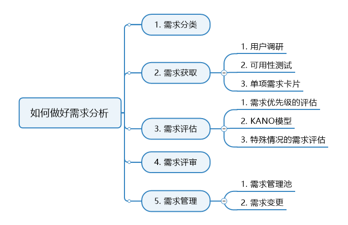

我们先来看看需求的分类。

## 一、需求分类

### 1、从商业角度分为用户需求和商业需求

>  **用户需求**：2C产品我们通常叫做用户，2B产品我们可能还会叫他客户。这些人的诉求称之为用户需求。

>  **商业需求**：和企业利益密切相关的需求。

作为产品经理，**我们一定不能只考虑用户需求，还要考虑其与商业需求的权衡**。你做一个所有人都喜爱的产品，但是却没有任何盈利点，又有什么用呢？

用户的需求包括但不限于一下这些：

> - 娱乐休闲

> - 归属感

> - 沟通

> - 意见领袖：意见领袖的一言一行是追随者愿意模仿，意见领袖存在是具有其自身价值的。

> - 利益：物质利益、精神利益

> - 获取知识和资讯

> - 自我情感表达
>   - 对人情感的分类：怀念，痛惜，怀恨，轻蔑，佩服，失望，嫉妒，庆幸，诚信，通信，嫉妒，快慰，信任，顾虑，顾忌，嘲笑。
>   - 对己情感分类：自豪，惭愧，得意，自责，开心难堪，自卑，自信
>   - 在现在生活中，人对自己情感的阅读很差的，很少有人愿意去读自己的内心。所以产品经理要学会洞察并把握用户情感。

> - 爱和被爱

> - 社交

> - 分享

> - 安全

> - 尊重

当然，这里有一个经典的理论模型——马斯洛需求层次理论模型。用户所有的需求都可以对应到这个模型上。我们要的不是说要了解该模型中每一层都对应哪些需求，而是要能够知道该需求可以对应到那一层，这是一个思维问题。

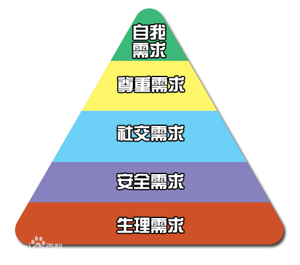

### 2、从产品开发角度分为功能性需求、非功能性需求

> 功能性需求：即产品设计上的功能
>
> 非功能性需求：包括产品性能、安全、兼容性、运营、UI、数据统计等需求。
> 

很多产品经理都会忽视非功能性需求，最终导致产品出现各种bug、宕机、频繁修改等问题。
这里提醒大家一点，我们永远不能假设开发同志们在开发时，能够考虑到性能、兼容性等问题。考虑这些问题，是产品经理的工作。

### 3、按需求重要性分

#### 3.1 必备型需求

必备型需求是用户认为产品“必须有”的属性或功能。

当其特性不充足（不满足用户需求）时，用户很不满意；当其特性充足（满足用户需求）时，无所谓满意不满意，用户充其量是满意，如婚嫁网站中搜索异性的功能等等。

用户认为是理所当然应该存在的比方说：汽车里面的空调、车轮子

#### 3.2 期望型需求

期望型需求（又叫绩效性需求）需求提供的产品或服务比较优秀。

注意期望型并不是“必须”的产品属性或服务行为（有些期望型需求连用户都不太清楚）但是是他们希望得到的。

在市场调查中，用户谈论的通常是期望型需求，期望型需求在产品中实现的越多，用户就越满意;当没有满足这些需求时，用户就不满意。

例如婚嫁网站中除了搜索功能外，还可以为用户在浏览异性的时候，根据浏览的异性匹配和推荐一些异性出来（根据喜好推荐）。

#### 3.3 魅力型需求

魅力型需求要求提供给用户一些完全出乎意料的产品属性或服务行为（兴奋型需求）。

魅力型需求使用户产生惊喜。当其特性不充足时，并且是无关紧要的特性，则用户无所谓，当产品提供了这类需求中的服务时，用户就会对产品非常满意，从而提高用户的忠诚度。

比如：进入婚嫁网站就直接给你推送喜欢的异性，都是你中意的或超出预期的。

#### 3.4 无差异型需求

无论提供或不提供此需求，用户满意度都不会有改变，用户根本不在意。

比如：婚嫁网站上面提供PM2.5值、预告婚嫁网站上面提供物流快递查询等。

#### 3.5 反向型需求

用户根本都没有此需求，提供后用户满意度反而会下降。

比如：婚恋网站上面提供在线离婚咨询

### 4、学会探究问题的本质
社会进程的推动，其实就是满足需求的过程。我们来看“国家的需求是稳定”这样一个需求，我们该如何去探究：
> - 国家需要稳定
>   - 合理的社会福利
>     - 医疗
>     - 社保
>     - 公积金
>   - 法律与执法机器
>     - 严格的法律
>     - 警察，武警
>   - 安全需求
>     - 军队
>     - 武器
>

互联网产品也是基于这样的需求大环境下被推动。
所以，思考问题是有方法的，当我们把一些根本的东西本质看透以后就能比较清晰的分析和思考问题了。

## 二、需求获取

需求获取的流程：明确目标 - > 选择采集方法 - > 制定采集计划 - > 执行采集 - > 资料整理。

这个流程没什么好说的。需求获取（采集）的方法有很多中，有些我们已经在《市场调研与分析》中讲过了，除了那些，还有可用性测试、从运营等业务部门获取等方法。

这里从需求获取工作中单提出来3点：用户调研、可用性测试和单项需求卡片。 

### 1、用户调研

#### 1.1 用户群细分

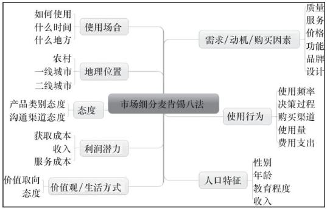

#### 1.2 明确目标用户群及特征

用用户群细分方法简单描述我们的目标用户群及其特征。

#### 1.3 用户场景及建模

用户角色模型：新手用户；熟练用户；价值用户。

其实就是对用户进行画像，类比与很多刑侦剧心理咨询师对罪犯的心理测写（这个类比好像不太合适哈），我们会对用户的基本人口特征、需求等进行描述。下面是一个示例：

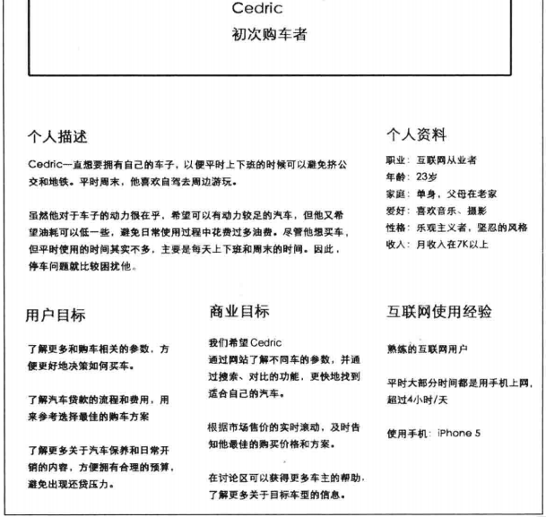

我们通常会在目标用户群中提炼出几个典型的用户，进行画像。最后产出的用户画像将是后续的各种讨论和决策的基本依据。

基于各种原因，我们的用户画像可能是会变化，这时我们就需要及时更新这些画像。

#### 1.4 用户核心需求把控/目标用户需求痛处

用户口中所说的需求未必就是真实的需求，我们要学会把用户需求转化为产品需求。

> 用户需求：用户自以为的需求，并且经常表达为用户的解决方案。

> 产品需求：经过我们的分析，找到的真实需求，并且表达为产品的解决方案。

所以我们所说的需求分析其实就是，从用户提出的需求出发，找到用户内心真正的渴望，再转化为产品需

求的过程。

### 2、可用性测试

可用性测试是指通过让实际用户使用产品或原型方法来发现界面设计中的可用性问题，通常只能做少数几个用户的测试，看他们怎么做，属于典型的定性研究。

可用性测试需要注意的问题：

**第一，如果可用性测试做得太晚（往往在产品将要上线的时候），这时发现问题也于事无补了。**

其实，可用性测试在产品的各个阶段都可以做。在尚无任何成型的产品时，可以拿竞争对手的产品给用户做；在产品只有纸面原型的时候，可以拿着手绘的产品，加上纸笔给用户做；在产品只有页面 Demo 的时候，可以拿 Demo 给用户做；更多的时候，在产品已经可以运行以后，可以拿真实的产品给用户做。不同阶段不同做法，从中都能发现相应的问题。

**第二，总觉得可用性测试很专业，所以干脆不做。**

可用性测试，听着很专业，但收益又无法量化，所以对很多老板来说，不太愿意在这个上面投入资源，经常因为项目时间过紧被略过。我们知道，可用性测试通常来说**做 5 个左右的用户才可以发现大部分的共性问题**，前前后后的准备也耗时不少，但只做一个用户，并且简化步骤，也比不做要好。

**第三，明确是测试产品，而不是测试用户。**

可用性测试要邀请用户来做测试人员，我们在开始之前，应当明确地告诉用户，这个测试的目的是发现软件产品中的问题，而不是要测试用户是否有能力来很好地使用软件。所以，不要让用户听到“可用性测试”的术语，而是说“来试用一下我们的 新产品，提点意见”。 清楚地说明这一点将有助于减轻用户的压力，使得他们能像在真实环境一样来使用软件。

**第四，测试过程中，组织者该做的和不该做的。**

刚开始的时候，可以告知用户大概持续的时间，要做哪些事情，让用户心中有数，轻松愉快地完成任务。

可用性测试中，我们可以要求用户在使用产品的过程中采用一种名为“发声思维”的方法，即在使用产品的同时说出自己的思考过程，比如为了完成某个任务，用户想先做什么，后做什么，为什么要做某个动作，等等。

做测试的过程中千万不要有任何的引导与暗示，而只是观察和记录，因为任何引导都可能使得原本可以发现的问题无法暴露。用户行为和预想的不一样时，可以提问，实在进行不下去的时候，给予提示。记住，一切的错都是产品和我们的错，用户绝对没有错。如果真觉得用户错了，那也是你找错人了，不是这个人错了。

结束之后，如有可能应该送个小礼品，当然在邀请的时候就要告诉用户会有一些对他付出时间的补偿。尽快总结，并且发给用户，一方面让用户感到他做了一件有意义的事，另一方面也是表示感谢，建立长期和谐的“用户参与产品设计”的氛围。

### 3、单项需求卡片

单项需求卡片的理念就是： 产品的需求工作不只是需求分析人员的事，而是涉及产品的每个干系人的义务，至少得参与“采集”的过程，理想的状态是产品的所有干系人都参加过“需求采集” 的培训，然后在日常工作中养成主动提交需求给产品人员的习惯，但实际很难做到，所以作为专业的需求分析人员，就应该尽量降低同事们，比如销售、服务、技术人员提交需求的成本，也是节省我们自己的时间。

一张单项需求卡片描述了一个用户需求到底包含哪些内容，重点是描述用户场景，谁在什么时间、地点产生了何种需求。

需求卡片还有一个好处是可以存档，可以避免后面的扯皮。为什么说这点呢，因为我曾经吃过亏啊！o(╥﹏╥)o

这里提供一个非常简单的模板：

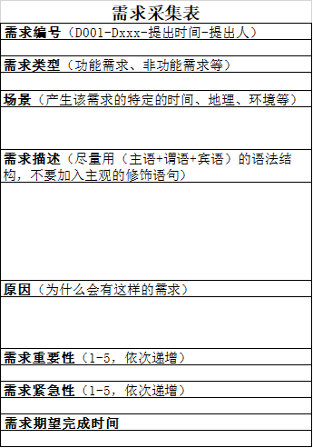

## 三、需求评估

需求评估有2个目的：

- 评估需求合理性：不合理的一般不会进入需求列表中
- 评估需求优先级：若需求合理，则评估其优先级

### 1、需求优先级的评估

我们把需求汇总好之后，会进行需求分析，这里会对所有的需求进行合理性的评估，结合产品战略与市场状况，决定哪些需求做哪些不做，汇总进产品需求池中。

| 序号 | 模块 | 子模块 | 页面 | 需求 | 需求描述 | 商业价值描述 | 商业优先级 | 开发量 | 性价比 | 备注 |
| ---- | ---- | ------ | ---- | ---- | -------- | ------------ | ---------- | ------ | ------ | ---- |
| ……   | ……   | ……     | ……   | ……   | ……       | ……           | ……         | ……     | ……     | ……   |
| ……   | ……   | ……     | ……   | ……   | ……       | ……           | ……         | ……     | ……     | ……   |

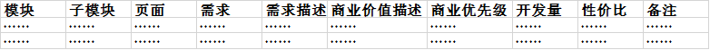

需求优先级的评估需要综合考虑产品战略、市场状况、开发量、性价比等。其中产品战略和市场状况决定商业优先级，商业优先级和开发量决定性价比（即需求优先级）。

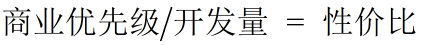

我们通常会把商业优先级在1-5级中，1最高，5最低。开发量一般以所需开发时长来定，以N小时/人作为计量单位。

这里面有个问题，商业优先级固定在[1,5]，但开发量的数值缺失不确定的。

举个例子：

| 需求  | 商业优先级 | 开发量 | 性价比 |
| ----- | ---------- | ------ | ------ |
| 需求1 | 5          | 10     | 0.5    |
| 需求2 | 4          | 8      | 0.5    |

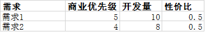

上面两个需求那个优先级高呢？

这里有几个答案：

> - 答案1：需求1和需求2优先级一样高；

> - 答案2：如果需求1的确很重要的话，那么需求1的优先级更高；

> - 答案3：如果需求1不是非常重要的话，那么需求2的优先级更高。

那个答案更合理呢？

在我看来，我认为答案1和答案2是合理的，答案3是一个伪命题。

对于答案3，如果需求1不是非常重要的话，我们就不应该给它的商业优先级定为5，定为5本身就是不合理的。

对于答案2，看起来比答案3合理多了。这里的逻辑是如果量化性价比出现问题的话，可以由主观意愿介入来做决定。

其实面对这种情况，我们还有一种办法。

前面的解决办法其实是建立在商业优先级和开发量的权重一样的情况下，一旦权重不一样，就会出现答案2 所说需求1的确很重要的情况。

这个时候，我们可以引入归一化的概念，对商业优先级和开发量进行归一化处理，然后加上其权重。此时就变成了如下公式：

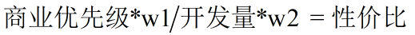

注：w1，w2为权重，商业优先级和开发量均经过归一化处理

另：我们很少会使用这种方法，了解即可。

#### 1.1 商业价值评估

即便是已经筛选评估出来的需求，很多时候量也是非常大的，而哪些该做，哪些不该做，很多时候我们会遇到：

> - 老板拍脑袋要这么做

> - 自己拍脑袋要这么做

> - 顾此失彼，左顾右盼

其实，在产品不同阶段，对需求的排序，也是有一些方法可以参考的，其实需求变通一下，和我们日常工作的评估方式是差不多的，可以分为四类：

> - 重要且紧急

> - 重要不紧急

> - 紧急不重要

> - 不紧急不重要

其实，无论需求到底是什么，产品终归是商业性产品，所以打造产品的商业价值才是最重要的，所以在衡量需求的时候，最重要的衡量指标就是这个需求是否具有商业价值，商业价值越大，那么它就越重要越紧急。

商业价值也只是产品某一个阶段的目标（有可能是一个长期的目标），基于这个目标我们会对其进行分解，当前的需求排序，应该最为符合当前的目标。

商业价值的评估是个哲学性问题，需要产品经理对行业和产品足够理解。

#### 1.2 开发量评估

开发量评估，其实是需要产品经理根据自己公司开发人员的具体情况来定的。

但还是有些定量和定性方法可以遵循。

**（1）标签估计法**

选定一个大家已知的功能，例如：上传照片（上传，编辑，保存等，已知该功能需要3天时间）

- 将此功能工作量设定为50

- 请研发工作人员参照这个50的系数（上传照片工作量）对目前手中需要完成的功能工作量进行评估，并写出他们估计的系数。

- 假定估算系数为：55（工作量和上传照片差不多）,80（工作量稍高）,200（工作量特别大），出现明显的数据差距，则说明研发人员对此功能并不理解，没有达成一致，这个时候则需要：
  - PM邀请成员进一步明确需求，理清功能

- 如果估算系数表现为：80,100,90，则说明大家意见比较统一（也有可能集体对需求理解错误，所以需要在明确一次需求），如果无误，则可以估算出该功能耗时时间大概是在5-6天，具体时间可商议确定。

**（2）实际讨论法**

实际讨论法其实就是与研发人员通过“沟通”大家达成一种默契，即可以保质保量的完成工作，也不至于大家熬更守夜（要注意：熬夜不是光荣的，更不是值得长期去干的事情）。

当大家达成意见一致以后，产品经理再根据讨论的结果来和领导以及其他部门协调各种时间。

其实在于职场，很多时候都是一种默契，即你让别人好过，自己也会相对好过。

**（3）强制手段法**

强制手段法顾名思义就是狭天子以令诸侯了，强制在某个时间点前完成。

产品经理要善于去争取各种资源，尤其是公司领导和老板，一些时候比较困难的事情可能因为老板点个头或者一封邮件，就会变得比较好办。

- 第一，不要总是拿老板压人，很多时候需要先和同事沟通在自己的底线范围内，都争取沟通解决。

- 如果确实对方无法在底线范围解决，而且你对当前任务确实相对看中，则需要想各种办法来推动整个事情的进程，可以通过邮件，电话，当面汇报等，向老板提请需求并说明实际情况，为什么需要由他来推动，重要在哪里，需要怎么推动等等。

- 这种情况一定注意一个原则，就是对事不对人。

（4）放弃法

规范的做法是标签估计法，最常用的方法是实际讨论法，经常需要用到的是强制手段法。这些方法都可以解决开发量评估的问题。

这里说一个，在很多小企业或者不规范的企业中存在的问题，就是需求可能是完全由产品经理来定，不会经过需求的审核流程。这是会出现产品经理提的合理性需求，开发不愿意做，老板也不愿意做，但需求的确是真实合理的，此时怎么办。

一、试图说服老板；二、老板说服不了，就放弃。

碰到这种情况，没必要去埋怨老板和开发傻逼，因为有些东西实在是你控制不了的，产品经理一定要明确这一点。

### 2、KANO模型

评估需求还有一个重要方法——KANO模型。

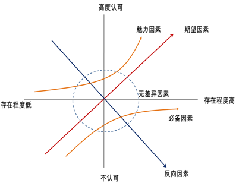

这个模型对应到我们在第1节第3小节讲到的各类需求。

使用KANO模型最简单的方法就是考虑每个模块或需求， 对它所属的类型进行讨论。 我们可以设计一套问卷， 对用户进行问卷调查。 

KANO建议通过对一个功能问两个问题来确定分类。 一个问题是： 如果产品中有这个功能， 用户会觉得如何？ 另一个问题是：如果功能不存在， 用户又觉得如何？ 

对每个问题采用5点度量方式进行回答： A表示我喜欢这样； B表示我期望这样； C表示我没有意见； D表示我可以忍受这样； E表示我讨厌这样。

经过访谈后， 根据归类矩阵， 将问题进行归类来确定需求的类型， 如表5-1所示。

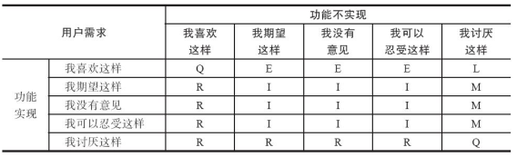

**注**： M代表Must-have， 是基本型需求； L代表Linear， 是期望型需求； E代表Exciter， 是兴奋型需求； R代表Reverse， 是相反的需求； Q代表Questionable， 是可疑的结果； I代表Indifferent， 是无关紧要的。

通过上述的矩阵分析， 可以得出： 哪些是用户需求表达时自相矛盾的； 哪些是用户自己都不确定的； 哪些是无关紧要、 可有可无的； 哪些是必须要有的； 哪些是期望有的； 哪些是自己都没有想到， 但用户喜欢的（ 即兴奋型需求）。

具体的评估方法就是对应基本型需求的功能必须要做， 不能在这方面失分； 对应期望型需求的功能选择性做， 提高其质量， 力争超过竞争对手； 对应兴奋型需求的功能选择1或2个必须做， 让用户尖叫。

#### Kano模型的优势和不足

结合过往的资料和自己的心得，认为在调研中，Kano模型有以下几个优势：

> - Kano模型可以细致全面的挖掘功能的特质

> - Kano模型可以帮助业务方在工作中排优先级，辅助项目排期;

> - Kano模型可以帮助人们摆脱“误以为‘没有抱怨’等于用户满意”的想法。

同样，Kano模型也有它的不足：

> - Kano问卷通常较长，而且从正反两面询问，可能会导致用户感觉重复，并引情绪上的波动，若用户受到影响没有认真作答，则会引起数据质量的下降。

> - Kano问卷在针对产品属性进行测试时，部分属性也许并不是很好理解。

> - Kano模型类似于一种定性归类的方法，以频数来判断每个测试属性的归类，这种情况下，可能会出属性归类结果表中，同一属性出现了不同归类栏频数相等或近似的情况。

由于KANO 模型存在这些不足，在运用KANO模型分析数据的时候就要注重数据收集前期的准备工作。比如在问卷设计时，把问卷尽量设计得清晰易懂、语言尽量简单具体，避免语意产生歧义。同时，可以在在问卷中加入简短且明显的提示或说明，方便用户顺利填答。

### 3、一些特殊情况的需求评估

#### 3.1 伪测试

伪测试指的是先不实现功能， 只提供一个按钮链接或文字链接或图片入口， 用户点击之后提示此功能正在建设当中。 根据用户的点击率数据情况来决定是否实现该功能。

伪测试在什么情况下比较适用呢？ 

如果产品团队和研发团队双方争执激烈， 谁也说服不了谁， 需要拿出能让团队彼此信服的证据，这个时候就可以采用这种方法。 

但是， 必须注意的是， 先在产品的忠实用户中进行灰度测试， 看点击率情况怎么样再做决定是否该做。

具体的评估方法就是测试用户中有超过40%的用户点击或使用了， 则表明值得做。

#### 3.2 A/B测试

AB测试比较有趣，是相对成熟的团队，有一定用户基础的团队使用的一种方法。

A/B测试的基本思想：

> - 同时提供多个方案并行测试。
> - 不同方案之间只存在一个变量， 排除其他干扰因素。
> - 以某种标准判定结果优劣， 筛出最优方案。

#### 3.3 新产品上线

新产品未上线时候的需求特点：没有运营数据支撑、需求一大堆。

在产品研发初期，还会遇到一些非用户需求，例如：后台编辑的方便性、基于产品自身的数据反馈等。

所以其实产品初期更重要的是形成产品的框架架构，即基本需求要打造完成。

#### 3.4 免费型产品已经上线

免费型产品的分类：全免费、部分免费、限时免费。

因为免费，免费产品都能相对获得更多的用户运营数据，也就是说产品经理除了通过KNAO模型或者其它方式获得需求筛选甄别排序依据外，还可以通过真实的运营数据来分析用户的实际需求。

我们可以通过数据公式来计算用户的期望型需求和魅力型需求：

**用户需求重要性=用户使用率（有多少用户用过）\*功能或者内容平均使用次数（经常用还是偶尔用）\*类别重要性权重（次功能的重要性，通过专家团队来评估）**

#### 3.5 需求有前置/后置条件

对于一些串行的产品需求，例如：A之后才能是B，B之后才能使C。那么按照需求重要排序则是 A>B>C。

### 4、小结

还是那句话，诸行无常。今天的兴奋需求也许明天就是基本需求，今天的基本需求通过改进也许就成了明天的兴奋需求。大家，可以思考一下那些需求以前是兴奋需求现在变成了基本需求。

在产品的生命周期中，应该做好基础需求，发现期望需求，创造兴奋需求。争取在产品上线的时候，就应该有一些期望和兴奋需求，这样才能在短时间里面让用户发现产品的价值。

注意，对于一些拿捏的很准的需求，就请忘记KANO模型吧。产品经理一定要学会灵活处理问题，很多时候可以对需求进行多重考量，而不是仅仅是套用一种方法。

产品经理对需求排序的能力，会影响到整个产品的进度以及开发人员，所以，产品经理一定要对需求排序心中有数，胸有成竹，说出道理，让大家明白，这样大家才能信服你，更好的与你展开合作。

有些东西说清了是什么和为什么之后，怎么做的问题就很清晰了，所以之后我会尽可能多说是什么和为什么，怎么做的问题我只会简要说明一下方法论。

## 四、需求评审

一个产品的开发过程会经过很多次评审，大概的顺序基本是：

> **BRD/MRD评审→PRD/需求评审→交互设计稿评审→视觉设计稿评审→开发需求评审→测试用例评审→运营规划评审→闭环循环**

其中每个环节的评审所对应的人员都是不同的，每个环节可能都不止评审一次。

**BRD/MRD评审**基本上会是产品经理和老板或高层一起评审，不仅包括需求的评审，还会有对产品战略、运营规划等方面的评审。

**PRD评审**是一个多方参与的工作，涉及到老板（最好叫上他哈）、开发、设计、测试、运营等。一般我们在做出比较大粒度的PRD之后就会做一次评审，以便尽早发现问题。

**交互设计稿评审**是在PRD评审之后，由交互设计师根据产品需求进行设计，参与方为：交互设计师、产品经理等。

**视觉设计稿评审**是由UI设计师根据产品需求和交互设计稿进行设计，参与方为：UI设计师、产品经理、交互设计师等。

**开发需求评审**是开发接到产品需求后，将产品需求转化为开发需求，一般是在研发人员内部进行评审，当然产品经理也可以参与。我的建议是最好参与进来。

**测试用例评审**，俗称TC评审，是测试人员根据产品需求对每一个需求写测试用例，测试会根据测试用例进行测试工作。此阶段的参与方为：测试、开发、产品。

**运营规划评审**是由运营人员产出运营规划后对规划进行的评审，参与方为：运营、产品、老板等。

对于由产品经理主导的评审会议，我们要注意以下问题：

开会前要注意几点：

- 开会前，最好能有一份会议议程给大家，然后大家提前熟悉一下，让大家带着问题来开会。

- 或者，开会的时候，先请大家过一遍内容等。

- 再或者，是开会开始的时候，产品经理先定一个基调，讲一下背景等等。

开会过程中要鼓励大家多提问题：

- 注意只要与会人员能放开提问题就是好事儿，这样能打消团队成员的疑虑。

- 也可以把没有想明白的东西提出来大家一起讨论

这里面涉及一个团队决策的问题，需要我们需注意：

在做团队讨论时，产品经理的思路很有可能会被淹没在团队决策中，产品变得四不像，这非常考验产品经理的拿捏以及决策能力和定力。

因为，团队讨论很有可能是每个参与者会“略微”站在自己的维度考虑问题，例如技术研发人员可能会考虑工作量，市场人员可能会考虑销售指标等，他们会选择对他们有利的方式，但不一定对产品有利。

因此，我们虽然提倡团队讨论，但决策还有要由我们自己来做。

## 五、需求管理

### 1、需求管理池

这里提供一个简易模板。

| 编号 | 版本 | 模块 | 页面 | 需求 | 需求类型 | 需求评审时间 | UI完成时间 | 技术评审时间 | 测试时间 | 需求优先级 | 进度 | 责任PM | 责任UI | 责任开发 | 责任测试 | 发布时间 | 备注 |
| ---- | ---- | ---- | ---- | ---- | -------- | ------------ | ---------- | ------------ | -------- | ---------- | ---- | ------ | ------ | -------- | -------- | -------- | ---- |
| ……   | ……   | ……   | ……   | ……   | ……       | ……           | ……         | ……           | ……       | ……         | ……   | ……     | ……     | ……       | ……       | ……       | ……   |
| ……   | ……   | ……   | ……   | ……   | ……       | ……           | ……         | ……           | ……       | ……         | ……   | ……     | ……     | ……       | ……       | ……       | ……   |

任何一个环节delay，都会导致整个项目的delay，因此，我们需要时刻关注一些时间和进度性质的字段，把控项目进展。

### 2、需求变更

几乎很少有从头到尾都不变更需求的产品，产品经理对于需求变更的控制也是贯穿到产品始终的。

很多需求变更都是通过口头沟通的，但是我们最好要做好书面记录（甩锅必备）。

这里也提供一个简易模板。

| 编号 | 项目 | 变更前描述 | 变更后描述 | 变更理由 | 变更日期 | 变更文档地址 |
| ---- | ---- | ---------- | ---------- | -------- | -------- | ------------ |
| ……   | ……   | ……         | ……         | ……       | ……       | ……           |
| ……   | ……   | ……         | ……         | ……       | ……       | ……           |

### 小结

到这里，我们对需求分析与管理的讲解就算完成了。原稿大概是2万字，但有太多废话，所以删减到了现在8千字左右的精华版本。

需求分析的方法论不止以上这些，但我们日常工作常用的基本就是本文所讲的了，我上面所提到的很多细节都是非常需要大家注意的。

本来打算把MRD和PRD也放在这里的，但这样篇幅太长了，因此我把这些下一篇讲。

