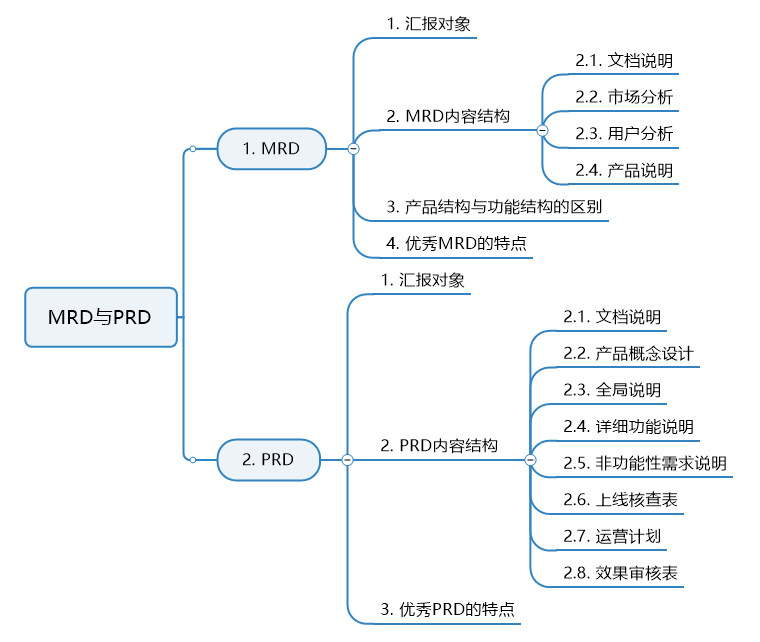
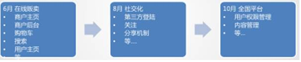
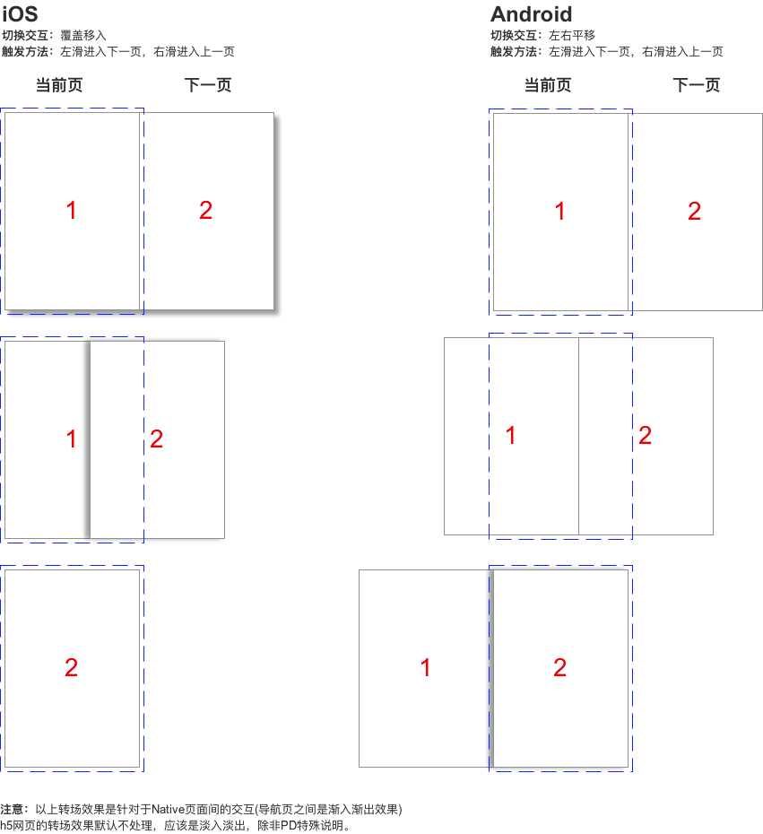
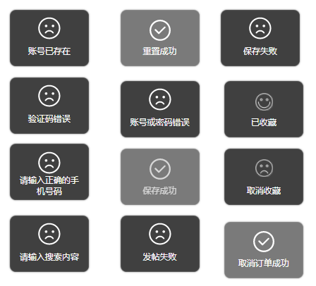
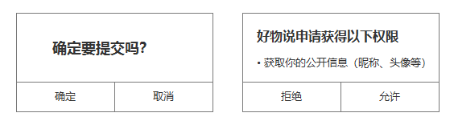
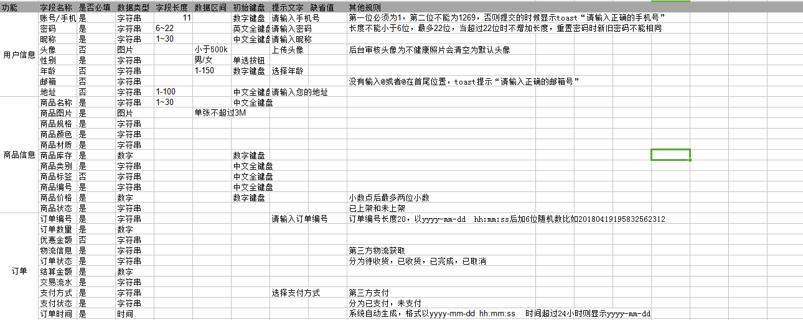
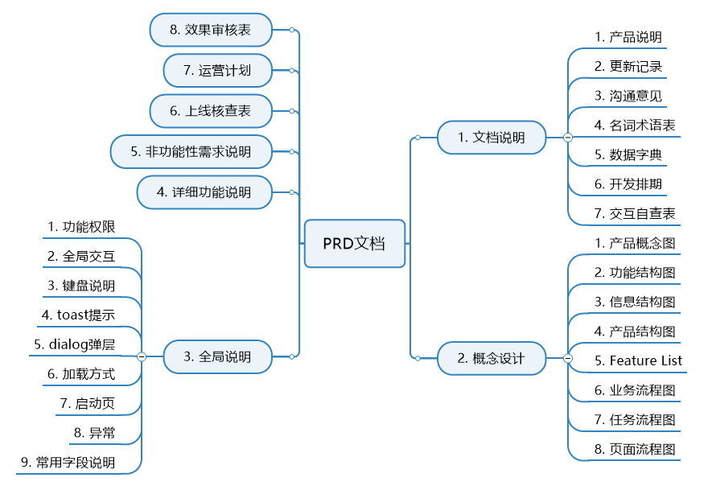

# 如何写出好的MRD和PRD？

MRD和PRD的写作真的是仁者见仁智者见智，没有固定的格式，只要能说明清楚问题就行。

我本人是不想讲这部分内容的，但是为了体系的完整，暂且简要讲一下，本文的内容基本是我以前学习时记录的，没有太多的修改。

本文结构如下：

## 一、MRD

MRD（Market requirements document，市场需求文档）。

获得老板们的支持后，产品进入实施阶段，需要写出MRD，要有更细致的市场与竞争对手分析，包括可通过哪些功能来实现商业目的，功能、非功能需求分哪几块，功能的优先级等等。实际工作中，PM在这个阶段常见的产出物有产品的feature list、业务逻辑图，这是从商业目标到技术实现的关键转化文档。

MRD到底要干什么?

用绕口的方法来说：如果说BRD是你抛出的论题，那么MRD就是要你用论点来支撑你的BRD，同时通过论证来得出你采取什么方式获得BRD里面的商业目标（讲究逻辑性）。

用大白话来说：MRD就是经过一系列的分析后，拿出一套你认为最合理的干某个事情的方法与指导实施的文档。

### 1、汇报对象

未来参与产品的各个层级的同事，都有可能要阅读MRD，包括产品经理自己。

MRD是最完善的产品诞生分析描述文档，以后的一段时间，产品的各种衍伸文档、产品依据、团队判断，都可能参考MRD文档。

产品参与成员需要了解产品的各种背景、数据、方法依据。

### 2、MRD内容结构

#### 1.文档说明

##### 1.1 文档基本信息

公司名称；产品名称；文档创建日期；创建人；创建人联系方式；部门；职务。

##### 1.2 文档修改记录

日期；版本；修改人；修改内容；审核人。

##### 1.3 文档目的

用于说明相关市场，用户，产品规划，核心目标，产品路线图，项目规划等。

##### 1.4 文档概要

文档说明；市场说明；用户说明；产品说明。

#### 2.市场分析

##### 2.1摘要（可选）

##### 2.2现有市场存在的问题与机会

就互联网而言，可以从以下（但不限于）几方面来选择性表述：

- 产品方面（例如：产品形态复杂，用户体验差）

- 技术方面（语音压缩技术不成熟，外资搜索引擎对中文理解不够深刻）

- 运营方面（产业链偏下游，重实体，轻线上，造成瓜分线下旅行社利润，形成对立）

- 用户方面（用户需要可替代产品尚未出现，需求明显）

- 商业模式方面（金山毒霸和360安全卫士的商业模式对比）

由于在以上的分析说明中，可能会涉及到用户分析相关的内容，可以先提用户分析的结果并说明详见用户分析章节即可，这样可以保证文档的完整连续性，也能简明扼要。

##### 2.3目标市场分析（基于该机会点下的市场分析说明）

- 市场规模：多少钱，成功可能大不大，往往是正比，但不绝对是，具体问题具体分析

- 市场特征：现有市场表现出的典型特征

- 发展趋势：未来2-5年的发展评测，搜索市场的语音搜索，苹果的Siri，体感便携设备：谷歌眼镜，苹果iwatch）

- 时间边界：这个市场的持续时间预估

##### 2.4  市场分析结论

一般来说，这里会得到一个比较有市场商业价值的结论，否则，这个文档就没有存在的意义了

#### 3.用户分析

##### 3.1 目标用户群体（找准）

一般划分维度：年龄段，收入，学历，地区

##### 3.2 目标用户特征

所谓特征，及时在这个群体下面的共性特点与非共性特点（分析）

##### 3.3建立虚拟用户角色（形象化）

- 常用用户特征（年龄；性别；出生日期； 收入；职业； 居住地；兴趣爱好；性格特征）

- 用户名称(张三，李四，王麻子)

- 用户技能（熟练使用电脑办公，对常用的智能手机应用谙熟于心）

- 与产品相关特征
  - 电子商务产品：购物习惯，年度消费预算等
  - 交友类：是否单身，择偶标准
  - 游戏类：是否喜爱3D游戏，是否有同类型游戏经验等

##### 3.4用户角色卡片

针对目标用户群体进行归类划分，抽取典型样本，数量不限，带需要能代表目标用户。

##### 3.5 用户使用场景

建立了用户卡片以后，把这些典型用户放到实际的使用场景中去。

此处的用户使用场景更多是产品经理在分析完成用户使用场景后的演示性场景。

**注意分析场景与演示场景的区别：**

用户使用场景就是描述用户在某个环境中完成某个了某个任务的故事。类似小学学习的八股文中的记叙文三要素：时间，地点，人物+干了什么事情+干事情的步骤。

##### 3.6 用户动机总结（读懂表象）

线下的在线商品比较与查询渠道等

##### 3.7 用户目标总结（明确实质）

获得性价比最高的购物体验，完美主义者会因此很得瑟，哪怕是便宜了1元钱也很得意

##### 3.8 影响用户使用的主要因素（重要，分析）

- 是否随身携带接入设备
- 网络是否通畅
- 查询速度
- 设备对商品信息的获取是否会对用户造成不便

#### 4.产品说明

##### 4.1  产品定位 

产品有越做越复杂的可能，但在一定时间内，定位决定了产品的一切。

产品定位与市场定位是有区别的，但经常容易混淆:：

- 市场定位：我们对用户或者用户市场的选择，例如:手机发烧友，白领，或者移动通讯设备市场 

- 产品定位：我们用什么样的产品满足用户或用户市场，例如：
  - 陌陌：一款基于地理位置的移动社交工具
  - 飞聊：兴趣社交APP

用户定位的描述：针对什么目标群体，做什么事情，用最本质的，无修饰的语言表述。

##### 4.2  产品核心目标（产品本身要达到什么一个目标） 

互联网产品的核心目标，往往表现为要解决目标市场（目标用户）一个什么问题。这个问题分析的越透彻，产品的核心目标也就越准确 ，确立好核心目标，不会使我们产品推进的过程中迷失。

例如： 

- 360安全卫士：解决用户使用电脑的安全问题 

- 微信：在最早的阶段，微信的核心目标是工具类的，为用户提供流畅语音沟通的移动应用 

通常来说，解决核心目标的工作优先级是最高的。产品任务，很多应该是围绕核心目标来开展的。所以，产品经理对于用户需求与产品核心目标关系的拿捏是个很重要的工作。

##### 4.3  产品结构（注意，不是功能结构，是产品的整体结构） 

产品的市场定位，产品定位，核心目标的直接表现。

##### 4.4产品路线图 

产品路线图是产品成长中的每个任务节点组合而成，是以任务为导向的时间节点图。

应注意一下，任务一定是和产品定位，核心目标等相符合的，是达到这些目标的任务分解。

##### 4.5产品功能性需求 

在线留言板举例： 

- 注册与登陆（直接注册，第三方注册，直接登陆，第三方登陆） 

- 交流（留言，回复，图片上传，文字发布） 

- 管理（查看，删除，修改）

##### 4.6产品非功能性需求 

- 埋点需求：为了便于数据分析需要做相应的埋点
- 性能需求：产品流畅、不卡顿等
- 扩展性需求：产品与技术架构都要可扩展
- 安全性需求：做好各种攻击、爬虫的防范
- 健壮性需求：产品要足够健壮，不崩溃、不宕机，可以算入性能需求
- 兼容性需求：要兼容各主流浏览器、手机系统、屏幕尺寸等
- 可用性需求：产品的基本需求要满足可用性原则
- 运营需求：运营的一些数据统计、活动运营等需求
- 用户体验需求：好的产品一定用户体验好

### 3、产品结构与功能结构的区别

这里我们把整个产品看成是一桌菜。

产品结构讲的为了让客人吃的舒服同时又要完成我们的核心目标，我们需要哪些菜品，而这些菜品与菜类需要我们事先规划出来： 

- 凉菜：凉拌则耳根，夫妻肺片等 

- 热菜：佛跳墙，麻辣鸡丝等 

- 主菜：宫保鸡丁  蒜蓉虾  烤扇贝 

- 甜点：地动山摇，巧克力布丁 

- 饮料：酸奶，玉米汁

功能结构：我们如何实现上述的各种菜品？ 

- 加热：热菜

- 爆炒：主菜，热菜

- 材料：则耳根，肺片

- 人员：厨师，墩子

**产品结构说明的注意事项：**

这里不是扣细节的时候，主要产品结构表述到位即可。

因为你之后肯定会非常苦逼的做非常细的产品说明与线框图、流程等。

- 一些无法归类的，放到其它里面 

- 如果能配合流程图与简单的主要页面线框图就更好了，更清楚，更明了

### 4、优秀MRD的特点 

- 逻辑性强：有论点，有论据，有论证 
- 把抽象的东西形象化的讲出来 
- 数据可靠，分析有理
- 有把握的主观，无把握的客观 
- 惜字如金，能把问题表述清楚，绝不多写一个字 
- 合理的产品进度分配更有利于研发人员工作（人有九等，不是所有人的人都是打了鸡血的产品经理） 
- 重视非功能需求
- 如果方案中出现很多专业名词，记得在文章的开通呈现给阅读者一个名字解释表

### 5、小结

## 二、PRD

### 1、汇报对象

汇报对象：老板、开发、设计、测试、运营等。一般我们在做出比较大粒度的PRD之后就会做一次评审，以便尽早发现问题。

我这里还是特意把汇报对象单独提出来，因为你的汇报对象决定了你应该把文档写成什么样，评审的时候你该怎么讲。

你要汇报的对象涉及到多个部门，这些部门的人员素质都不一样，怎样有效的把PRD描述出来，让各方都能够听懂，是一个很考验产品经理功力的事情。

### 2、PRD内容结构

PRD包括但不限于以下这些内容：

#### 1. 文档说明

##### 1.1 产品说明

- 背景描述：为什么要做这个产品、市场行情

- 业务目标

- 产品定位

- 用户群体及其特征

##### 1.2 更新记录

序号、产品版本、修订日期、修订人、修订章节即内容、修订原因、审核人

**产品版本的命名：**

以产品版本1.2.6为例，1为主版本号，2为子版本号，6为修正版本号。

- 主版本号通常是重大调整升级、产品结构功能等都有调整时，进行修改。

- 子版本号通常是在原有基础上对局部功能进行了升级或调整时，进行修改。

- 修正版本号通常是局部小范围优化与bug修复时，进行修改。

- 归零原则：前一个数字增加一位，后面的数字都归零

##### 1.3 沟通意见

主要记录与各部门沟通的历史，包括沟通部门、沟通人员、沟通内容描述、沟通结果、沟通日期等。

##### 1.4 名词术语表

对于文档内的各个名词术语进行解释，包括词汇名、对应的别名、具体的说明。

##### 1.5 数据字典

数据字典就是数据库各个表结构的描述，用于文档内需求的精准描述。

##### 1.6 开发排期

产品经理需要把控开发进度，直接在PRD里记录是其中一个方法。以下是一个示例。

##### 1.7 交互自查表

交互自查表是产品经理用户检查自己产品设计的工具。

#### 2. 产品概念设计

##### 2.1 产品概念图

产品概念图描述**产品的大致思路**。以下是一个简单的产品概念图示例：

##### 2.2 功能结构图

功能结构图描述产品有**哪些功能**。

##### 2.3 信息结构图

也称信息架构图，我的理解是**产品内字段的分类整合**，这些信息是研发人员**建立数据库的参考**。

我推荐先思考功能结构图，在做信息结构图。

##### 2.4 产品结构图

产品结构图是按照产品的逻辑与表现方式，结构化的表现产品构造的一种示意图，可以说是产品的**页面功能与信息拆解**。

##### 2.5 Feature List

即需求列表。以下是一个简单的示例：

##### 2.6 业务流程图

根据上述各种结构图，画出产品内**业务的流转过程**，是从**产品角度**来讲的。

**画流程图的技巧：**

- 从主线，到支线

- 从正常流，到异常流

- 不要把整个流程画到一个页面里面，可以使用分页来进行调整，这样更清晰更易于讲解和使用与传递。

- 有自己的图示，表明清楚每个图示的意思。

##### 2.7 任务流程图

任务流程图就是产品内**完成各项任务的流程图**，是从**用户角度**来讲的，通过用户行为串联信息结构与产品结构，阅读者通过阅读用户使用流程，能更好的理解产品经理设计的用户行为。以下是一个小程序登录的流程图：

##### 2.8 页面流程图

主要是页面之间的**跳转关系**。

#### 3. 全局说明

##### 3.1 功能权限

后台/B端产品和部分用户端产品会设计到用户使用权限的管理，此时需要在这里进行全局性的说明。

对于复杂的权限，也要在相应原型旁边注明权限。

##### 3.2 全局交互

##### 3.3 键盘说明

输入**特定的内容**时，弹出特定的键盘面板。如输入银行卡密码时，弹出乱序的数字键盘等。

##### 3.4 toast提示

一般设置1-3秒后消失。

##### 3.5 dialog弹层

涉及到需要用户确认的场景，属于强制中断用户操作的行为。

##### 3.6 加载方式

**全屏加载**

对整个页面进行加载，可以保证内容的完整性，但会让用户产生强烈的等待感，3s以上会有焦躁情绪。

所以全屏加载最好要配合上有明确进度表示的进度条。

**上拉加载**

常用于信息流、长列表形式的产品，用户可以一直沉浸在内容里。

**下拉刷新加载**

更多的是承载刷新的功能，比如新闻APP里下拉可获取更新的信息。

**优先加载**

对于重要内容进行有限加载。

**占位加载**

如果网速状况不好的话，先进行占位性的展示。

加载都是需要一定的时间的，为了减少用户的等待感，我们可以使用非模态的加载方式，适当的给一个取消的选项；也可以使用情趣化的加载动画；或者提前预加载，对内容进行缓存；还有就是告知加载进度。

更详细的加载方式，可以参考这篇文章《[常见的七种app加载样式设计](http://www.woshipm.com/pd/2331647.html)》

##### 3.7 启动页

启动页是展示我们产品的信息，还是展示产品的初步引导，又或者是展示广告，是需要我们综合考虑产品目标、产品生命周期等因素的。

##### 3.8 异常

异常有很多种，网络异常、服务器异常、加载超时等等，但通常我们都把它们当做网络异常来展示给用户，并提供说明引导和解决方案。

展示的方式可以使用toast提示、全屏提示、dialog提示等。

##### 3.9 常用字段说明

这些和数据字典和信息结构图息息相关，我们需要对产品中相关模块（如表单填写、信息展示等）内的元素定义格式，比如字段的长度、数据类型、是否必填等。这个东西非常重要，是开发设计表结构的重要参考。

#### 4. 详细功能说明

详细功能说明是整个PRD文档里占比最大也最核心的部分，我们之后讲的内容也基本都是这里的东西，现在大家只要了解PRD的内容结构是什么样的就行了。

功能说明包括：功能名称、功能概述、优先级、使用者、前置条件、后置条件、原型描述、功能规则、流程描述等。

PRD如果是直接写在Axure文档里的话，详细功能说明基本就是原型+标注了。

标注一般就是在原型旁边写上视觉说明、交互说明（给开发看到，最重要）、运营说明等一系列说明。

以前很多人说用Axure写PRD不方便进行版本管理，其实是不对的。我们有三种方式对版本修改进行管理：

- 直接在相关页面记录历史的修改：好处是能看到自己每次修改的演变过程，坏处是文档会越来越庞大。

- 每次修改都存成一个文件：更好的存档，但不方面查看。

- 使用Git/SVN等版本管理工具：可以看到查看之前的版本，Axure自带有SVN。

事实上，我会三个方法同时用。

现在小一些的公司有时是不会做在原型上做完整的交互的，一般会在原型上标注交互的规则。

如果是用Word来写的话，就要复杂一些。我就一开始的时候用过Word等文本型的文档写PRD，但现在发现用Axure写真的很爽。当然还有一些产品会用墨刀这样的快速设计原型的工具，也是不错的选择。我没怎么用过这种方法，在这里也就不分享了。

#### 5. 非功能性需求说明

在MRD中，非功能性需求是不用详细说明的，但在PRD里就需要产品经理根据具体的产品设计，详细说明非功能性需求。这部分内容是开发、运维、测试的重要参考。

#### 6. 上线核查表

这里主要写明上线需要的各种东西，如：申请App Store账号、宣传物料的准备。

这些都是固定性的东西，我们把它当成每次上线前的产品核查表。

#### 7. 运营计划

产品上线后的运营方案。产品可以先列出一个简要计划，然后和运营讨论出一个完善的方案。

#### 8. 效果审核表

我们的每一次改版上线，都是基于业务目标的，所以产品上线后，我们需要追踪产品是否达到既定业务目标。这里会提供上线效果的审核表，包括产品版本、上线日期、预期结果、实际结果等。

### 3、优秀PRD的特点

- 正确 ：确保文档中的表述与产品经理的思路是对应且正确的
- 无歧义 ：文档的表述方便阅读理解，不会产生歧义
- 完备 ：MECE原则尽量保证对产品功能需求表述的系统完整
- 一致 ：文档中用词用语一致，对于同一事物的表述应该一样，避免混用同义词
- 具有优先级 ：产品的功能性需求是有先后主次的，对于一次性规划叫多功能的PRD，应该注明功能性需求的先后主次
- 可验证 ：对于功能性的描述，是可以进行测试的，而不是不发测试，无法定性的东西，例如：效率高，交互完美等词语，都是无法验证的
- 可修改 ：PRD文档利于后期的修改与升级
- 可追踪 ：每个功能性需求的来源应该是清楚明白的

### 4、小结

我这里提供的仅仅只是模板，大家要根据实际情况进行增减。

### 三大文档总结

回顾我们所讲的3个文档（BRD、MRD、PRD），可以发现三者是一个层层递进的关系。

MRD可以说是BRD的进一步细化文档，BRD更多是以PPT的形式呈现，MRD可能就需要用文档形式呈现了。PRD可以说是对MRD的进一步进化，PRD可以用Word、Axure等各种形式呈现。

上面的PRD我真的只是在列一个模板，很多细节不好讲述，如果大家有不明白的可以在评论区提出来，我会进行一一解答。

产品经理平时工作中涉及到的文档还有很多，但都没有固定性的标准。如果之后我无聊的话，会进行一个汇总。

**预告**：下一篇将会讲《交互设计与用户体验》