MRD和PRD的写作真的是仁者见仁智者见智，没有固定的格式，只要能说明清楚问题就行。

我本人是不想讲这部分内容的，但是为了体系的完整，暂且简要讲一下，本文的内容基本是我以前学习时记录的，没有太多的修改。

## 一、MRD

MRD（Market requirements document，市场需求文档）。

获得老板们的支持后，产品进入实施阶段，需要写出MRD，要有更细致的市场与竞争对手分析，包括可通过哪些功能来实现商业目的，功能、非功能需求分哪几块，功能的优先级等等。实际工作中，PM在这个阶段常见的产出物有产品的feature list、业务逻辑图，这是从商业目标到技术实现的关键转化文档。

MRD到底要干什么?

用绕口的方法来说：如果说BRD是你抛出的论题，那么MRD就是要你用论点来支撑你的BRD，同时通过论证来得出你采取什么方式获得BRD里面的商业目标（讲究逻辑性）。

用大白话来说：MRD就是经过一系列的分析后，拿出一套你认为最合理的干某个事情的方法与指导实施的文档。

### 1、汇报对象

未来参与产品的各个层级的同事,都有可能要阅读MRD，包括产品经理自己。

MRD是最完善的产品诞生分析描述文档，以后的一段时间，产品的各种衍伸文档、产品依据、团队判断，都可能参考MRD文档。

产品参与成员需要了解产品的各种背景、数据、方法依据。

### 2、MRD内容结构

#### 1.文档说明

##### 1.1 文档基本信息

公司名称；产品名称；文档创建日期；创建人；创建人联系方式；部门；职务。

##### 1.2 文档修改记录

日期；版本；修改人；修改内容；审核人。

##### 1.3 文档目的

用于说明相关市场，用户，产品规划，核心目标，产品路线图，项目规划等。

##### 1.4 文档概要

文档说明；市场说明；用户说明；产品说明。

#### 2.市场分析

##### 2.1摘要（可选）

##### 2.2现有市场存在的问题与机会

就互联网而言，可以从以下（但不限于）几方面来选择性表述：

- 产品方面（例如：产品形态复杂，用户体验差）

- 技术方面（语音压缩技术不成熟，外资搜索引擎对中文理解不够深刻）

- 运营方面（产业链偏下游，重实体，轻线上，造成瓜分线下旅行社利润，形成对立）

- 用户方面（用户需要可替代产品尚未出现，需求明显）

- 商业模式方面（金山毒霸和360安全卫士的商业模式对比）

由于在以上的分析说明中，可能会涉及到用户分析相关的内容，可以先提用户分析的结果并说明详见用户分析章节即可，这样可以保证文档的完整连续性，也能简明扼要。

##### 2.3目标市场分析（基于该机会点下的市场分析说明）

- 市场规模：多少钱，成功可能大不大，往往是正比，但不绝对是，具体问题具体分析

- 市场特征：现有市场表现出的典型特征

- 发展趋势：未来2-5年的发展评测，搜索市场的语音搜索，苹果的Siri，体感便携设备：谷歌眼镜，苹果iwatch）

- 时间边界：这个市场的持续时间预估

##### 2.4  市场分析结论

一般来说，这里会得到一个比较有市场商业价值的结论，否则，这个文档就没有存在的意义了

#### 3.用户分析

##### 3.1 目标用户群体（找准）

一般划分维度：年龄段，收入，学历，地区

##### 3.2 目标用户特征

所谓特征,及时在这个群体下面的共性特点与非共性特点（分析）

##### 3.3建立虚拟用户角色（形象化）

- 常用用户特征（年龄；性别；出生日期； 收入；职业； 居住地；兴趣爱好；性格特征）

- 用户名称(张三，李四，王麻子)

- 用户技能（熟练使用电脑办公，对常用的智能手机应用谙熟于心）

- 与产品相关特征
  - 电子商务产品：购物习惯，年度消费预算等
  - 交友类：是否单身，择偶标准
  - 游戏类：是否喜爱3D游戏，是否有同类型游戏经验等

##### 3.4用户角色卡片

针对目标用户群体进行归类划分，抽取典型样本，数量不限，带需要能代表目标用户。

##### 3.5 用户使用场景

建立了用户卡片以后，把这些典型用户放到实际的使用场景中去。

此处的用户使用场景更多是产品经理在分析完成用户使用场景后的演示性场景。

**注意分析场景与演示场景的区别：**

用户使用场景就是描述用户在某个环境中完成某个了某个任务的故事。类似小学学习的八股文中的记叙文三要素：时间，地点，人物+干了什么事情+干事情的步骤。

##### 3.6 用户动机总结（读懂表象）

线下的在线商品比较与查询渠道等

##### 3.7 用户目标总结（明确实质）

获得性价比最高的购物体验，完美主义者会因此很得瑟，哪怕是便宜了1元钱也很得意

##### 3.8 影响用户使用的主要因素（重要，分析）

- 是否随身携带接入设备

- 网络是否通畅

- 查询速度

- 设备对商品信息的获取是否会对用户造成不便

#### 4.产品说明

##### 4.1  产品定位 

产品有越做越复杂的可能，但在一定时间内，定位决定了产品的一切。

产品定位与市场定位是有区别的,但经常容易混淆:：

- 市场定位：我们对用户或者用户市场的选择,例如:手机发烧友,白领,或者移动通讯设备市场 

- 产品定位：我们用什么样的产品满足用户或用户市场,例如：
  - 陌陌：一款基于地理位置的移动社交工具
  - 飞聊：兴趣社交APP

用户定位的描述：针对什么目标群体，做什么事情，用最本质的，无修饰的语言表述。

##### 4.2  产品核心目标（产品本身要达到什么一个目标） 

–互联网产品的核心目标,往往表现为要解决目标市场（目标用户）一个什么问题 

•这个问题分析的越透彻,产品的核心目标也就越准确 

•确立好核心目标,不会使我们产品推进的过程中迷失. 

•例如： 

–360安全卫士:解决用户使用电脑的安全问题 

–微信:在最早的阶段,微信的核心目标是工具类的,为用户提供流畅语音沟通的移动应用 

•通常来说，解决核心目标的工作优先级是最高的 

•产品任务，很多应该是围绕核心目标来开展 

•这里就要引申出来一个问题，即产品经理对于用户需求与产品核心目标关系的拿捏

##### 4.3  产品结构（注意，不是功能结构，是产品的整体结构） 

产品的市场定位，产品定位，核心目标的直接表现。

##### 4.4产品路线图 

产品路线图是产品成长中的每个任务节点组合而成，是以任务为导向的时间节点图。

应注意一下，任务一定是和产品定位，核心目标等相符合的，是达到这些目标的任务分解。

##### 4.5产品功能性需求 

在线留言板举例： 

- 注册与登陆（直接注册，第三方注册，直接登陆，第三方登陆） 

- 交流（留言，回复，图片上传，文字发布） 

- 管理（查看，删除，修改）

##### 4.6产品非功能性需求 

- 性能需求：产品流畅、不卡顿等

- 扩展性需求：产品与技术架构都要可扩展

- 安全性需求：做好各种攻击、爬虫的防范

- 健壮性需求：产品要足够健壮，不崩溃、不宕机，可以算入性能需求

- 兼容性需求：要兼容各主流浏览器、手机系统、屏幕尺寸等

- 可用性需求：产品的基本需求要满足可用性原则

- 运营需求：运营的一些数据统计、活动运营等需求

- 用户体验需求：好的产品一定用户体验好

### 3、产品结构与功能结构的区别

这里我们把整个产品看成是一桌菜。

产品结构讲的为了让客人吃的舒服同时又要完成我们的核心目标，我们需要哪些菜品，而这些菜品与菜类需要我们事先规划出来： 

- 凉菜：凉拌则耳根，夫妻肺片等 

- 热菜：佛跳墙，麻辣鸡丝等 

- 主菜：宫保鸡丁  蒜蓉虾  烤扇贝 

- 甜点：地动山摇，巧克力布丁 

- 饮料：酸奶，玉米汁

功能结构：我们如何实现上述的各种菜品？ 

- 加热：热菜

- 爆炒：主菜，热菜

- 材料：则耳根，肺片

- 人员：厨师，墩子

**产品结构说明的注意事项：**

这里不是扣细节的时候，主要产品结构表述到位即可。

因为你之后肯定会非常苦逼的做非常细的产品说明与线框图、流程等。

- 一些无法归类的，放到其它里面 

- 如果能配合流程图与简单的主要页面线框图就更好了，更清楚，更明了

### 4、优秀MRD的特点 

- 逻辑性强：有论点，有论据，有论证 

- 把抽象的东西形象化的讲出来 

- 数据可靠，分析有理

- 有把握的主观，无把握的客观 

- 惜字如金，能把问题表述清楚，绝不多写一个字 

- 合理的产品进度分配更有利于研发人员工作（人有九等，不是所有人的人都是打了鸡血的产品经理） 

- 重视非功能需求

- 如果方案中出现很多专业名词，记得在文章的开通呈现给阅读者一个名字解释表

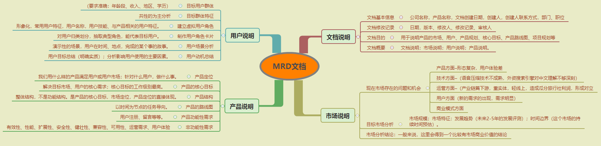

## 二、PRD

### 1、汇报对象

汇报对象：老板、开发、设计、测试、运营等。一般我们在做出比较大粒度的PRD之后就会做一次评审，以便尽早发现问题。

我这里还是特意把汇报对象单独提出来，因为你的汇报对象决定了你应该把文档写成什么样，评审的时候你该怎么讲。

你要汇报的对象涉及到多个部门，这些部门的人员素质都不一样，怎样有效的把PRD描述出来，让各方都能够听懂，是一个很考验产品经理功力的事情。

### 2、PRD内容结构

#### 1. 文档说明

##### 1.1 产品说明

- 背景描述：为什么要做这个产品、市场行情

- 业务目标

- 产品定位

- 用户群体及其特征

##### 1.2 更新记录

序号、文档版本、修订日期、修订人、修订章节即内容、修订原因、审核人

##### 1.3 沟通意见

主要记录与各部门沟通的历史，包括沟通部门、沟通人员、沟通内容描述、沟通结果、沟通日期

##### 1.4 名词术语表

对于文档内的各个名词术语进行解释，包括词汇名、对应的别名、具体的说明。

##### 1.5 数据字典

数据字典就是数据库各个表结构的描述，用于文档内需求的精准描述。

##### 1.6 开发排期

以下是一个示例。

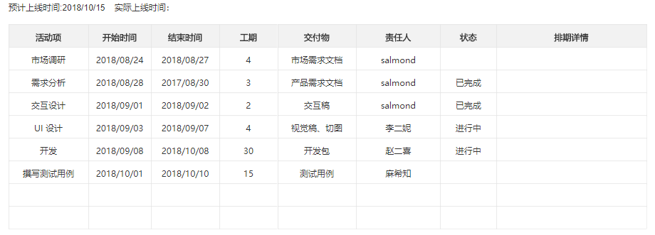

##### 1.7 交互自查表

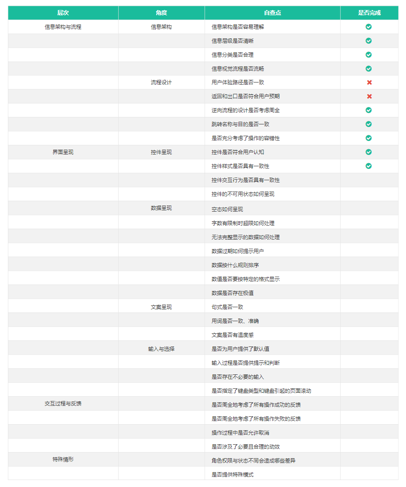

#### 2. 产品概念设计

##### 2.1 产品概念图

以下是一个简单的产品概念图示例：

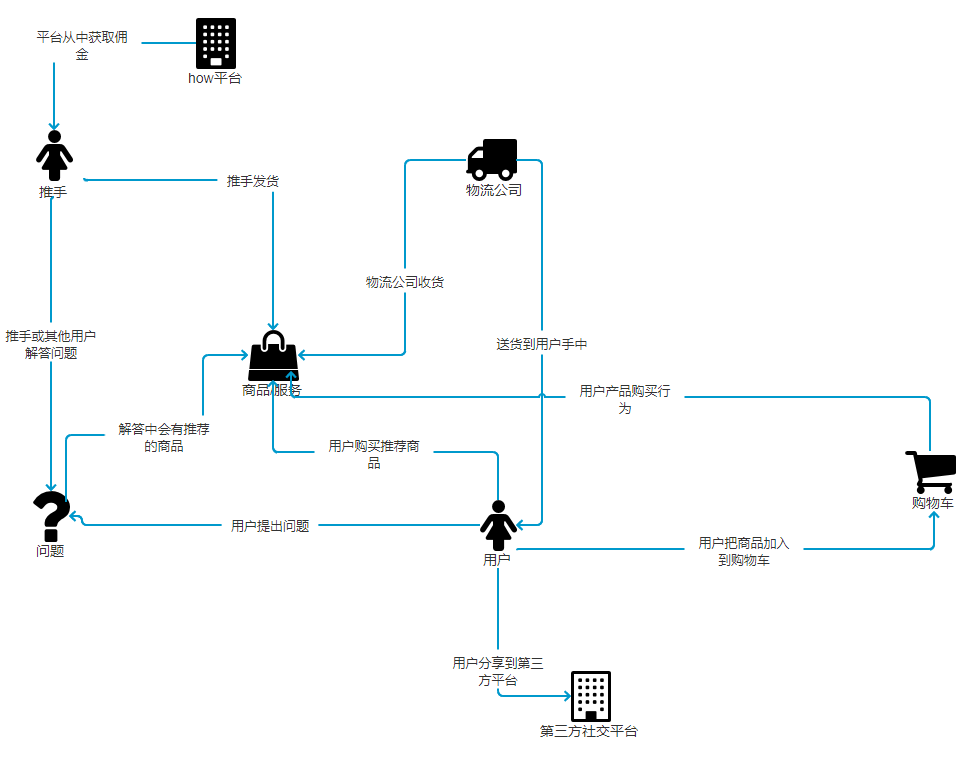

##### 2.2 功能结构图

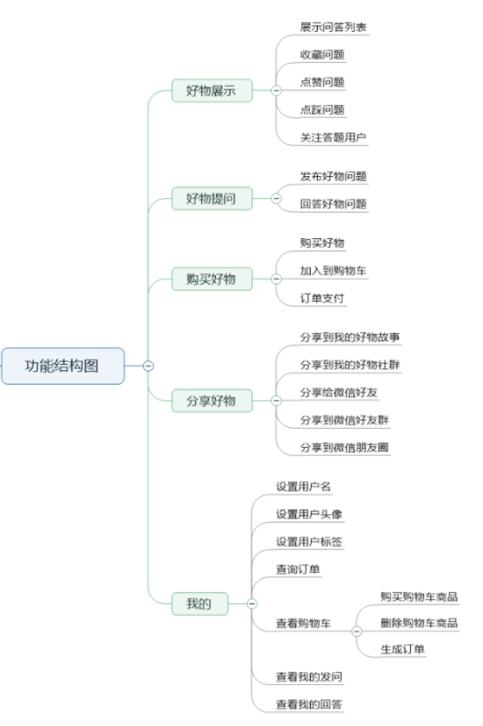

##### 2.3 信息结构图

也称信息架构图。

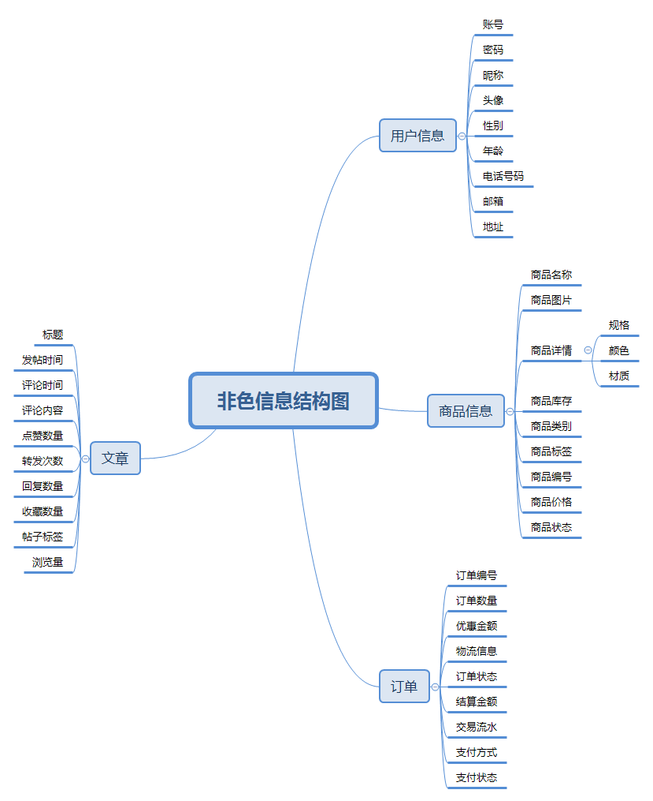

我推荐先思考功能结构图，在做信息结构图。

##### 2.4 产品结构图

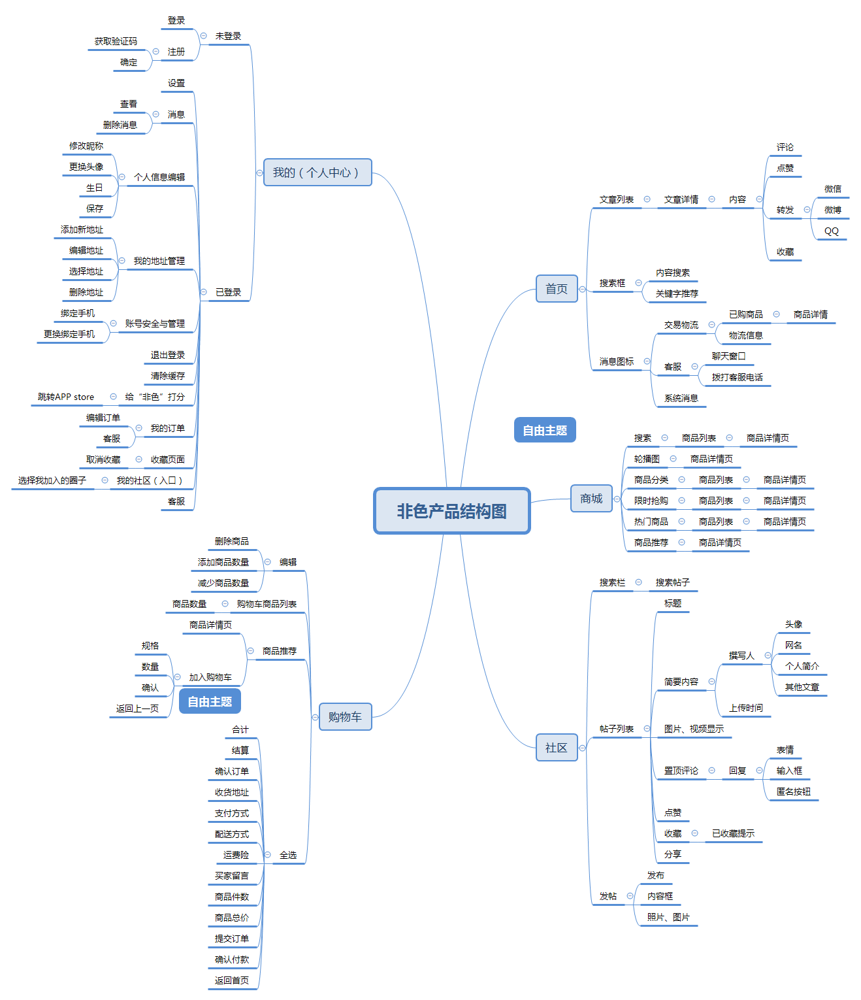

##### 2.5 Feature List

即需求列表

以下是一个简单的示例：

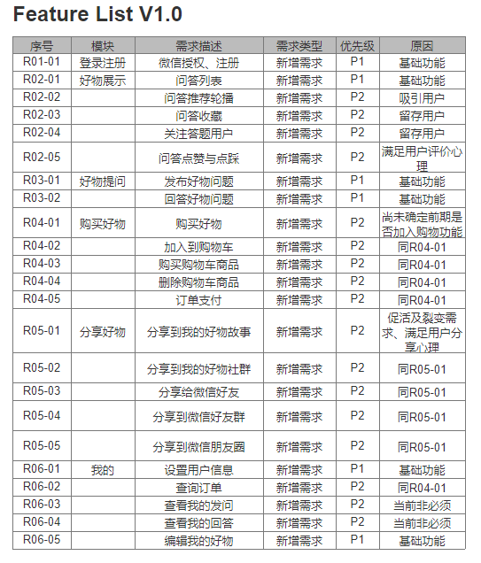

##### 2.6 业务流程图

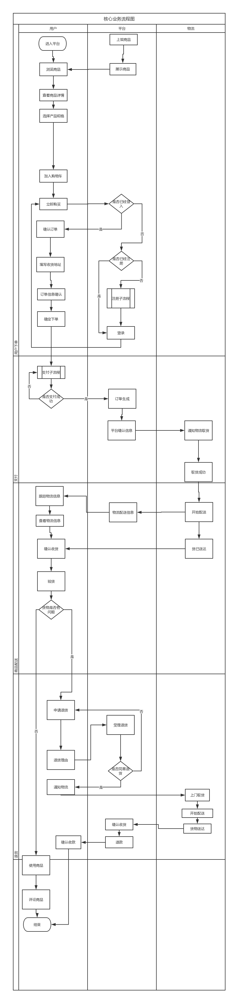

##### 2.7 任务流程图

任务流程图就是产品内完成各项任务的流程图，以下是一个小程序登录的流程图：

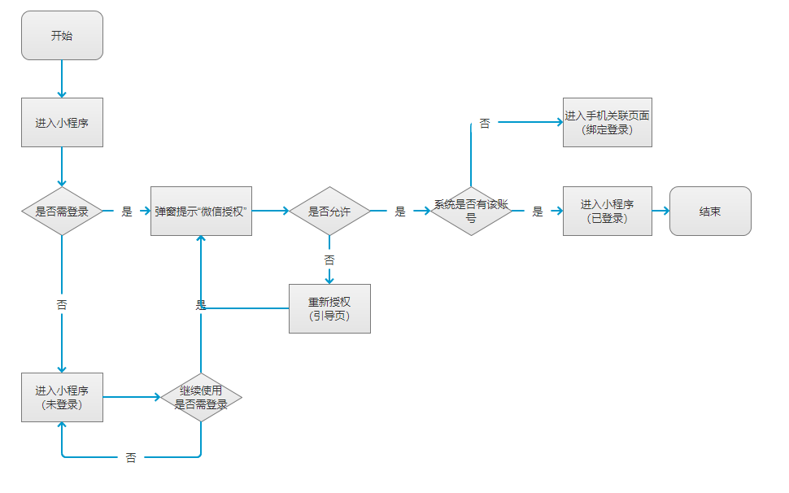

##### 2.8 页面流程图

主要是页面之间的跳转关系。

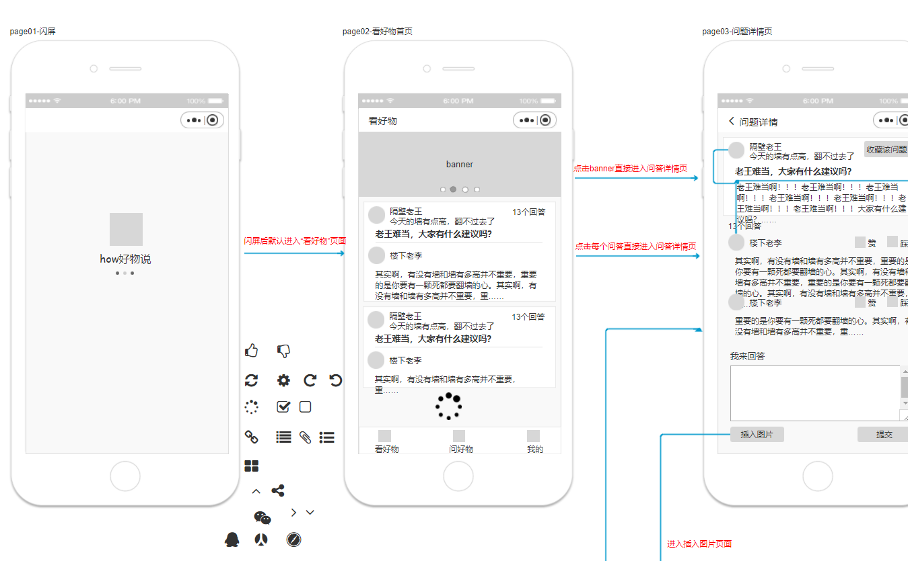

#### 3. 全局说明

##### 全局说明

##### 功能权限

##### 页面内交互

##### 页面间交互

##### 键盘说明

##### 提示

##### 弹层对话

#####加载方式

#### 4. 详细功能说明

这里如果是直接写在Axure文档里的话，基本就是原型+标注了。以前很多人说用Axure写PRD不方面进行版本管理，其实是不对的。有三种方式进行版本修改的管理：

- 直接在相关页面记录历史的修改：好处是能看到自己每次修改的演变过程，坏处是文档会越来越庞大。

- 每次修改都存成一个文档：更好的存档，但不方面查看。

- 使用Git/SVN等版本管理工具：可以看到查看之前的版本。

事实上，我会三个方法同时用。

如果是用Word来写的话，就要复杂一些。

### 5、小结

回顾所讲的3个文档（BRD、MRD、PRD），我们可以发现三者是一个层层递进的关系。

MRD可以说是BRD的进一步细化文档，BRD更多是以PPT的形式呈现，MRD可能就需要用文档形式呈现了。PRD可以说是对MRD的进一步进化，PRD可以用Word、Axure等各种形式呈现。

