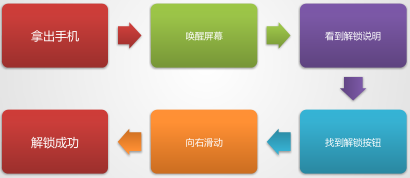

# 用户体验与交互设计

用户体验这个词也许是产品经理提到的最多的一个词，影响用户体验的因素有很多，其中显性易判断的有2个：视觉设计和交互设计。其中交互设计对用户体验的影响更甚。

本文结构如下：

## 一、用户体验设计

用户体验设计(User Experience Design，UED) 。UED的通常理解，就是“我们做的一切都是为了呈现在您眼前的产品”。UED是针对用户心灵,眼睛,耳朵,触感的设计。用户体验就是用户在使用一款互联网产品的整体感受度。

### 1、UED的相关概念

- UE(User Experience)

- UCD(User-Centered Design)以用户为中心的设计-强调以用户体验有限的产品设计理念

- HCI(Human-Computer Interaction)人机交互

- GUI(Graphical User Interface)图形化用户界面

- WR（Web Rebuild）网站重构

### 2、UED团队的输出物与工作职责

**产品经理：**

输出：用研文档；竞品分析文档；产品需求与需求分级文档

配合工作：协助UED相关人员对产品的调性进行把控；协助UED相关人员进行测试与组织管理。

**交互设计师**

输出：完整产品原型图含交互设计；用户使用流程；产品信息结构图

配合工作：交互测试，测试交互还原度

工作职责：为产品设计具体的行为、界面设计，组织良好的产品信息结构，提高产品的可用性与易用性

**视觉设计交互设计师**

输出：对产品的界面视觉设计稿；竞品风格调研；设计规范；概念设计说明；产品流程中界面还原度全程评估审核。

配合工作：视觉测试，测试视觉还原度

职责：界面呈现,美观度,体验,品牌形象设计负责

**页面重构师**

输出：静态网页；静态页面规范说明(CSS,复用,性能,兼容性等)

配合工作：页面测试工作，测试页面还原度；兼容性测试；页面性能优化

职责：界面呈现,美观度,体验,品牌形象设计负责

 

### 3、用户体验的要素

**战略层：**

明确商业目标和用户目标，重点是解决两者之间的冲突，找到平衡点。例如，通常的商业目标是赚钱，而用户是要省钱，这种最底层的冲突没法通过产品设计解决，而要靠商业上找准价值的切入点。作为PD，通常早些年接触不到战略制定的过程，但仍然要深刻理解公司战略并尽可能的去发挥自己的影响力。

**范围层：**

做好需求采集工作，确定功能范围和需求优先级。这时候先要尽可能多的收集，通过各种市场研究、用户研究的方法收集，不要遗漏；再尽可能多的放弃，因为我们的资源有限，只能做最有价值的。先做的收集不是为了放弃，而是为了不漏掉任何“最有价值的”。

**结构层：**

完成信息架构与交互设计。上一步相当于把菜都选好了，现在开始考虑具体是蒸是煮是炒是炸了，这一步可以产出产品的功能结构关系，网站地图等。一般来说，技术部门在这个层面开始全面介入。

**框架层：**

界面设计、导航设计、信息设计，到了这一步，才出现用户真正能看到的东西。常见错误是从以为这里才开始算设计，忽略了上面的几层，这样在大前提不正确的情况下做出来的产品必然会成为一个悲剧。

**表现层：**

包含了视觉设计和内容优化。这部分是最有意思的，但设计师一定要理解好商业和用户的目标才能做出正确的设计，毕竟我们不是艺术家，这里的表现是最终产品气质的体现。

五层整体是抽象到具体的过程，时间上是顺序的，但每步的界限模糊，彼此交叉，而且必须反复迭代的，又有一点从商业到产品到技术的感觉。

套用咨询思维的经典结束（意译）：事情来了不要扑上去做，也不是先订计划，而是先想清楚意义、目的、目标等等。

### 4、用户体验的五个层次

**（1）有用**

“有用”其实就是对用户首先要有价值“即有使用他的价值”，这里要注意一点，这里的“有用”是针对“用户体验而言”，而非之前说的Kano模型里面正对需求而言的那几项（必备，期望，魅力，不要搞混了）。

我们拿微信来举例，我们使用他最重要的价值就在于它能语音传输，这就是他对于用户来说，最基本的“有用（基本价值）”的地方。

**（2）能用**

在对用户“有用（有使用价值）”的基础上面，还需要强调，这个东西是能够正常使用的，例如：

- 图片上传不允许出现丢失

- 交互设计应该按照最基础的IOS系统交互规则来进行设计

**（3）可用**

可用，即可用性，就是在有用，能用的基础上面，我们应该考虑如何让用户更好，更方便的使用产品，例如：

- 注册填写邮箱的时候，自动补全后面的“@qq.com,@163.com等等”

**（4）用的爽**

用的爽，就是在 有用，能用，可用的基础上面，还能让用户感觉使用产品畅快淋漓，有一种爽的感觉，爽这个字很难形容，我们可以具象一下：

- 超出用户预期的产品服务与功能

- 流畅的操作体验（队列，补全，规避用户错误等）

- 文案优美

- 视觉设计符合产品调性与目标人群喜好

**（5）形成品牌效应**

好的产品，日积月累，就会形成品牌，例如：

- 小米手机口口相传的品牌效果

 

用户体验层次让我们在规划用户体验的时候，有明确的指向，以及有明确的边界。

1有用>2能用>3可用>4用的爽>5品牌效应

- 初期一定要保证，1,2,3，因为资源、时间、成本有限

- 能力强的团队，初期可保证到1,2,3,4

### 5、用户体验的度量

我们把用户体验分成了7个大类，这7个大类里面又有若干个小类，每个小类又有可考核的依据。于是乎，原本感觉不太好的考评的用户体验，现在的就变得相对可考评了。考评方式是什么呢？——专家团队考评

#### 5.1 价值体验

呈现给用户心理上的体验，强调友好性以及与用户关系的维系,一般包括但不限于：基本型价值；期望型价值；魅力型价值。

#### 5.2 感官体验

精准定位：**调性风格是什么样子的**，是否匹配目标人群的喜好特征。

呈现给用户视听上面的体验,强调舒适性,一般包括但不限于： 

- 设计风格（极简风格的；前卫；女性化；男性化；复古；后现代） 
- 网站LOGO
- 页面布局（平面设计；板式设计；主次分明；视觉引导）
- 页面色彩表现
- 性能稳定（响应速度快；系统不崩溃）
- 兼容适配（兼容不同手机操作系统、手机型号、屏幕适配性）
- 动画效果
- 页面导航
- 广告位
- 背景音乐 

#### 5.3 交互体验

呈现给用户操作上的体验，强调易用/可用性,一般包括但不限于： 

- 表单填写
- 表单提交
- 按钮设置
- 点击提示
- 错误提示 
- 意见反馈

##### 交互原则

**导航清晰**：让用户指导自己在哪，退路在哪，可以去哪儿，怎么去，附近有什么

**搜索便捷**：符合用户心理模型（心理预期）

**扁平任务**

用户完成一个预期行为的过程越简单耗时越短越好

**容错性**

通过设计：突出正确操作；避免容易引发的错误操作；对错误操作要有包容性（队列技术的使用等等）

**主次原则**

主次分明，色彩，内容，板式，功能。

**直接原则**

不要出现过多的行为，能在当前页面完成的行为，不要去过多跳转。

**统一原则**

产品价值，文案，功能，内容，样式，设计风格等都保持统一：一方面降低用户学习使用难度；一方面可以提高产品的整体性与专业性，还能降低产品开发的成本

**少做原则**

让用户少做：补全；记忆；联想；直接给出预期结果等等..

**反馈原则**

用户的每一个操作，都能有有效的反馈给用户，让用户明白自己操作的：过程；状态；结果等等...

**对称原则**

对称原则是一种思考方式，即需要交互设计的时候去思考当一个状态出现的时候，会不会有相反或者想对应的状态。

浏览器的刷新和停止（合并）；前进与后退；Axure的导入和导出；论坛的发布与编辑

**简洁原则**

产品表现，功能使用，文案等等，简洁易懂。

**合并原则**

合并原则就是对一些具有相同属性的交互元素与内容进行合并，从而有效的减少用户学习成本与使用难度。浏览器停止刷新按钮的合并。

#### 5.4 浏览体验

呈现给用户浏览上的体验，强调吸引性,一般包括但不限于： 

- 栏目的命名
- 栏目的层级
- 内容的分类
- 内容的丰富性
- 相关内容的推荐 
- 信息的搜索
- 文字排列与字体
- 分页浏览

##### 浏览体验原则

**信息架构合理**

主要看：是否符合用户心智模型、

心智模型：汽车发动

用户心智模型：钥匙扭一下

工程师眼里：钥匙触动电动打火装置-打火装置点燃XX-XX带动XX-后发动起启动

**内容呈现符合产品定位**

大方向要正确。小方向：栏目设定；主题推荐；精华内容

**产品兼容性良好**

移动客户端android系统，就要兼容很多厂商很多机型。

web端，需要兼容浏览器火狐、chrome、opera

pc客户端：xp、win7、win8

**相关内容表现合理**

图片，视频，文字，色彩，排版等等表现合理，符合目标用户的获取信息的习惯。

#### 5.5 情感体验

呈现给用户心理上的体验，强调友好性以及与用户关系的维系,一般包括但不限于：

- 友好提示
- 售后反馈
- 会员优惠
- 鼓励用户参与 

##### 情感体验原则

**尊重**（主人，你的电脑快挂了！；主公，微臣已经帮您清洗了电脑垃圾！）；**惊喜；友好；满意；共鸣**（小米的微博：七夕感慨！）；**人文关怀**（qq登录节日问候，提醒啊等等）

#### 5.6 信任体验

呈现给用户的信任体验，强调可靠性，包含但不限于： 

- 公司介绍
- 投资者关系-
- 服务保障
- 文章来源
- 联系方式or服务热线
- 有效的投诉途径
- 安全及隐私条款
- 法律声明
- 网站备案
- 帮助中心
- 隐私保护
- 权威推荐
- 成功案例

### 6、如何提高用户体验

**1.新手上路提示**

对于复杂的产品或者上线了重大改版功能时，提供新手引导是有必要的。

**2.适当引导用户**

在该引导用户的地方引导用户，不要过度引导从而引起用户的反感。

**3.贯穿生命周期**

用户体验是整个产品周期中，所有部门和团队成员都必须要关心的重点要点，不仅仅是产品部门的事情，更不是产品经理一个人的事情，整个团队从上至下尊重用户，贯穿用户体验，才有可能做出优秀的产品。

**4.超出用户预期**

提供超出用户预期的功能，有时可以让用户暂时忽略产品的不足之处。

**5.正确对待反馈**

要倾听，不要照着去做。

**6.可用性测试**

产品上线之前先进行可用性测试，减少用户体验的盲点。

**7.数据分析和挖掘**

通过对用户行为数据的分析，挖掘对用户体验影响更大的因素。

**8.多用和多研究**

产品经理要自己多用多体验，才能感受用户在使用产品过程中的挫折点。

## 二、交互设计

交互设计是人工制品、环境和系统的行为，以及传达这种行为的外形元素的设计与定义。

不像传统的设计学科主要关注形式，最近则是关注内容和内涵，而交互设计首先旨在规划和描述事物的行为方式，然后描述传达这种行为的最有效形式。

交互设计借鉴了传统设计、可用性及工程学科的理论和技术。它是一个具有独特方法和实践的综合体，而不只是部分的叠加。它也是一门工程学科，具有不同于其它科学和工程学科的方法。交互设计，是用户体验的重要组成部分。

### 1、互联网交互设计

是指用户使用产品过程中行为输入产品再到产品输出信息的全过程，拿iphone解锁举例：

### 2、几个要区分的概念

**产品设计**

关注的是功能、结构、人因、形态、色彩，环境等设计要素以及采用的技术、方法和功能的实现手段等，是间接影响产品最终用户的设计

**以用户为中心的设计**

是在设计过程中以用户体验为设计决策的中心，强调用户优先的设计模式。

**用户体验**

目标，即我们努力应该去为用户创造良好的感受

**交互设计**

注重产品和使用者行为上的交互以及交互的过程，强调的是设计理念和方法。侧重的是交互双方信息表达方式和情感，是直接影响产品最终用户的设计

**人机交互**

人与计算机的交互，交互的对象特指计算机，是交互设计里面的一种。

**界面设计**

主要指人和机器交互界面的设计。

**可用性**

评测用户体验的标准。

### 3、如何更好的学习交互设计

首先要明确，交互设计对PM的要求必须是：实战经验；要求知识面广。

我们如何更好的学习交互设计，建议练习方式如下：

–找到一些常见的任务，例如注册，登陆，发布微博等

–仔细分析用户的特征后，明确目标以后,自己开始手绘交互的流程（手绘比工具快）

–反复修改，直到你认为已经达到了最简单，最好体验

–对比你的设计与真正的现有的优秀产品

### 4、交互设计的特性

识别性：形状，布局，尺寸，色彩等..

感知性：文案，色彩感受，版式，关系，层级

可衡量性：流程，点击次数，移动距离，姿态，完成时间

### 5、交互设计的原则

- 反馈：返回与活动相关的信息，以便用户能够继续下一步操作

反馈：返回与活动相关的信息，以便用户能够继续下一步操作

- 限制：在特定时刻显示用户操作，以防误操作

- 映射：准确表达控制及其效果之间的关系

- 一致性：保证同一系统的同一功能的表现及操作一致

- 启发性：充分准确的操作提示

#### 1）直接和间接操作

**直接操作**

对一个可以操作的对象进行：移动；旋转；拖拽；改变色彩等等

以上的操作就被称作直接操作，直接操作可以理解为为用户提供了现实世界中与模仿现实世界中的各种操作。

直接操作容易学习，因为直接操作能映射到我们的现实生活中的实际经验上面。

**间接操作**

间接操作是指我们用命令行，菜单，语音等控制方式去操作一个对象，尤其是很古老的DOS操作，就是明显的间接操作。例如菜单中的“反选”“全选”

#### 2）预设用途

生活经验会告诉我们，事物本身存在的外表（形状，色彩等）会暗示给我们他的用途（久而久之约定俗成）。

- 红色（紧张，警告）

- 一把锁（安全，可靠）

- 搜索图标的放大镜代表搜索

为什么我们会知道？这就是预设用途。

交互设计的到了某个阶段（尤其是细化阶段），交互设计可以看作是在为用户提供预设用途，以便产品的功能特征易于被用户识别与察觉。

#### 3）反馈与前馈

人与机器对话，类似人和人对话，试想你一个人说话，这个人总是不理你或者心不在焉，你会不会很生气呢？

人们需要反馈，反馈意味着提示，意味着某件事情发生过。

给用户的反馈应该频繁，而且灵敏的，举例：

有可能出现错误的操作（误以为没有操作成功，多次点击）

常见的反馈方式：

- 提示灯，操作后，灯会闪亮（遥控器上面）

- 声音（手机按键的嗒嗒声，银行ATM机器难听的咚咚声音）

- 直接在操作位置的反馈（按钮的几种状态）

- 进度条

数字产品的反馈是一种响应的过程，由开始动作和产品做出反应的时间（延时）来决定，存在4个基本层次：

- 及时响应：0.1秒内呈现结果，快到用户忽略响应时间，例如你输入一个字母，屏幕上面不存在延迟，立刻显示出来。

- 延迟响应：同样的操作如果存在在远程登录控制的电脑面，就有可能出现在本地输入，但是1秒钟后，才在远程的电脑上面显示出来，0.1-1秒的时间才响应，用户会注意到延迟，如果重复出现用户会觉得迟钝，会变得沮丧。

- 中断：中断就是机器没有反应用户的操作，用户会觉得他们的工作被打断了，这个时候你的产品已经开始在干扰要用户的工作了。

- 异常终止：超过十秒以上的延迟，用户会觉得工作彻底中断了，提供进度条或者沙漏能比较好的减轻用户中断忧虑，菊花，进度条，文字提示请稍后，都是如此。

此时要注意，中断和异常终止，有可能是用户的心理模型，尽管现实模型还在顺畅的运行，所以必备的提示与反馈非常的重要。

前馈，是指执行一个动作之前就知道将要发生什么，相对反馈更难，但是更有效。

例如一个连接地址为：点这里 与 点击访问百度 ，后者就存在明显的前馈，让用户明白自己的操作将会有什么可预测的结果。

#### 4）心智模型

心智模型通常由设计师提供的信息来建立，这些信息可能以预设用途、反馈、前馈以上原则来呈现，以便用户更好的知道他们的操作目标，操作状态，预期结果。

#### 5）标准化设计

标准是一种可供用户参考和按规律可循的操作依据。

微软和苹果都提供了基于自己系统下的设计标准，基于这样的设计标准，可以让设计师们事半功倍。

除非你能创造出基于设计环境下（Mac，windows，iOS，android等环境）更好的操作方式，否则请按照标准来设计。

不要试图去挑战用户累计的操作经验，除非你的产品具有革命性或让用户明显受益，否则懒惰的用户迟早会放弃你的产品。

熟能生巧，建议大家先按照标准化设计，运用自如以后，再考虑优化与强化。

#### 6）菲茨定律

触屏操作按钮的触感面积设计往往应该大于实际按钮，但是可以更大（前提是不会被误操作到），这样的设计让用户赏心悦目，感觉到产品的灵动快速。

出现在操作焦点旁边的选项，往往也比用户移动鼠标去点击屏幕顶部的菜单来的更快捷更舒服。

#### 7）希克定律

希克.海曼定律，表述为：**用户做决定所需的时间由备选项的数量决定**。

用户不会对所有备选项挨个思考考虑，而是把备选项细分为类，每一个决策步骤，会排除大约一半的剩余选项。

比起两个菜单，每个菜单五个选项，用户会更快的从有十个选项的一个菜单中做决策。

这个定律虽然暗示了用户思考判断问题的规律，但如果按照这个思路去设计将会是恐怖之极的，想想屏幕上面放满了各种选项。

希克定律说明了做决策需要的时间被两个因素的影响：

- 用户对选项的熟悉程度：根据提示能很好的判断这个选项下的子类别，例如：插入菜单...

- 用户对选项的表现形式：声音，文字，视频，还是按钮...例如：mindjet就通过类似office 的菜单形式为用户提供明确的操作反馈与表现，让用户易于理解和快速进行到下一个任务。

#### 8）神奇的数字“7”

用户的暂时记忆通常会记得5-9个信息块，综合来看，就是7 ，5-9的中间数。

#### 9）特斯勒“复杂守恒定律”

每个过程都有固有的复杂程度（或简单或复杂），这些过程被简化到一定程度后，将不再可能被简化（除非过程的本质被颠覆），我们只有把固有的复杂性从一个地方移动到另一个地方来实现简化的目标。

发送邮件时候必须要的两个选项：发件人地址、收件人地址。

如果没有以上两个选项，邮件无法被成功发送，因此现在的操作是将这样的复杂性转嫁给邮件工具。

自动记录和提示，补全收件人地址等等。

这里想要表述的是：

- 产品经理要承认，无论多么完善，所有的过程都有一些不能再简化的元素。

- 产品经理需要想办法来转化这些无法完善的元素，是否可以用其它流程来优化或者承担等等。

#### 10）防止错误原则

帮助用户避免发生错误的几率，是交互设计中重要的原则，日本传奇工程师，品质专家乡新重夫在1961年为丰田工作的时候创造了防止错误原则：**为用户避免无心的错误**。

产品经理在产品设计中使用这种原则，迫使用户调节他们的行为，正确执行操作。

出现错误后，及时的反馈错误信息并提示正确操作。

高危选项，在执行后，通常灰化或者出现独占模块需要再次确认（导弹发射按钮，甚至需要两个艇长同时扭动钥匙）

#### 11）错误

出现错误消息是差劲的设计，好的设计应该能帮助用户规避错误。

如果出现错误，仅仅提示错误消息是不够的，还应提供解决方案，或者发生错误的原因。

最恶心的错误提示：你遇到了错误678，请重试（我想摔电脑！）

## 三、Axure原型设计

我们不会讲Axure的使用，这里只简单提一下用Axure进行原型设计时的注意事项。

### 1、原型设计的思路

开始一个Axure页面设计的时候

- 该页面所在流程中的位置，前后页面关系是什么

- 该页面的主要功能是什么

- 该页面次要功能点有什么

- 基于草图的页面设计是否已经通过，还有优化的空间吗

- 该页面有那些元素是可以直接从其它页面复制过来的
- 哪些元素可以来自母版：经常使用；使用量相对较多；可能不太确定，需要有修改的地方
- 交互设计中，哪些交互元素是可以复用的（保持统一）
- 你可以把PRD的一些需求直接写在Axure里面，不掉价，高手都这么干！
- 如果一些功能不太能说清楚，可以在旁边标注流程图等，重点在于说清楚，不在于方法

### 2、Axure使用的tips

- 多使用Ctrl+G对元素进行编组方便操作

- 多使用母版降低工作量

- 按照Ctrl左键拖动复制，Shift是平移，Ctrl+C和Ctrl+V要多使用

- 养成随手Ctrl+S的习惯，永远不要试图去挑战这个习惯

- 动态面板和中继器是重点，可节省大量精力

### 小结

我们在上篇文章中有一个《交互自查表》，它就是根据交互设计的一些原则进行制定的，大家可以去对比体会一下。

今天讲的内容比较枯燥，都是理论上的东西，实际应用是需要我们在工作中去摸索与研究的。

**预告**：下一篇将会讲《项目管理与敏捷开发》

