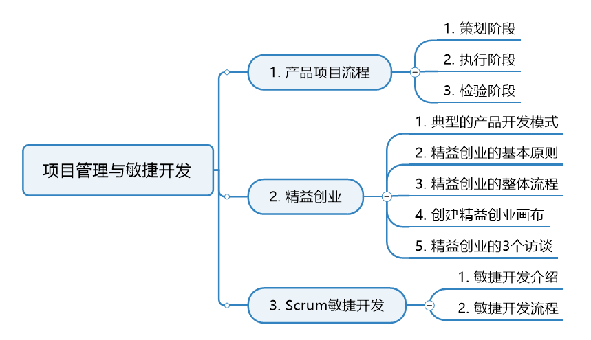
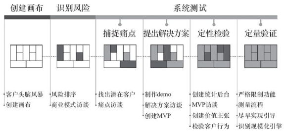
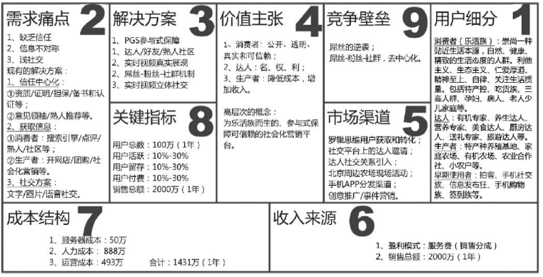
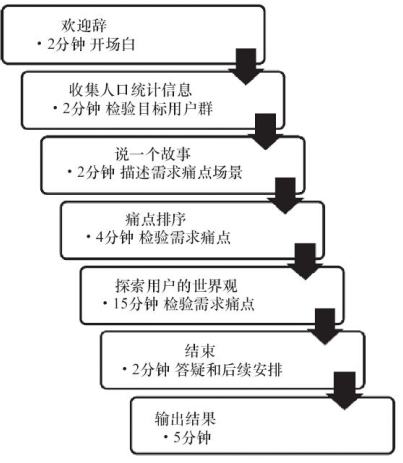
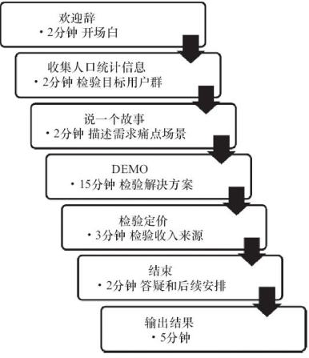
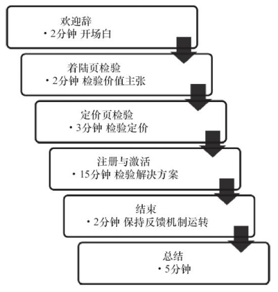
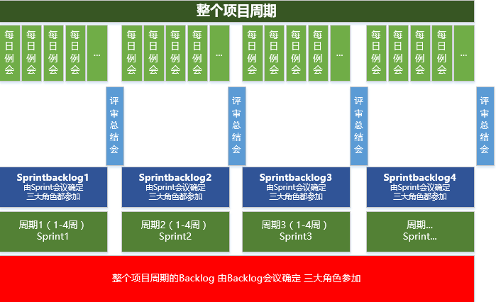
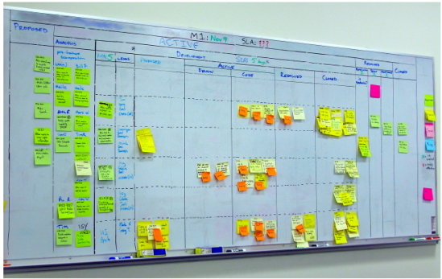
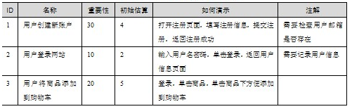
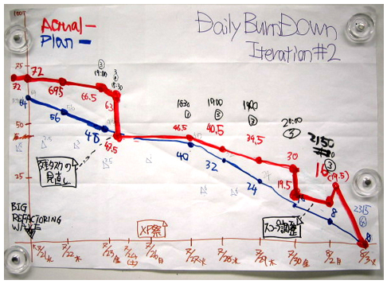

# 项目管理

今天的这篇内容对初级产品经理来讲，没有那么重要，但为了体系的完整，这里也写一下，本文重点是精益创业和敏捷开发。

本文结构如下：

## 一、产品项目流程

先从项目管理的角度，梳理一下产品开发项目的大体流程。

### 1、策划阶段（Plan）

#### 1.1 主要工作与交付物

策划阶段主要工作与交付物如下：

**（1）用研：根据公司与产品部门定制的产品战略与定位，从一个想法开始，进行用户调研。**
**目标用户群**

- 用户特征

- 用户动机

- 用户需求的痛点

- **交付物：人物角色**

**（2）用户需求分析**

- 获取用户需求

- 分析用户需求

- 评估需求

- 对评估出来的需求做优先级排序

- 形成产品路线图

- 交付物：初步的产品需求文档

**（3）产品原型设计：与UED团队合作**

- 信息架构

- 文案设计

- 页面间的交互流程

- **交付物：产品原型图、页面交互图**

**（4）可用性测试**

- 根据实际情况，使用不同的方法对产品进行测试

- **交付物：**
  - 可用性测试评估（是否通过，需要优化改进的地方，需要多少时间来改进等）

**（5）完成整个策划阶段工作**

- **交付物：**
  - 产品需求文档
  - 业务流程图
  - 功能需求
  - 非功能需求（运营，统计，帮助需求）
  - 产品原型

- 注意在这个阶段可以邀请其他团队的Leader一起来参与，一方面让各个团队的Leader掌握，了解项目情况，一方面避免后面发生不必要的麻烦（技术无法实现或者某些环节涉及运营开展难度过大等等）

#### 1.2 需求达到的预期KPI

不同的产品有不同的策划，运营，技术实现思路，但都背负着目标，为了达成目标，我们就必须要正确的理解KPI（关键绩效指标）。

根据产品类型、阶段不同，产品，运营，技术在产品生命周期中扮演的角色也不同，不同的阶段，有不同的KPI考核方式，常见的考核的指标有：
访问量、产品的用户数、活跃用户数、忠实用户数、使用率、使用频率、用户创造内容数量、转化率、营收、利润、等等.....

KPI的制定有2种方式：上层决策、团队商议

**特别注意：**

制定KPI的时候，应该仔细思考产品团队KPI，做到该承担要承担，但是不该承担的时候，也要讲出道理。

现在都是很现实的公司制度，不要去当沙僧，给自己挖坑埋！

### 2、执行阶段（Do）

#### 2.1 设计阶段

这个阶段主要是要跟设计师们沟通好产品的调性，风格，必要的时候可以找一些比较好的产品提供参考。

#### 2.2 开发阶段

和程序猿们打交道是有趣也很痛苦的事情。

他们对事物和新闻都有自己独到的看法（逻辑性强，善于思考），有的比较死板，思维面比较狭隘。

这个阶段主要注意：

- 和项目经理做好沟通
- 和程序员做好沟通
- 把握好项目进度
- 有问题及时沟通，并确保项目按照时间计划进行
- 如果存在不可调和的问题，需要及时与领导沟通，确保领导对项目情况知情。

#### 2.3 测试阶段

首先开发会对自己的代码进行单元测试。

然后交付产品初审，产品经理从产品层面检查用户体验、交互流畅度、产品性能等。

详细的测试会交由测试部门负责，基本流程如下：

- 编写用例
- 与产品团队过用例（补充，完善）
- 产品的每个阶段完成后，测试团队都可以进入对已完成的阶段按照用例进行测试
  对出现的问题与bug，提交到测试管理系统里面去。
- 开发人员对测试系统里面提出的问题进行修改，然后测试团队确认并关闭问题，反复。
- 最后由产品团队验收。

#### 2.4 上线准备阶段

经过测试后，产品进入上线前的临战状态，此时工作主要为：

- 运营工作的前期准备
- 产品发布炒作造势
- 数据分析系统搭建
- 填充数据
- 发布通知
- 完善帮助
- 给业务人员进行相关的培训和技术方面的准备

团队验收准备，然后确认产品发布时间。

### 3、检验阶段（Watch）

#### 3.1 数据检验阶段

产品上线后的数据评估，看是否达到KPI目标，重要指标是否达到预定目标。

重点在于找出方法，改进和完善，好不一定真好，差不一定真差，需要锁定当初最好产品策划时候的目标来分析。

之后，产品开始新一轮的策划、迭代。

#### 3.2 策划会议阶段

从定性、定量两个方面估算下一个版本的KPI目标，并思考和提出相应的解决方案。

## 二、精益创业

### 1、三种典型的产品开发模式

1. 从需求到设计到实施到验证到维护， 这是典型的瀑布式开发模式， 这种模式适用于问题已知， 解决方案也已知的情境。

2. 轻量级、 灵巧， 每个方法和思想做到极限、 做到最好， 基于测试驱动开发， 提倡最简单的设计方式， 现在或最近都根本不需要的就不设计， 需要重构（ 灵活性和可扩展性） ， 代码集体所有权， 结对编程， 持续集成， 验收测试， 小型发布， 不断迭代。 这是典型的敏捷开发模式， 这种模式适用于问题已知， 但是解决方案未知的情境。

3. 提倡企业进行“验证性学习”， 先向市场推出极简的原型产品， 然后在不断地试验和学习中， 以最小的成本和有效的方式验证产品是否符合用户需求， 并迭代优化产品， 灵活调整方向。 这是典型的精益开发模式， 适用于问题未知， 解决方案也未知的情境。

### 2、精益创业的基本原则

- 减少浪费， 低成本（ 无收入不扩增）

- 一种开发、 测量、 学习的文化

- 快速假设， 快速学习， 失败后快速调整

- 敏捷技术开发

**精益创业的特征：**

- 非资本推动型， 主动自发， 关注用户价值， 拒绝华而不实

- 持续的用户互动

- 从第一天开始， 以收入为目标

- 如果没有收入， 就一定限制规模编制

- 假设用户和未来都是未知的

- 资源的低燃烧率， 降低风险

精益创业模式虽然强调快速假设， 快速学习， 快速调整， 但不等于可以盲目试错。 

精益开发模式不能确保产品或项目孵化一定成功， 只是一个帮助提高成功概率的框架。 

精益创业强调走出办公室多与用户访谈和互动， 关键在于研发出来的产品是不是用户想要的， 用户愿不愿意为之付费。

**认识误区：**

- 精益意味着便宜（ 正确认识是精益不是贪图便宜， 而是注重效率） 。

- 一定能成功（ 正确认识是精益创业只是一个帮助提高成功概率的框架， 不能保证一定成功） 。

- 精益创业等于试错（ 正确认识是： 试错可以， 但不能盲目试错， 试错也有成本） 。

### 3、精益创业整体流程

 精益创业的整体流程主要包括创建画布、 识别风险和系统测试三大阶段， 其中系统测试包括捕捉用户需求痛点、 提出解决方案、 定性检验和定量验证四个阶段。

**1） 创建画布：** 

由于用户需求和解决方案未知， 所以需要跟目标用户进行头脑风暴提出假设， 主要包括目标用户群是谁？ 他们有什么痛点？ 针对痛点的解决方案是什么？ 给用户带来什么价值？ 如何将这些价值传递给用户（ 市场渠道是什么） ？ 如何获取商业价值（ 收入模式是什么） ？ 获取商业价值的同时需要付出多少成本（ 有哪些成本） ？ 如何判断产品做得好还是不好（ 关键数据指标有哪些） ？ 要想持续做好， 需要拥有或构建什么样的竞争壁垒？ 这些内容都可以在九格画布上填写， 但是并不是每一个内容都必须填写， 不能确定的内容可以先不填。

**2） 识别风险：**

精益创业的风险是比较微观的风险， 主要包括用户风险、 产品风险和市场风险。 用户风险指的是在捕捉用户需求痛点时因不准确而导致的风险。 产品风险指的是提出的解决方案并不是用户想要的而导致的风险。 市场风险指的是不能持续扩大市场规模导致的风险。 精益创业强调学习文化， 旨在通过学习不断降低或消除上述三种风险。

**3） 系统测试：** 

针对画布上的所有假设进行小心求证。 找到目标用户群， 进行需求痛点访谈， 挖掘出需求痛点， 并不断更新画布上关于需求痛点的内容。 针对需求痛处， 提出解决方案假设， 制作产品原型， 招募目标用户群进行访谈和求证， 并不断更新画布上关于解决方案的内容。 接下来是研发出最简单可用的1.0版本的产品， 并招募目标用户群进行访谈和求证， 看用户对产品传递的价值主张是否能接受和认可， 并不断更新价值方面的内容， 这是定性检验阶段。 通过数据统计后台， 分析用户使用行为， 不断学习和调优。 如果数据情况不客观， 需要重新调整方向， 直到研发的产品是用户想要的为止。 如果数据情况非常乐观， 那就进入到最后一个阶段， 定量验证阶段， 识别出产品增长动力引擎， 获取更多的市场份额。

精益创业整体流程如下图所示：

 

### 4、创建精益创业画布

精益画布其实就是一张纸， 上面有9个空格需要填写， 分别是**目标用户细分、** **需求痛点、** **解决方案、** **价值主张、** **市场渠道、** **收入来源、** **成本结构、** **关键指标和竞争壁垒**。 

精益画布跟商业模式有什么关系？ 

商业模式其实指的是创造价值、 传递价值和获取价值的基本原理， 也就是说基本上有三个阶段， 画布中的价值主张对应给用户创造什么样的价值， 市场渠道对应的是如何将创造的价值传递给用户， 收入来源对应的是用户得到价值之后如何让用户付费， 也就是盈利模式。 

精益创业画布其实蕴含了商业模式的三个阶段， 即创造价值、 传递价值和获取价值。 商业模式不等于盈利模式。 

画布的9个格并不是要求都要填写， 在没有确定之前都可以先空着， 然后通过用户参与之后， 一步一步调整和完善画布。 一般给领导汇报的时候， 不一定要写商业计划书或者商业需求文档， 使用精益创业画布加上产品原型即可。

精益创业画布每个空格的解释在此不再多说。

 

### 5、精益创业的3个访谈

精益创业的三大访谈要求跟用户深度访谈， 让用户参与到产品设计中来。 通过不断的学习先实现痛点和产品之间的匹配， 然后再实现产品与市场之间的匹配， 最后是发动增长引擎， 扩张并规模化。 

精益开发不等于盲目试错， 所以我们需要花更多的时间来洞悉用户想要的是什么， 虽然通过访谈能发现那些你所不知道的事情， 但是超出用户预期并让用户尖叫的产品才是用户想要的。 产品的尖叫包括功能或内容或机制上的尖叫， 而不是仅仅局限于功能上的尖叫。

#### 5.1 痛点访谈

精益创业提倡走出办公室， 不要闭门造车， 大胆假设， 小心求证， 与目标用户打成一片， 深度访谈， 好好与用户谈一场“恋爱“， 让用户参与到产品从无到有的研发过程中来。 精益创业强调学习， 学习最快的方式是进行深度的用户访谈。 用户访谈就是要发现那些你所不知道的事情。

痛点访谈主要是使用定性方法来检验画布中的第1、 2格中填写的内容。 一般找10个目标用户群。 可能会有人质疑， 做10个目标用户访谈够吗？ 这不符合统计学中大数定理。 易用性大师Jakob Nielsen研究结果表明， 5名用户的测试可以发现85%的可用性问题。 如果找的10个用户里头没有一个喜欢你的产品， 这就很有统计意义了。 如果10个用户都喜欢你的产品， 这事就有点靠谱了。

痛点访谈的步骤， 如下图所示。

#### 5.2 解决方案访谈

解决方案访谈主要是使用定性方法来检验画布中的第1、 3和6格中填写的内容。 如何进行解决方案访谈？ 主要是给用户展示产品DEMO， 越是高保真的产品DEMO访谈的效果越好。 展示的这个DEMO要让用户看得见你的解决方案。

解决方案访谈的步骤， 如下图所示。

#### 5.3 MVP访谈

通过痛点和解决方案访谈之后， 将重大发现应用于MVP， 即发布版本号为1.0的产品。 

MVP访谈非常重要， 因为这决定产品的方向是否需要调整。 那么通过这种方法如何证明研发的产品是用户想要的？ 最直接的衡量标准就是看用户是否愿意为MVP付费买单。 

若是用户愿意为产品付钱， 那就证明产品的方向没问题； 否则， 就说明还需要不断学习和调整， 直到产品是用户想要的为止。 MVP主要检验画布中第4、 5、 6格中的内容。

MVP访谈的步骤，如下图所示。

MVP访谈主要是产品的可用性测试,根据MVP访谈过程中用户的反馈进行MVP的调优。 

实施完痛点、 解决方案和MVP三大访谈之后， 需要根据访谈过程中得到的重要发现更新到画布中。

## 二、Scrum敏捷开发

### 1、Scrum敏捷开发介绍

传统的开发方式是瀑布式开发，具体的大家可以百度，啊，呸，大家可以Google。

互联网这个行业是一个快鱼吃慢鱼的行业，除了竞争激烈之外，其产品服务模式也具有鲜明的特色。

互联网的产品往往是面向海量用户的服务，它非常关注用户的行为和反馈，一切以用户价值为核心是互联网产品最核心的特点。这一特点也决定了互联网产品研发具有如下4个关键特性：

- 产品的高度不确定性
- 产品需要快速响应用户的变化
- 团队具备高度创新能力
- 产品的短平快发布模式。

敏捷开发的核心理念刚好与互联网产品研发特色相吻合，因此，敏捷开发的理念正不断给互联网公司研发部门所接受。

#### 1.1 Scrum敏捷开发的理念

敏捷开发的四个理念：

- 个体与交互胜过流程与工具
- 可用的软件胜过完备的文档
- 客户协作胜过合同谈判
- 响应变化胜过遵循计划

#### 1.2 Scrum敏捷开发原则

坚持通过持续的迭代为为用户提供有价值的产品与服务。

- 通过讲故事（人物角色，场景，情绪版等）来罗列分析需求
- 对需求优先级做排序
- 需求的优先级按照投资回报率为第一实现目标（要看产品的阶段性目标）
- 通过频繁持续的迭代与用户形成良好的互动关系，让用户感知到产品是有生命的
- 锁定在能为用户创造价值的产品需求上面，忽略伪需求与无价值的需求。

即使到了后期，也欢迎改变需求

- 与瀑布式开发相反，敏捷开发利用讲究及时的相应需求，因为关注点和行业的不同。
- 互联网行业关注用户体验与产品的实际价值

阶段性的经常交付可用于工作或测试的产品，交付时间短平快。

- 瀑布流最大的问题在于需求确立后的开发周期过长导致投入市场的时候与需求确立期存在较大的时间差。
- 敏捷开发讲究小步快跑，快速迭代。

项目开发期间，业务人员与开发人员必须天天工作在一起

- 有问题当面沟通，做到及时响应，最大限度降低沟通成本。

个人的战斗力决定团队战斗力

- 要使个人目标与团队目标一致，调动成员积极性，提供所需的环境，支持与信任。

讲究当面沟通

- 降低成本

- 每日沟通会等

以用户可用为衡量工作量的标准

- 不是代码行数，用例个数来衡量，而是最直接的用户可用功能

保持长期恒稳的开发速度

不断关注能提升敏捷开发的优秀技能，人才，和设计。

简单化是根本

最好的团队架构，需求和设计都是来源于团队而不是管理者

- 提升团队默契
- 形成团队风格
- 提升团队战斗力
- 定期总结

### 2、Scrum敏捷开发流程

#### 2.1 敏捷开发简易示意图

#### 2.2 三个角色

**产品负责人：**

- 确定产品功能以及确定功能前的事情（用研，需求，交互等等）
- 决定发布日期和发布内容，确定迭代目标
- 为产品利润负责
- 追求投资回报率
- 明确短期目标（需求优先级，功能调整）
- 验收开发质量

**项目经理：**

- 领导团队进行敏捷开发，协助产品负责人实现项目利益。

- 确保团队在正确的工作路线上面（时间节点，效率）

- 保证各个角色间的良好协作

- 解决开发障碍

- 团队沟通出口，屏蔽干扰

- 组织参与每日例会等

**研发团队成员:**

- 尽可能保证全职（项目执行期间）

- 确保达到短期的冲刺目标

- 做好自我管理

- 必要的时候，为产品人员演示功能，并确保能通过验收

#### 2.3 三个物件

##### 2.3.1 产品Backlog

产品Backlog（工作清单）指根据初始需求分解出的任务列表，包括：

- 功能性
- 非功能性的所有功能
- 由产品负责人为Backlog中的任务确定优先级别，当开发团队开始某个任务的时候（其实就是进入了sprint），再精确定义和分解这个任务。
- 产品Backlog是产品所要具备的所有功能和非功能需求的总纲。
- 当一个项目刚刚开始时，没人能够事先预见到所有的任务和需求，并为之制定一个充分、详细而包罗万象的计划。可行的方式是，先为一个项目写下所有它该具备的显著特性和功能，数量不必很多，最好能保证团队的第一个Sprint1（拆分周期）有活可干。

用于研发人员进度管控的需求列表清单：

- 排序，估算的，渐进的
- 通过故事来讲诉每个需求（讲故事可以更好的让团队成员理解该功能）
- 每个需求必须对用户有必要的价值
- 按照商业价值排列，优先级越高的条目越详细（对比参照现阶段目标与公司战略目标）
- 优先级由产品负责人来确定
- 每一个短期目标完成后，都需要更新排列
- 团队需要5-10%的时间来做这件事情
  - 阅读
  - 理解
  - 执行
- 产品负责人必须对Backlog进行优化

Backlog：

##### 2.3.2 Sprint Backlog

随着项目冲刺的进行，生产出可发布的产品增量，客户对产品的直观认识也会随之加深，他们可以据此建议更改或者添加产品Backlog中的任务。

在Sprint计划会议上，产品负责人为产品Backlog中的任务确定优先级，并向Scrum团队描述这些任务。Scrum团队随后根据团队整体情况，确定他们能在这个即将到来的Sprint中完成哪些功能，并把它们挪到Sprint Backlog中去。

说白了，之前的产品Backlog就是一个总纲，用比较人性化的方式，来表述要做的事情，但一些事情，往往需要由很多个小事情组成，而这些小事情，就是Sprint Backlog。

- 在Backlog上，讨论出明确的任务清单
- Springt Backlog 能把Backlog变成可用的产品功能任务
- 方便的时间估计，通常不超过8小时(时间颗粒计算的很细)
- 团队成员自己挑选任务，而不是指派任务
- 对于每个任务，每天要更新剩余的工作量（每个人的效率大家都看着呢）
- 每个团队成员都可以修改Sprint Backlog，增加或者删除修改任务（但必须告知三大角色）

**举例：**

例如ID1中的注册，就有可能存在的Sprint Backlog，该功能需要分块完成（举例）：

1.填写注册信息中用户ID注册态验证

任务编号 1-1   负责人：sammi   工作量：3小时    状态：未开始    备注

2.验证码 

任务编号 2-1   负责人：jack       工作量：1时       状态：已开始     备注

有人要问，我应该用什么工具和什么方法来只做Backlog 和 Sprint Backlog呢？

我的回答：用你团队看得懂的，且感觉专业的方法来做，没有固定的方法，简单，容易，明确即可。

有团队有专门的系统来管理，如：jira等。

##### 2.3.3 燃尽图

Y：工作量
X：工作日期表

#### 2.4 四个会议

##### 2.4.1 Sprint会议

- 定制Sprint目标
  - 这个阶段的节点是什么（周期到什么时候为止）
  - 要完成什么节点任务（哪些任务需要被完成）
- 定制Sprint Backlog
  - 基于该节点任务下的具体工作列表

- 保证Sprint目标实现的方式方法
  - 根据团队的技术能力
  - 根据团队的人力资源
  - 等……

- 按照小时计算Sprint backlog里面的需求达成时间

- 三大角色都需要参加

##### 2.4.2 每日例会

- 早上，15分钟，站立进行

- 让团队成员在会上发言，其它成员可参与，但只能旁听

- 会议由项目负责人主持，团队成员轮流回答以下问题
  - 昨天完成了什么工作
  - 今天打算做什么
  - 目前工作中遇到的困难

- 每日例会主要用于沟通工作进度与遇到的问题，不是用于解决问题

- 有问题留在会后，单独沟通，不影响其它团队成员工作

##### 2.4.3 Sprint评审会议

- 目的：
- 产品负责人评审和验收团队开发的产品，功能

- 参与者：
  - 组织者
    - 产品负责人
  - 项目经理
  - 团队成员必须参加

- 内容
  - 展示该Sprint中完成的功能，现场演示
  - 验收结果与反馈
    - 好
    - 不好
    - 拒绝
  - 产品负责人根据结果更新Backlog
    - 这里要注意一点，更新后的Backlog可能和之前的计划不同，注意同步更新其它相关Backlog

##### 2.4.4 Sprint目标回顾会议

全体成员参与

每个Sprint都要做，时间不应过长

总结前一阶段Sprint的优缺点，总结优点，并找到解决缺点的可行方法

#### 2.5 Scrum价值、误解和总结

##### 2.5.1 Scrum敏捷开发价值

- 符合现阶段的互联网产品打造需求

- 关注效率

- 人性化

- 关注产品对用户提供的价值

- 短平快的思路

##### 2.5.2 Scrum敏捷开发误解

1.1.1.2 Scrum敏捷开发误解

- 认为不需要任何文档和制定任何计划

- 认为只是开发者的事情

- 认为随时可以改变项目进度计划

- 认为只是针对小项目适用

##### 2.5.3 Scrum实施常见问题

**角色变化大，人员流动大。**

- 公司层面和团队内部组织的问题

**会议效率低**

- 会议应该考虑团队的接受力，开发速度，技术水平和商业条件等。

- 每日例会严格控制时间，这个会议室用于沟通存在的问题和困难，不适用于解决讨论问题的（意思说如果有问题，接下来单独开会讨论，而不是拖着大家一起来讨论，除非这个问题确实需要在坐的所有人参与）

- Sprint评审中，评审和验收团队的开发的产品功能，注意控制时间，和阶段性的评审，避免出现需求与开发事物脱节的问题。

- Sprint总结会议，就是总结经验教训，没有太多好说的。

**任务拆分不够细致**

- 根据需求与Backlog，拆分的研发任务越细致越好，颗粒太大容易有遗漏，对项目不利。

- 注意每个任务颗粒的状态的明确标注：
  - 未开始
  - 进行中
  - 测试
  - 重做
  - 完成
  - 移出
  - 锁定 

**团队成员积极性不高**

**过分关注短期目标**

**信息沟通不对称**

今天的内容就讲到这里，主要都是一些概述性的东西。

下一节讲运营，依旧是概述性的东西，但我们之后会对运营工作中一些特别的点进行十分详细的讲解，比如渠道运营、数据运营体系、用户分层等。

### 项目管理

我们这里用到一个大杀器：项目建议书。

项目建议书不仅是未来描述想如何开展，项目团队的胜任力如何，更重要的是与客户方建立沟通与信任，从这个意义上说，项目建议书更像谁是一个我方能给对方提供的服务、胜任对方向明的销售工具。

#### 项目管理的核心

- 要有丰富的行业知识
- 对项目目的或客户需求的充分理解
- 丰富的调研专业知识
- 项目建议书先行
- 精益求精的项目态度
- 充分的规划和严谨的执行

