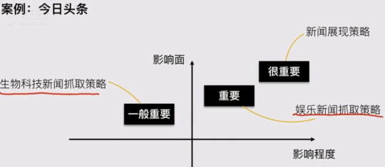
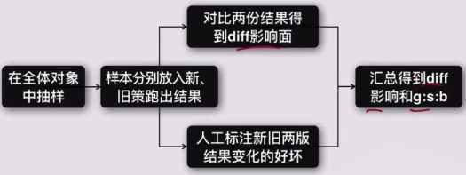

# 1. 发现问题

## 1.0 发现问题的方法

- 用户反馈收集

- 系统监控

- 效果回归

- 阶段性调研

## 1.1 用户反馈收集

- 处理用户反馈的流程
- 收集用户问题的渠道
  - 自有渠道
  - 外部渠道
- 用户反馈分析的方法
  - 数据处理：清洗、标注
  - 问题整理：分析、汇总

## 1.1.1 处理用户反馈的流程

收集用户问题→用户反馈分析→整理撰写需求→落实产品改进

### 1.1.2 收集用户问题的常见渠道

- 自有渠道：产品各个端上的用户反馈入口、客服收集到的问题

- 外部渠道：应用商店评论、媒体渠道的评论

## 1.1.3 用户反馈分析的方法

**（1）数据处理：清洗、标注**

浏览了解数据内容-删除无效数据-对反馈问题进行标注、理解背后反映的问题

常见问题分类：

- 不是问题：常见为用户的抱怨，在产品当前服务范畴之外

- 已知问题：常见为优先级不高、或已在项目计划中还未上线的老问题

- 未知问题：常见为新版本问题或之前没发现的老问题

如果无法直接判断原因，需要抽取当时具体的session（自有渠道）、或进行用户回访（外部渠道）定位具体问题。

**（2）问题整理：分析、汇总**

会对问题进行标注。

- 已知问题：按照原有计划推进

- 未知问题：进行分析定位合并，进行下一步产品计划

### 1.1.4 用户反馈分析的局限性：

- 收集到的问题比较随机，很难反映产品现状的全局。

- 虽然可能代表一类问题，但是问题的影响面和优先级比较难判断。

每一个反馈背后都是一个真实用户的情感表达，以敬畏心深入分析每一个问题。

 

## 1.2 系统监控

- 监控系统的类型
  - 效果监控
  - 策略监控
- 系统监控的流程
  - 定义待监控指标
  - 定义报警规则
    - 触发报警的条件
    - 报警的方式
      - 如何界定正常波动区间
      - 如何评估指标重要程度
- 监控规则
- 监控的局限

监控是一个针对相对稳定的产品，通过数字性指标的收集和观察，自动、实时发现问题的有效手段。

作为策略PM，除了要监测数据，更要知道如何搭建监控系统。

### 1.2.1 监控系统的类型

监控系统（即系统监控）的搭建分为2种形式，分别针对可见的功能（白盒部分）和不可见的功能（黑盒部分）分为效果监控和策略监控。

**效果监控：**

针对产品的白盒部分，监控用户的体验，即产品的核心目标。该指标发生异常变化时需要重点即刻关注。

**策略监控：**

针对产品的黑盒部分，监控整个策略的运转情况，对象为各类中间指标。该指标经常受到某个项目迭代影响，监测作用大于监控。

### 1.2.2 系统监控的流程

- 定义待监控指标：告诉机器要观察哪些指标

- 定义报警规则：告诉机器什么时候 & 如何通知我们

#### 定义待监控指标

#### 定义报警规则

- 触发报警的条件：什么时候报警

- 报警的方式：怎么报警

##### 触发报警的条件：

根据产品历史数据得到正常波动区间，在正常区间外即发起报警给相关负责人。

##### 报警的方式：

监控指标的重要程度和波动幅度 决定 响应的及时性，从而决定报警方式（电话、短信、邮件等）

异常情况报警处理方式：

##### 如何界定正常波动区间：

- 数据敏感度：波动是否超越历史波动范围

- 三西格玛理论：波动范围在 μ±3σ

##### 如何评估指标重要程度：

对产品核心指标（用户体验、收入等）的**影响程度**和**影响面**。

### 1.2.3 监控规则

对效果监控来说，小时级本身波动就比较大，所以设置的报警阈值也比较大。如：

- 小时级监控：同比上周同期波动>50%时，以短信形式发出报警。

- 天级监控：同比上周同日波动>5%时，以邮件形式报警，波动>20%时，以短信形式发出报警。

### 1.2.4 监控的局限性

- 考虑到准确率，监控覆盖的精度（策略意义上的召回率）有限

- 虽然可以帮助发现异常，但是通常**不能直接定位问题**，最终依然需要配合人工手段确定最后的问题。

### 1.2.5 小结

对于任何一个复杂的策略系统，人工去排查每个模块给用户带来的影响，是一种非常不经济的方式。所以线上监控作为一种自动、实时、针对效果的问题发现方法，日趋重要。

案例：

## 1.3 效果回归

效果回归是策略产品非常重要的一部分工作。

**效果回归的作用：**

- 产品循环：判断产品循环是否中止，确定产品接下来的计划

- 自我成长：验证解决方案可行性，修正和巩固方法论

 

## 1.4 阶段性调研

- 阶段性调研的时间节点
- 阶段性调研的通用方法论
- 如何找到理想态
- 抽样分析
- 优先级判断

阶段性调研时针对产品现状进行的系统性分析。

此时产出的分析结论最能代表产品问题全貌，可以有效指导下阶段的产品计划。

### 1.4.1 阶段性调研的时间节点

- 接触新产品：接手某个产品方向的时候

- 周期性回顾：每个月/季度/半年等固定周期的回顾

- 不定期回顾：其他需要临时回顾整个产品现状时

### 1.4.2 通用方法论
**定义理想态 → 拆解未达理想态的情况 → 提出解决方案 → 验证是否解决**

具体到如何做阶段性调研，更关注通用方法论的前两个环节。

- 1、**找到理想态**：定义理想态并以数字化的指标或其他明确标准来衡量（定义关-键指标）

- 2、**抽样分析**：将所有不到理想态的case抽样分析，并做统计分类，明确满足不好的原因

- 3、**优先级判断**：汇总所有问题，综合影响面、问题严重程度和解决成本确定优先级，对问题进行科学的排期，作为接下来的项目计划

### 1.4.3 step1-如何找到理想态

**理想态的定义：**

所有的理想态都是为阶段性的产品目标服务的，随着产品的进化，理想态的定义也在随着变化。

任何一个产品都是用来解决用户的问题，产品的理想态即给出的方案确实解决了用户的问题。

- **简单情况：**对于大多数刚需和工具型产品、或只是其中的策略模块，通常都可以以[帮用户解决了问题]作为理想态，并找到单一的数据指标来衡量。

- **复杂情况：**但依然存在很多产品，其理想态的描述是相对复杂的。

示例：

- 搜索产品通常以 平台当前能够给出的最佳产品方案 作为理想态。

- 推荐产品是在猜测用户的非刚需求，我们永远不清楚最准确的答案是什么，所以推进产品以 平台当前能够给出的最佳产品方案 作为理想态。

### 1.4.4 step2-抽样分析明确问题原因

策略面对的是难以枚举的一群人的问题，通常需要通过样本来代表群体情况。

样本们通常被叫做**case**。

**抽样的基本步骤：**

确定调研目标 → 确定抽样对象 → 选择抽样方法 → 确定抽样数量 → 样本分析标注 → 整理汇总问题

**1、确定调研目标：**

首先我们需要再明确调研的目标，帮助确定抽样的对象和方式。

**2、确定抽样对象：**

通过一定规则筛选出的待分析的全量集合。

- 筛选规则：核心指标未达到理想态、可以代表全体用户的行为的最小时间窗口内的全量数据。

- 样本类型：根据策略模型，可以是用户个体、行为片段（session）、搜索词（query）、订单、……其他维度

**确定抽样对象(案例)**

- 分析滴滴成交问题：直接在全国一周内所有未成交的订单中抽样

- 分析美团搜索问题：因为无法直接通过数字性指标精确筛选哪些是不满足的行为，所以只能退而求其次从一天的全量用户session中抽样，然后人为进行进一步筛选

**3、选择抽样方法：**

常用的是`简单随机抽样`。

从总体N个单位中任意抽取n个单位作为样本，使每个可能的样本被抽中的概率相等。

**4、确定抽样数量：**

从统计角度来来讲，抽样数量越高统计准确率越好，然而调研成本也会随之上升。所以数量是精度和成本的balance，通常只要代表某类问题的样本数量有统计意义即可。

经验值：尽量使代表某问题的样本数量>=5，或者影响面>=3%。

示例：
策略相对程度已经没有影响面>5%的显著问题，接下来要看影响面1-5%量级的问题：

为了使1 %问题的case数量至少达到5，那抽样数量最少要500。或者在1k的量级、即代表单个问题的case在至少为10个左右，此时得到的问题影响面数据才有较高的置信度。

**5、样本分析标注；**

**6、整理汇总问题：**

将标注出的问题按照合理的逻辑框架整理汇总。

- 上下层级：总分关系

- 同层级之间：相互排斥，不重叠、不遗漏

问题的框架并不唯一，只要逻辑合理既可以：

- 标注前有初版预设

- 标注中不断调整，直到完善

示例：爱奇艺视频推荐

### 1.4.5 step3-优先级判断构建项目计划

得到现状的问题集合后，需要进一步给出优先级判断，确定接下来的项目计划。

**优先级判断：**

- 按照[单位成本下的收益]从大到小排序

- 单位成本下的收益（ROI） = 项目收益/项目成本

**优先级判断注意点：**

- 如果出现ROI相同的多个项目，通常情况下绝对收益较高的项目优先级较高。
  - 10天拿到10点收益的项目√  vs 2天拿到2点收益的项目

- 外部环境瞬息万变，很难保证200天后项目依然能拿到对应收益，从期望值来说，20天的项目更稳妥。
  - 20天拿到20点收益的项目√  vs 200天拿到200点收益的项目

- 存在一些紧急项目，因为待解决问题的恶劣程度较高，优先级高于其他常规项目。

**如何计算项目收益与成本：**

**如何进行优先级判断：**

**小结：**

优先级判断是阶段性调研的最后一步， 直接决定后续的产品计划。

进行优先级判断时，在关注项目成本和收益之外，pm要灵活应对外部环境的变化，综合决策。

**总结：**

阶段性调研后，产出的**分析结论**最能代表产品问题全貌，可以有效指导下阶段的产品计划。

### 案例：滴滴叫车成功率

**理想态定义**：用户发出需求后有司机应答并将其送至目的地

**核心指标及拆解**：成交率是核心指标

### 案例：百度搜索结果

**理想态定义**：用户以最低成本找到了想要的东西

**核心指标及拆解**：什么情况下用户确实得到了满足，以什么指标衡量

用户没有点击行为，需求可以通过结果摘要得到满足，同

时无后续变更搜索词或切换tab等行为

用户点击了1条可以满足需求的搜索结果，同时无后续行为

### 作业

 豆瓣[喜欢这本书的人也喜欢]这个推荐模块的调研

 推荐的相关标签与知识图谱是相关联的，但推荐的标签最好符合MECE原则。

 

# 2. 撰写需求，发起项目

## 2.1 项目计划发起时间

确定项目计划后，PM开始撰写需求，产出需求文档，正式发起项目。

## 2.3 需求文档

包括项目背景、项目目标、需求概述、需求详述、（统计需求、监控需求）

- 项目背景：为什么要启动这个项目？
- 项目目标：背后解决的问题是什么？怎么才能达到解决问题这个目标？
- 需求概述：理解整个文档的需求框架
  - 待解决问题
- 需求详述：所有产品细节是怎样的？
  - 输入因素和输出效果的概述
  - 各类特殊情况下的计算逻辑补充
  - 输入因素和输出效果的详述(case示例)
- 统计需求、监控需求：非通用，从0到1的需求不需要，修复bug的需求不需要

## 2.3 不同需求类型

- 功能产品：收敛的解决方案，通过流程和原型表达产品实现效果。

- 策略产品：发散的解决方案，通过逻辑描述和效果示例表达产品实现效果。

## 2.4  策略需求的差异

### 2.4.1 简单策略

逻辑简单直接的需求，通常开发成本较小

PM可以直接给出策略规则，包括待解决问题、输入、计算逻辑、输出四要素的部分或全部。

- 基于历史数据给出（已有一定数据积累的情况下）
- 参照竞品给出（多用在产品从0到1搭建，没有数据积累的时候）

### 2.4.2 复杂策略
逻辑复杂的需求，通常开发成本较大

PM详细描述待解决问题、输入因素、输出效果，包括总结性的概述和示例case (来源于问题调研)。计算逻辑由策略工程师开发实现。

针对复杂策略，可以**跳过计算逻辑**这个要素，但是需要通过**具体的case示例**将问题和产品实现效果更清晰地表达出来。

**实际工作中的两类项目：**

- 从0到1的项目：更多描述理想态，在怎样的输入下要达成怎样的输出效果
- 策略迭代的项目：更多描述策略现状，待解决的问题是什么，针对这些问题，理想的输出效果该是怎样的

## 2.5 需求文档的自检清单

- 结构：逻辑清晰，层次分明
- 背景：需求背景描述清楚，待解决问题一目了然
- 目标：产品理想态或考核指标是什么
- 示例：通过示例辅助，让问题更明确和清晰

策略需求文档的核心是将策略的四要素描述清楚。

## 案例：阅读器

## 案例：滴滴

 

# 3. 跟进开发评估

## 3.1 策略类项目的流程

策略是在黑暗中寻找道路，很难一蹴而就，PM和RD在一轮轮的评估中趋近理想态。

## 3.2 评估类型

### 3.2.1 策略质量评估

**策略质量评估**：

用来说明策略本身的质量，更关注每个策略的质量，如：军事类新闻的识别策略，看识别的效果如何。

**输出结论**：

该策略的**召回率** & **准确率**

- **召回率 = 希望被覆盖的案例中，策略实际覆盖到的案例/理想态下希望策略覆盖的案例，代表策略对问题的解决程度**

- **准确率 = 策略覆盖的案例中，真正希望被覆盖的/策略覆盖的所有案例，代表策略有没有带来其他伤害**

### 3.2.2 Diff评估

在一个复杂的策略体系中，**各种策略会相互作用，共同影响最终效果**，比如搜索、推荐。

在迭代其中某条策略时，除了评估策略本身的召回和准确，还要关注策略变化前后，用户角度直接感受到的产品效果变化是怎样的。

**输出结论：**

- diff影响面、good:same:bad

- **Diff影响面**：策略调整前后，用户感知发生变化的比例，通常要小于策略影响面

- **good:same:bad** (简称g:s:b)：随机抽样有变化的case，站在用户体验角度评估效果是变好了、无变化、还是变差了

**案例：一个菜品加工厂准备在所有菜上增加一道浇辣椒迪的工序**

策略影响面100%，diff影响面80% (比如水煮肉原本就有辣油，增加工序后用户几乎无感知)

g:s:b=30:10:4，典型good是酸菜鱼、same是韭菜炒鸡蛋、bad是拔丝红薯

**Diff评估的步骤：**

案例：性别识别策略

如何处理真实性别和数据挖掘出的性别？

### 3.2.3 如何做评估

**（1）基于理想态，找到问题**

策略召回率理想是100%，目前只有60%，剩余40%没被策略召回

策略diff评估中有占比10%的bad case

**（2）汇总和抽象问题，提出解决思路or方向**

40%未召回case主要是3类问题，分别应该通过xx思路解决

目前占比10%的的basecase主要是xx原因，需要解决

**（3）给出结论**

问题依然很严重、需要继续优化 or 问题可接受、策略可以上线了

老问题：以投入产出比为主要考虑因素，通常以项目预期为终止点

新问题：通常容忍度较低。以pm认为的不可忍受的体验为标准。

## 小结：

开发过程中的评估是策略pm的必经之路，是pm和rd通过深度配合在黑暗中找到道路的重要环节。

**召回率、准确率、diff影响面、g:s:b**四个指标是策略评估的主心骨，所有评估都是围绕着它们发现和抽象问题的过程。

 

# 4. 效果回归

## 4.1 什么是效果回归

有没有解决问题 or 达到目标？

- 如果有：有没有进一步优化空间、有没有引入新问题、优化/解决手段是什么
- 如果没有：是为什么、如果要达到目标，接下来要做什么

## 4.2 如何做效果回归

（1）明确预期：产品/项目目标是什么

（2）指标体系：该目标可以用哪些数据指标来衡量

建立指标体系，要回答三个问题：

- 问题和目标是什么：找到核心指标

- 解决问题和实现目标的关键路径是什么：找到过程指标

- 新的路径伤害了谁：找到观察指标

（3）确定上线方式

**全流量上线：**

- 如果核心/过程/观察指标仅与本项目有关，评估效果很好、希望尽快上线拿到收益- 时，可选择全流量上线

- 回归方法：实验期同比上个时间周期，变化了XX%

**小流量上线：**

- 如果核心/过程/观察指标变化可能受项目外的因素影响，或者项目效果存在一定不确定时，尽量选择A/B test。

- 回归方法：实验流量比基线，变化了XX%

注意：

- 抽样方法是否足够随机。

- 样本集合是否有天然差异，先进行流量空跑（AA测试），避免问题。

（4）收集第2步中指标，看是否达到第1步的预期

（5）分析问题产出结论

- 符合预期：产品循环暂时中止

- 不合预期：新的产品循环开始

## 4.3 决策路径

## 4.4 案例：百度搜索[搜索建议]

### 4.4.1 产品目标

降低用户输入成本

### 4.4.2 核心指标

用户输入时间，预期降低2秒

### 4.4.3 项目启动前的指标拆解

**过程指标的拆解：**

- **用户输入效率的影响因素：**
  - sug展现的比例，在哪个输入长度下展现，是否被用户点击

- **过程指标：**
  - sug展现率、平均输入长度、sug点击率

**观察指标的拆解：**

- sug改动对输入流程的影响是可控的，对输入后搜索体验的影响是不确定的。(某种意义上， sug起到了推荐效果)

- 观察指标：
  - sug输入query的搜索结果满足度

**小结：**

- 核心指标：用户输入时间，预期降低2秒

- 过程指标：sug展现率、平均输入长度、sug点击率

- 观察指标：sug输入query的搜索结果满足度

### 4.4.4 选择上线方式

小流量上线：实验组、对照组各10%流量

### 4.4.5 上线后回归

**核心指标**：

- 降低了1.2秒， 有收益，但是低于预期

**过程指标和观察指标：**

- 平均输入长度变短；符合预期；

- sug展现率变低y点击率没变化与预期不符；

- 并且sug输入query的搜索满足度降低，用户体验差。

需要进一步分析问题

### 4.4.6 分析后结论

- 性能有问题，导致长词汇(多term) sug的加载过慢，拉低了平均展现率和使用率。——需要启动性能优化项目

- 在一些热门候选词上做了需求扩展(欢乐颂2剧情介绍)，对应的搜索结果质量较差。——需要联合搜索排序(基础rank)部门优化效果

## 4.5 小结

效果回归是决定一个产品循环终止或再开始的枢纽。

整个工作贯穿项目前中后三个阶段；项目启动前对策略目标和过程的深刻剖析是效果回归工作最关键和重要的部分。

# 5. 总结

## 5.1 通用方法论

**定义理想态 → 拆解未达理想态的情况 → 提出解决方案 → 验证是否解决**

通用工作流程：[ 发现问题 → 解决问题 ] 的循环

- 发现问题：
  - 定义理想态
  - 对未达到目标进行有效拆解
- 解决问题：
  - 提出解决方案
  - 验证是否解决

## 5.2 具体到工作的每个环节

**发现问题：**

对问题的分析更宏观，产出可能是一系列项目计划

- 定义理想态

- 抽样分析未达理想态的问题是什么

- 对所有问题进行归类统计，确定优化方向和项目优先级

**撰写需求，发起项目：**

提出解决方案，呈上启下的环节

- 以逻辑描述和case示例的方式描述待解决问题和解决后的效果期望

- 简单策略：直接给出计算规则。

- 复杂策略：详细描述待解决问题、输入因素、输出效果，包括总结性的概述和示例case (来源于问题调研)

**跟进开发评估：**

对问题的分析更具体，直接指导具体策略的优化逻辑

- 验证每一版策略是否解决了所有问题：
  - 达到目标，策略上线
  - 未达目标，问题是什么，接下来怎么迭代

**上线后效果回归：**

结论得出首先依赖指标的统计性分析，未达目标时才进行「发现问题」的拆解

- 验证是否符合上线前预期：
  - 达到目标，产品循环暂时中止
  - 未达目标，问题是什么，开启新的产品循环

# 6. 案例：京东到家消息推送

## 理解产品目标：

**产品目标**：通过消息触达用户，实现相应的转化目的

**核心指标**：消息点击率

*本案例覆盖的消息仅指活动类消息，不包括各类业务消息(比如订单发货、退款、订阅更新等业务环节的提醒)

## 版本0.0：人工推送

**产品方案**：运营同学写好文案，通过简易的消息推送工具给全部注册用户发送消息

**推送效果**：点击率只有0.5%

## 版本0.0：问题分析

**理想态**：所有人都点击

**未达理想态**：有99.5%的人没有点击，怎么拆解。。。?

**pm对用户的理解还较少，提出新的分析思路**：反向看点击的人，对比点击的人和没点击的人有什么差异，试着分析其中规律

分析发现两个人群在一些基础数据上有明显差异，具体如下：
|特征	|点击的人中占比	|未点击的人中占比|
| :--- | ---- | ---- |
|活跃用户(一周内打开app)	|80%	|5%|
|活跃用户中iphone：android	|3：5	|4：1|

进一步分析：

- a)这次推送对活跃用户的效果更好，点击率大概7.4%，非活跃用户只有0.1%。虽然预期会有差异，但是差距太大，需要试着优化针对不活跃用户的推送内容

- b)活跃用户中，android点击率23%、 iphone用户 点击率3.5%。差异非常大，不符合认知，猜测可能大量iphone关掉了app推送

## 版本1.0：增加基于用户分层的推送

**产品方案:**

- A)基于用户基础信息和历史行为挖掘用户标签:活跃程度、手机平台

- B)运营可根据标签配置不同的文案和推送通道

- C)增加短信推送通道

| 用户活跃程度 |  文案    |
| ------------ | ---- |
| 活跃(一周内有动作)             | 月底奶品全场5折起， 周六11: 00准时开始，手慢无噢     |
| 不活跃(一月内有动作，近一周无动作)             | 为庆祝xx两周年，特引进澳洲原产地肉蛋奶品，本周六全场五折起大促     |
| 沉默(一月内无动作)             | 100元现金券已塞入你的钱包，周六澳洲原产地生鲜全场五折起     |

**推送规则**: lphone增加短信通道一 起推送， android仅进行app推送

## 版本1.0:效果回归

**推送效果**:点击率提升至1.5%

- a)活跃用户点击率提升至11%，其他用户点击率0.5%，都提升明显
- b) iphone点 击率0.7%，android用户 点击率2.4%，iphone转化率依然不高

**结论:**短信通道的效果不好，需要分析问题。另外，可以进一步分析其他待优化点

## 版本1.0:问题分析

首先分析短信通道问题，发现:

- A) app中没有埋点，所以点击短信短链接后无法调起app

- B)而且短信中的短链接没有加统计标识，打开的移动端网页不知道这是短信带来的流量

然后对没有点击的各用户群各自抽样分析，发现:

- 没有点的用户都是曾经很少或没有买过肉蛋奶类商品的用户。在活跃用户中表现尤其显著。同时补充抽样点击用户，发现86%的用户都有>2个包含该品类的订单。——可以考虑更细化的推送内容

## 版本2.0：个性化的内容推送

**产品方案:**

- A)收集更多用户历史行为(订单、收藏、搜索、浏览)等，建立更加细化的用户标签，用于内容推荐

- B)收集平台商品上架和价格等信息的变化和常规活动信息，作为待推送内容集合
- C)根据用户标签和候选内容，生成基于每个用户兴趣的内容

- D)设置推送频率限制，在允许频率内，当某用户存在可推内容时，自动进行推送

- --此时，运营同学只需要配置各类兴趣维度的模板，系统自动发起推送

| 兴趣维度     | 文案     |
| ---- | ---- |
| 基于历史店铺-折扣     |  您上次光临的「xx」店「周六19点」 「x折」起，年货囤起    |
| 基于历史店铺-新商品     | 您上次光临的Fxxu店上新了「xxxJ，1小时疯狂销售500份     |
| 基于历史商品-折扣     | 您上次购买的xxx正在「7折」,快来填满你的冰箱     |
| 基于历史商品-同品类     | 新到xx」...     |

*「F」中内容由候选集合中相关字段自动填写

## 版本2.0:效果回归

**推送效果**:点击率提升至2.5%

- a) iphone点击率2.1%，android用户 点击率2.6%，两者非常接近了，符合预期

- b)优化内容后，各类用户的点击率均有可以明显提示

**结论:**比较符合预期，可以进一步 分析其他待优化点

继续对比点击和未点击用户差异，并随机抽取用户详细分析，发现:

- A)各推荐维度在不同品类上有不同表现

- B)不同用户对同一种推荐维度的点击率也差异较大

- C)同一用户在不同时间段的点击率有比较明显的差异

- ——可以在推荐特征中增加品类和用户历史点击数据；可以将推送时间纳入个性化系统

## 版本3.0:基于反馈的推荐系统

**产品方案:**

- A)将推送时间纳入推送控制

- B)继续丰富推荐使用的标签数据

- C)将每个人的点击行为作为推荐优化的重要依据，不停迭代

 

## 小结

消息推送的效率本质：

给合适的用户在合适的时间点发送合适的消息，[ 合适 ] 最初有PM定义，最终根据数据反馈确定。

# 7. 案例：滴滴的目的地输入优化

